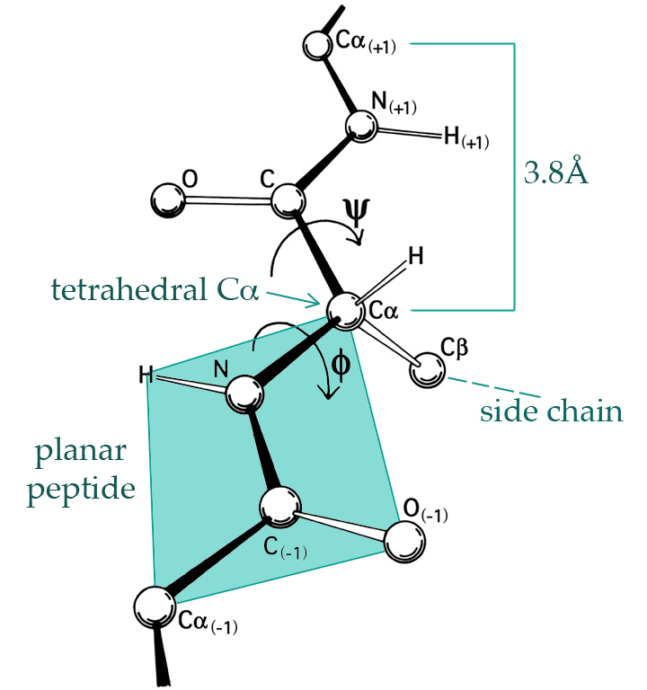

## Computational Statistics

```{r init, echo=FALSE, message=FALSE, warning=FALSE}
library(ggplot2)
library(gridExtra)

knitr::knit_hooks$set(crop = knitr::hook_pdfcrop)

knitr::opts_chunk$set(
  fig.width = 4.8,
  fig.height = 4.2,
  fig.retina = 3,
  fig.align = "center",
  cache = TRUE,
  autodep = TRUE,
  crop = TRUE
)

load(file.path("data", "top100dih.RData"))
phipsi2 <- na.omit(dataset)
phipsi <- read.table(file.path("data", "phipsi.tsv"), header = TRUE)
phipsi[, c("phi", "psi")] <- pi * phipsi[, c("phi", "psi")] / 180

theme_set(theme_grey(base_size = 18))

options(width = 80)
```

--

### Problems

* Computing nonparametric estimates
* Computing integrals (and probabilities)
  $E f(X) = \int f(X) dP \left(P(X \in A) = \int_{(X \in A)} \ dP\right)$.
* Optimizing the likelihood

--

### Methods

* Numerical linear algebra
* Monte Carlo integration
* The EM-algorithm, stochastic gradient descent

---

## Example: Amino Acid Angles

```{r PhiPsi, echo = FALSE, out.height=400, out.width=400, fig.align='center'}

```

---
## Ramachandran Plot

.two-column-left[
```{r phipsi-plot1}
ggplot(phipsi, aes(phi, psi)) + 
  geom_point(alpha = 0.2)
```
]
--

.two-column-right[
```{r phipsi-plot2}
ggplot(phipsi2, aes(phi, psi)) +
  geom_point(alpha = 0.2)
```
]

---
## Histograms


.two-column-left[
```{r hist1}
hist(
  phipsi$phi,
  prob = TRUE,
  xlab = expression(phi),
  main = NULL
)
rug(phipsi$phi)
```
]

--

.two-column-right[
```{r hist2}
hist(
  phipsi$psi,
  prob = TRUE,
  xlab = expression(psi),
  main = NULL
)
rug(phipsi$psi)
```
]
---
## Density Estimation

.two-column-left[
```{r dens1, eval = FALSE}
lines(
  density(phipsi$phi),
  col = "red",
  lwd = 2
)
```


```{r, echo = FALSE}
<<hist1>>
<<dens1>>
```
]
--

.two-column-right[
```{r dens2, eval = FALSE}
lines(
  density(phipsi$psi),
  col = "red",
  lwd = 2
)
```

```{r, echo = FALSE}
<<hist2>>
<<dens2>>
```
]

---
## Statistical Topics of the Course

* **Smoothing:** what does `density()` do?
--

    + How do we compute nonparametric estimators?
    + How do we choose tuning parameters?
--


* **Simulation:** how do we efficiently simulate from a target distribution?
--

    + How do we assess results from Monte Carlo methods?
    + What if we cannot compute the density?
--


* **Optimization:** how do we compute the MLE?
--

    + What if we cannot compute the likelihood?
    + How to deal with very large data sets?


---
## Computational Topics of the Course

* **Implementation**: writing statistical software.
--

    + R data structures and functions
    + S3 object oriented programming
--


* **Correctness**: does the implementation do the right thing?
--

    + testing
    + debugging
    + accuracy of numerical computations
--


* **Efficiency**: minimize memory and time usage.
--

    + benchmark code for comparison
    + profile code for identifying bottlenecks
    + optimize code (Rcpp)

---
## Course Work

.pull-left[
### Assignments

- Eight assignments covering four topics
- Register in Absalon for the presentation of 
  one assignment solution. 
- Presentations are done in groups of two-three students. 
- On four Thursdays there will be presentations with discussion and feedback.
- For the exam you need to prepare four *individual* presentations, one for each topic assignment.
]

--

.pull-right[
### Examination

- Oral exam
- For each of the four topics you choose one out of two assignments to 
prepare for the exam.
- Assessment is based on your presentation *on the basis of the 
entire content of the course*.
- Get started immediately and work continuously on the assignments as the
course progresses. 
]

---
## Prerequisites in R 

Good working knowledge of:

* Data structures (vectors, lists, data frames).
--

* Control structures (loops, if-then-else).
--

* Function calling.
--

* Interactive and script usages (`source`) of R.
--

* You don't need to be an experienced programmer.

---
## Exercise

```{r, echo = FALSE, out.height=NULL, out.width=200, fig.align='center'}
knitr::include_graphics("images/PracIcon.png")
```

With `x` a vector of numbers, write code in R to compute a vector 
`y` of logicals such that `y[i]` is `TRUE` whenever `x[i] > 0`. E.g. 

```{r, echo=3:4}
x <- c(-1, 0, 1, 2)
y <- c(FALSE, FALSE, TRUE, TRUE)
x
y
```


---
## Vectors in R

Think of a vector as a column with a number of entries.

### Atomic Vectors

All components are of the same type, e.g.

  + integers
  + numbers
  + logical values
  + character strings

--

### Lists

May contain components of different types, including components which themselves are lists. 

--

Atomic vectors and lists are important building blocks of data structures in R.

---
## Atomic Vectors and Subsetting

Example of a vector
```{r my_vector}
my_vector <- c(1.1, 3.2, 90, 67.7, 10)
my_vector
```

--

You can extract components with `[]`.
```{r my_vector_subsetting, dependson = "my_vector"}
my_vector[1]
my_vector[c(1, 4)]
my_vector[-2] # Negative indices drop corresponding components
```
```

---
## Vectors of Class `integer`

```{r integer_vector}
integer_vector <- 1:10 #<<
integer_vector

class(integer_vector)
```
--

This is a vector of length 10, i.e. it has 10 elements.
```{r length, dependson = "integer_vector"}
length(integer_vector)
```

---
## Numerical Vectors

Example of a vector with non-integer values.
```{r numeric_vector}
numeric_vector <- seq(0.1, 1, by = 0.1)
numeric_vector

class(numeric_vector)
```

--

```{r}
typeof(numeric_vector) # Internal storage mode
```

---
## A Tricky (Non-)Integer Vector

Example of a vector with only seemingly integer values (and how to fix it).

```{r num_int_example}
x <- c(1, 4, 7, 9)
class(x)
```

--

```{r}
typeof(x)
```

--

```{r}
x <- c(1L, 4L, 7L, 9L)
class(x)
```

---
## Comparison of Numerical Values

Values in a vector of class numeric are approximate.
```{r numeric_vector_comparison, dependson = "numeric_vector"}
numeric_vector[2:3]
numeric_vector[2:3] == c(0.2, 0.3)
```

--

Function `all.equal` has a tolerance.
```{r numeric_vector_near, dependson = "numeric_vector", message = FALSE}
all.equal(numeric_vector[2:3], c(0.2, 0.3))
```

---
## Precision

```{r}
options(digits = 20) ## Precision of printed numbers increased
c(0.2, 0.3)
numeric_vector[2:3]
options(digits = 7) ## Default precision of printed numbers restored
```

--

Note that the internal storage precision is **not** changed by setting the `digits` 
option. It only affects the precision of printed numbers.

--

The differences arise because not all decimals are represented to arbitrary 
precision in the binary numeral system.


---
## Logical (Boolean) Vectors

Example of a logical vector.
```{r logical_vector, dependson = "integer_vector"}
logical_vector <- integer_vector > 4
logical_vector
class(logical_vector)
```
--

How many percent (%) of the components of `integer_vector` are (strictly) larger than 4?
--

```{r logcial_vector_mean, results = "hold", dependson = "integer_vector"}
mean(integer_vector > 4) * 100
```

---
## Character Vectors

Example of a character vector.
```{r character_vector}
character_vector <- c("A", "vector", "of", "length", 6, ".")
character_vector
```

--

```{r}
class(character_vector)
length(character_vector)
```

--

* Observe that the number was coerced to a string.

---
## Factor (Categorical) Vectors

Example of a factor.
```{r factor_vector}
factor_vector <- factor(c(
  "m", "m", "f", "m", "f",
  "m", "f", "f", "f", "m"
))
factor_vector
class(factor_vector)
```

--

Might look like a character vector but is actually based on an integer vector.

--

```{r}
typeof(factor_vector)
```

--
* Can only take a fixed set of values (default: values present in data).
--

* Possibility of reordering levels convenient e.g. for plots.

---
## Date Vectors

Example of a date vector.

```{r date_vector}
date_vector <- seq(Sys.Date(), length.out = 4, by = "quarter")
date_vector
class(date_vector)
```

--

* Date vectors might also look like character vectors, but they are based on numeric vectors.


---
## Lists

A list with named elements.

.pull-left[
```{r my_list, dependson = "integer_vector, factor_vector, logical_vector, date_vector", results="hide"}
my_list <- list(
  my_integers = integer_vector,
  my_factor = factor_vector,
  my_logicals = logical_vector,
  my_dates = date_vector
)

my_list
```
]

.pull-right[
```{r my_list_output, echo=FALSE}
options(width = 35)
my_list
options(width = 100)
```
]

---
## Subsetting Lists

Example of a sublist.
```{r my_first_sublist, dependson = "my_list"}
my_first_sublist <- my_list[1:3]
my_first_sublist
```
--

```{r my_first_sublist_class, dependson = "my_first_sublist"}
class(my_first_sublist)
```

---
## Subsetting lists

Example of another sublist.
```{r my_second_sublist, dependson = "my_list"}
my_second_sublist <- my_list[4]
my_second_sublist
```
--

```{r my_second_sublist_class, dependson = "my_second_sublist"}
class(my_second_sublist)
```

---
## Subsetting Lists

Extracting components from a list.

```{r my_list_dates, dependson = "my_list"}
dates_from_list <- my_list$my_dates
dates_from_list
```
--

```{r}
class(dates_from_list)
```
--

The original date vector and the one extracted from the list are identical:
```{r identical_dates, dependson = "date_vector, my_list_dates"}
identical(date_vector, dates_from_list)
```

---
## Exercise

```{r, echo = FALSE, out.height=NULL, out.width=200, fig.align='center'}
knitr::include_graphics("images/PracIcon.png")
```

Run the following code and explain the differences/similarities

```{r, eval=FALSE}
xl <- list(x = c(-1, 0, 1, 2))
xl[1]
xl[[1]]
xl$x
```

---
## Data Frames

Example of a data frame.

```{r my_data frame, dependson = "my_first_sublist"}
my_data_frame <- as.data.frame(my_first_sublist)
my_data_frame
```
--

**Question:** Why does `as.data.frame(my_list)` produce an error? 


---
## Subsetting Data Frames

Extracting one column from a data frame by name.
```{r my_data_frame_integers, dependson = "my_data_frame"}
my_data_frame$my_integers
```
--

Extracting one column from a data frame using that it is a list.
```{r my_data_frame_integers2, dependson = "my_data_frame"}
my_data_frame[[1]]
```
--

Extracting one column from a data frame using data frame subsetting.
```{r my_data_frame_integers3, dependson = "my_data_frame"}
my_data_frame[, 1]
```

---
## Subsetting data frames

You can subset data frames using brackets

```{r}
my_data_frame[5, 1]
```

--

... and you can assign values to entries using brackets such as 

```{r}
my_data_frame[5, 1] <- NA
my_data_frame[1, 3] <- NA
```

---
## Functions

We introduced missing values in our data frame above. Suppose we want to 
impute a value whenever it's missing.
--

.pull-left[
```{r}
res <- within(
  my_data_frame,
  my_integers <- ifelse(
    is.na(my_integers),
    0,
    my_integers
  )
)

head(res, 4)
```
]

--

.pull-right[

However, this is a bit cumbersome to copy-paste around, and it's 
not completely clear what this code does. 

Let's write a function with a good name.

```{r}
impute_missing <- function(x) {
  ifelse(is.na(x), 0, x)
}
```
]


---
## Functions

```{r}
within(my_data_frame, my_integers <- impute_missing(my_integers))
```

---

## Exercise

Write a function, `is_pos`, which takes a vector `x` as argument and returns a
vector of logicals whose i-th entry is `TRUE` whenever `x[i] > 0`. E.g. 

```{r, echo=2}
is_pos <- function(x) x > 0
is_pos(c(-1, 0, 1, 2))
```


---
## Functions

What happens if we apply the `impute_missing` to other columns?

```{r}
impute_missing
```

--

```{r}
within(my_data_frame, my_logicals <- impute_missing(my_logicals))
```

---

## Better Impute Function

```{r}
impute_missing <- function(x, value = 0) {
  ifelse(is.na(x), value, x)
}
```
--


```{r}
within(my_data_frame, {
  my_integers <- impute_missing(my_integers)
  my_logicals <- impute_missing(my_logicals, value = FALSE)
})
```

---
## R Programming 

- R functions are fundamental. They don't do anything before they are called and the call is evaluated. 

--

- An R function takes a number of *arguments*, and when a function call is evaluated it computes a *return value*.

--

- An R program consists of a hierarchy of function calls. When the program is executed, function calls are evaluated and 
replaced by their return values. 

--

- Implementations of R functions are collected into source files, which can be organized into R packages.

--

- An R script (or R Markdown document) is a collection of R function calls, which, when evaluated, 
compute a desired result. 

--

- R programming includes activities at many different levels of sophistication and abstraction.
