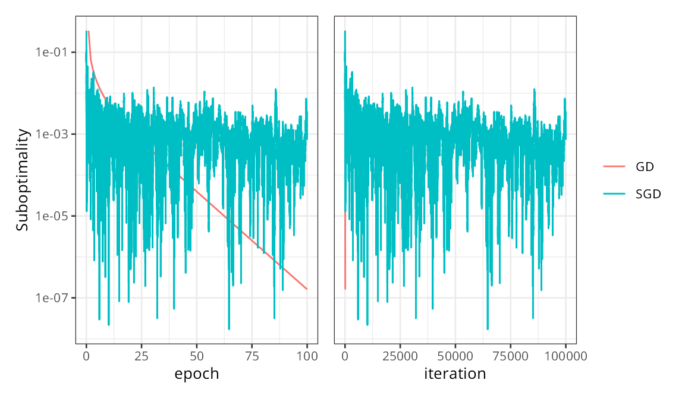

```{r setup, include=FALSE}
knitr::knit_hooks$set(crop = knitr::hook_pdfcrop)

knitr::opts_chunk$set(
  fig.width = 8,
  fig.height = 5,
  fig.retina = 3,
  fig.align = "center",
  cache = TRUE,
  autodep = TRUE,
  dev.args = list(pointsize = 16),
  crop = TRUE
)

library(animate)
library(tidyverse)
library(patchwork)

xaringanExtra::use_tile_view()

set.seed(1422)

theme_set(theme_bw(base_size = 18))
```

## Today

### Stochastic Gradient Descent

Useful stochastic method for optimization

--

Can be used in a **mini-batch** version.

---

## Minimizing Sums

Many of the functions we are trying to minimize are of the form
$$\frac{1}{n} \sum_{i=1}^n f_i(x).$$

--

.pull-left[
### Gradient Descent

Since $\nabla \left(\sum_{i=1}^n f_i(x)\right) = \sum_{i=1}^n \nabla f_i(x)$, GD
steps are
$$x_{k+1} = x_k - \gamma \sum_{i=1}^n \nabla f_i(x_k).$$
]

--

.pull-right[
### Stochastic Gradient Descent

SGD instead takes steps
$$x_{k+1} = x_k - \gamma \nabla f_{i}(x_k)$$
where $i$ is an index in $\{1, \ldots, n\}$ drawn at random.
]

---

## Unbiasedness

If $i$ is drawn uniformly at random from $\{1, \ldots, n\}$ then
$$\operatorname{E}(\nabla f_i(x)) = \nabla f(x).$$

So SGD gradients are **unbiased** estimates of the full gradient.

--

## Motivation

Why consider SGD?

- Iteration cost is lower: $O(p)$ vs. $O(np)$.
--

- Can be more robust to local minima.

---

### Example: Logistic Regression

.pull-left[
We have
$$f_i(\beta) = \log(1 + e^{-y_i x^T_i \beta})$$
and
$$\nabla f_i(\beta) = - \frac{y_i x_i}{1 + e^{y_i x^T_i \beta}}.$$

SGD typically converges quickly at the start but slows down as it approaches the minimum.
]

.pull-right[
```{r svg-gd-image, echo = FALSE, fig.cap = "GD vs SGD for a logistic regression problem"}
knitr::include_graphics("images/lecture12-gd-vs-sgd.png")
```
]

---

```{r gd-sgd-conv1, echo = FALSE, fig.cap = "Convergence for GD and SGD for a particular choice of learning rate."}

```

---

```{r gd-sgd-conv2, echo = FALSE, fig.cap = "Convergence for GD and SGD for another (equally valid) learning rate choice."}

```

---

## The Robbins–Monro Convergence Theorem

Suppose $f$ is strongly convex and
$$\operatorname{E}(\rVert \nabla f(x))\lVert_2^2) \leq A + B \lVert x\rVert_2^2$$
for some constants $A$ and $B$.
If $x^*$ is the global minimizer of $f$ then $x_n$ converges almost surely
toward $x^*$ if
\begin{equation*}
  \sum_{k=1}^{\infty} \gamma_k^2 < \infty \quad \text{and} \quad
  \sum_{k=1}^{\infty} \gamma_k = \infty.
\end{equation*}

--

The theorem applies to learning rates satisfying
$$\gamma_k \propto \frac{1}{k}.$$

---

### Diminishing Step Sizes

Assume cyclic rule and set $\gamma_k = \gamma$ for $n$ updates. We get
$$x_{k + n} = x_k - \gamma \sum_{i=1}^n \nabla f_i(x_{k + i - 1}).$$

--

Meanwhile, **full** gradient descent with step size $n\gamma$ would give
$$x_{k + 1} = x_k - \gamma \sum_{i=1}^n \nabla f_i(x_k).$$

--

Difference between the two is
$$\gamma \sum_{i=1}^n \left( \nabla f_i(x_{k + i - 1}) - \nabla f_i(x_k) \right)$$
which does not tend to zero if $\gamma$ is constant.

---

### Convergence Rates

#### Gradient Descent

For convex $f$, GD with diminishing step sizes converges at rate
$$f(x_n) - f^* = O(1/\sqrt{k}).$$

--

When $f$ is differentiable with Lipschitz gradient, we get
$$f(x_n) - f^* = O(1/k).$$

--

#### SGD

For convex $f$ with diminishing step sizes, SGD converges at rate
$$\operatorname{E}f(x_n) - f^* = O(1/\sqrt{k}).$$

--

But this **does not improve** when $f$ is differentiable with Lipschitz gradient.

---

### Rates for Strongly Convex Functions

When $f$ is strongly convex and has Lipschitz gradient, GD satisfies
$$f(x_n) - f^* = O(\delta^k), \qquad \delta \in (0, 1).$$

--

Under same conditions, SGD gives us
$$\operatorname{E}(f(x_n) - f^*) = O(1/k).$$

--

So SGD does **not** enjoy linear convergence rates under strong convexity.

---

## (Mini-)Batch Gradient Descent

Idea: take (mini-)batch $A_k$ of size $b$ of the data and iterate through
$$x_{k+1} = x_k - \frac{\gamma}{b} \sum_{i \in A_k} \nabla f_i(x_k).$$

--

Estimates are still unbiased,
$$\operatorname{E}\frac{1}{b}\sum_{i \in A_k}\nabla f_i(x) = \nabla f(x),$$
but variance is reduced by a factor of $1/b$.

--

Under Lipschitz gradient, rate goes from $O(1/\sqrt{k})$ to $O(1/\sqrt{bk} + 1/k)^3$.

--

Typically more efficient than standard SGD for various
computational reasons, but somewhat **less** robust to local minima.

---

```{r batch-sgd-conv, echo = FALSE, fig.cap = "Impact of batch size"}

```

---

## So, Why Use SGD?

- If $n \gg p$, then we can pick a batch size that is reasonably accurate but
  still much smaller than $n$.
--

- In many applications (e.g. deep learning), we don't care about optimizing
  to high accuracy.
--

- Stochastic gradients help us escape local minima.
--

---

## Learning Rate

The learning rate $\gamma$ is crucial for SGD, but hard to set.

Convergence theorem does not give much of a hint.

--

### A Class of Decay Schedules

$$\gamma_k = \frac{\gamma_0 K}{K + k^a} = \frac{\gamma_0 }{1 + K^{-1} k^{a}}$$
with initial learning rate $\gamma_0 > 0$ and constants $K, a > 0$.

--

Convergence is ensured by Robbins–Monro if $a \in (0.5, 1]$.

--

Fixing the exponent $a$ and picking a target rate, $\gamma_1$, to be reached
after $k_1$ steps, we can solve for $K$ and get
$$K = \frac{k_1^a \gamma_1}{\gamma_0 - \gamma_1}.$$


---

class: middle

```{r decay, cache = TRUE, echo = FALSE}
decay_scheduler <- function(gamma0 = 1, a = 1, K = 1, gamma1, n1) {
  force(a)

  if (!missing(gamma1) && !missing(n1)) {
    K <- n1^a * gamma1 /
      (gamma0 - gamma1)
  }

  b <- gamma0 * K

  function(n) b / (K + n^a)
}
```

```{r decay-fig, echo=FALSE, dependson="decay", fig.height=5, fig.width=11, fig.cap="Examples of learning rate schedules."}
grid_par <- expand.grid(
  n = seq(0, 1000, 2),
  K = c(25, 50, 100),
  a = c(0.6, 1),
  gamma0 = 1
)

grid_par <- dplyr::mutate(grid_par, rate = gamma0 * K / (K + n^a))

p1 <- ggplot(grid_par, aes(n, rate, color = factor(K), linetype = factor(a))) +
  geom_line() +
  scale_color_discrete("K") +
  scale_linetype_discrete("a") +
  guides(color = guide_legend(order = 1), linetype = guide_legend(order = 2))

grid_par <- expand.grid(
  n = seq(0, 1000, 2),
  K = c(1e4, 1e5, 1e6),
  a = c(2, 2.5),
  gamma0 = 1
)

grid_par <- dplyr::mutate(grid_par, rate = gamma0 * K / (K + n^a))

p2 <- ggplot(grid_par, aes(n, rate, color = factor(K), linetype = factor(a))) +
  geom_line() +
  scale_color_discrete("K", labels = c(quote(10^4), quote(10^5), quote(10^6))) +
  scale_linetype_discrete("a") +
  guides(color = guide_legend(order = 1), linetype = guide_legend(order = 2))

p1 + p2 + plot_layout(axes = "collect_y")
```


---


### So, Is The Problem of Setting Learning Rate Solved?

No, unfortunately not

--

.pull-left[

```{r stepsize-short, echo = FALSE, fig.cap ="Too fast decay (a = 1)"}

```
]

--

.pull-right[
```{r stepsize-long, echo = FALSE, fig.cap = "Too slow decay (a = 0.5)"}

```
]

---

## Example: Least Squares Loss

Consider an objective of the type
$$f(\beta) = \frac{1}{2n} \sum_{i=1}^n  (y_i - \mu(x_i, \beta))^2.$$

--

Gives us gradient

$$\nabla f_i(\beta) = -\nabla_{\beta} \mu(x_i, \beta) (y_i - \mu(x_i, \beta) ).$$

--

For a linear model, $\mu(x_i, \beta) = x_i^T \beta$, and $\nabla_{\beta} \mu(x_i, \beta) = x_i$
so
$$\nabla f_i(\beta) = - x_i (y_i - x_i^T \beta).$$

---

### A Poisson Regression Model

$$Y_i \mid Z_i = z_i \sim \mathrm{Poisson(e^{\beta_0 + \beta_1 z_i})}$$
for $\beta = (\beta_0, \beta_1)^T$ and
$Z_i$ uniformly distributed in $(-1, 1)$.

--

The conditional mean of $Y_i$ given $Z_i = z_i$ is thus
$$\mu(z_i, \beta) = e^{\beta_0 + \beta_1 z_i}.$$

---

### Least Squares for the Poisson Model

```{r online-poisson-SG-SE0, echo=-1, cache = TRUE}
set.seed(13102020)
n <- 5000
beta_true <- c(2, 3)
mu <- function(z, beta) exp(beta[1] + beta[2] * z)
beta <- vector("list", n)
```

--

```{r online-poisson-SG-SE1}
rate <- decay_scheduler(gamma0 = 0.0004, K = 100)
beta[[1]] <- c(beta0 = 1, beta1 = 1)
```
--

```{r online-poisson-SG-SE, cache = TRUE}
for (i in 2:n) {
  # Simulating a new data point
  z <- runif(1, -1, 1)
  y <- rpois(1, mu(z, beta_true))
  # Update via squared error gradient
  mu_old <- mu(z, beta[[i - 1]])
  beta[[i]] <- beta[[i - 1]] - rate(i) * mu_old * (mu_old - y) * c(1, z)
}
beta[[n]] # Compare this to beta_true
```


---

### Log-Likelihood Loss

```{r online-poisson-SG-LL0, echo=-c(1, 2), dependson="online-poisson-SG-SE", cache = TRUE}
set.seed(13102020)
beta_se <- cbind(
  as.data.frame(do.call(rbind, beta)),
  data.frame(iteration = 1:n, loss = "squared error")
)

rate <- decay_scheduler(gamma0 = 0.01, K = 100)
beta[[1]] <- c(beta0 = 1, beta1 = 1)
```

--

```{r online-poisson-SG-LL, dependson=c("online-poisson-SG-SE", "online-poisson-SG-LL0"), cache = TRUE}
for (i in 2:n) {
  # Simulating a new data point
  z <- runif(1, -1, 1)
  y <- rpois(1, mu(z, beta_true))
  # Update via log-likelihood gradient
  mu_old <- mu(z, beta[[i - 1]])
  beta[[i]] <- beta[[i - 1]] - rate(i) * (mu_old - y) * c(1, z)
}
beta[[n]] # Compare this to beta_true
```

---

class: middle

```{r pois-sgd, echo=FALSE, dependson="online_poisson_SG", warning=FALSE, fig.height=6, fig.width=11, fig.cap = "Convergence for Poisson regression model."}
beta_all <- rbind(
  cbind(
    as.data.frame(do.call(rbind, beta)),
    data.frame(iteration = 1:n, loss = "log-likelihood")
  ),
  beta_se
) |>
  tidyr::pivot_longer(cols = c("beta0", "beta1"), names_to = "Parameter") |>
  dplyr::filter(iteration %% 50 == 0)

ggplot(beta_all, aes(iteration, value, color = Parameter)) +
  geom_hline(yintercept = beta_true[1], color = "blue") +
  geom_hline(yintercept = beta_true[2], color = "red") +
  geom_point(alpha = 0.5, shape = 16, size = 2) +
  ylim(c(1.75, 3.25)) +
  ylab("Parameter value") +
  xlab("Number of data points") +
  facet_wrap("loss") +
  scale_color_manual(values = c("blue", "red"))
```

---

## Exercise

- Implement an SGD algorithm to fit standard least-squares
  regression, i.e. minimize $$\frac{1}{2n} \lVert y - X\beta\rVert_2^2.$$
--

- Run the algorithm on a simple linear regression problem in two dimensions.
--

- **mvtnorm::rmvnorm()** to generate $X$ from a multivariate Gaussian distribution,
  specifying some non-diagonal covariance structure.
--

- Try to visualize both the convergence of the algorithm and the path it takes in the parameter space. For the latter, try something
  like the following:

```{r exercise-hint, eval = FALSE}
beta1 <- seq(-1, 3, length = 100)
beta2 <- seq(-1, 3, length = 100)
loss_2d_vectorized <- Vectorize(function(b1, b2) loss_2d(b1, b2, X, y))
z <- outer(beta1, beta2, loss_2d_vectorized)

contour(beta1, beta2, z)
```

---

## Implementation

```{r SG, cache = TRUE}
sgd <- function(
    par,
    grad, # Function of parameter and observation index
    n, # Sample size
    gamma, # Decay schedule or a fixed learning rate
    maxiter = 100, # Max epoch iterations
    sampler = sample, # How data is resampled. Default is a random permutation #<<
    cb = NULL,
    ...) {
  gamma <- if (is.function(gamma)) gamma(1:maxiter) else rep(gamma, maxiter)
  for (k in 1:maxiter) {
    if (!is.null(cb)) cb()
    samp <- sampler(n)
    for (j in 1:n) {
      i <- samp[j]
      par <- par - gamma[k] * grad(par, i, ...)
    }
  }
  par
}
```

---

## Poisson Regression Model, Batch Learning

```{r pois-gradient, dependson="SG", echo=-1, cache = TRUE}
set.seed(17102020)
n <- 50 # Small sample size #<<
z <- runif(n, -1, 1)
y <- rpois(n, mu(z, beta_true))
grad_pois <- function(par, i) (mu(z[i], par) - y[i]) * c(1, z[i])
```

--

```{r batch-poisson-SG, dependson="pois-gradient"}
library(CSwR)
pois_SG_tracer <- tracer("par", Delta = 0)
rate <- decay_scheduler(gamma0 = 0.02, gamma1 = 0.001, n1 = 1000)
sgd(c(0, 0), grad_pois, n, rate, 1000, cb = pois_SG_tracer$tracer)
```

--

### Test

```{r pois-beta-hat, dependson="pois-gradient", echo=1}
beta_hat <- coefficients(glm(y ~ z, family = poisson))
cat("beta_hat:", beta_hat)
```

---

## Poisson Regression Model, Batch Learning

```{r batch-poisson-SG-2, dependson="pois-gradient", echo=-1, cache = TRUE}
set.seed(17102020)
n <- 500 # Larger sample size #<<
z <- runif(n, -1, 1)
y <- rpois(n, mu(z, beta_true))
pois_SG_tracer_2 <- tracer("par", Delta = 0)
rate <- decay_scheduler(gamma0 = 0.02, gamma1 = 0.001, n1 = 100)
sgd(c(0, 0), grad_pois, n = n, gamma = rate, cb = pois_SG_tracer_2$tracer)
```

--

### Test

```{r pois-beta-hat-2, dependson="batch-poisson-SG-2", echo=1}
beta_hat_2 <- coefficients(glm(y ~ z, family = poisson))
cat("beta_hat_2:", beta_hat_2)
```
---

class: middle

```{r batch-pois-sgd-fig, echo=FALSE, dependson="online_poisson_SG", warning=FALSE, fig.height=6, fig.width=10, fig.cap = "Convergence for the Poisson regression problem using different batch sizes."}
hline_data <- data.frame(
  beta0 = c(beta_hat[1], beta_hat_2[1]),
  beta1 = c(beta_hat[2], beta_hat_2[2]),
  n = c("n = 50", "n = 500")
)

dplyr::bind_rows(
  small = summary(pois_SG_tracer)[seq(10, 1000, 10), ],
  large = summary(pois_SG_tracer_2),
  .id = "n"
) %>%
  dplyr::mutate(n = ifelse(n == "small", "n = 50", "n = 500"), it = rep(5 * seq(10, 1000, 10), 2)) %>%
  dplyr::rename(beta0 = par.1, beta1 = par.2) %>%
  tidyr::pivot_longer(cols = c("beta0", "beta1"), names_to = "Parameter") %>%
  ggplot(aes(it, value, color = Parameter)) +
  geom_hline(data = hline_data, aes(yintercept = beta0), color = "blue") +
  geom_hline(data = hline_data, aes(yintercept = beta1), color = "red") +
  geom_hline(yintercept = beta_true[1], linetype = 2, alpha = 0.5) +
  geom_hline(yintercept = beta_true[2], linetype = 2, alpha = 0.5) +
  geom_point(alpha = 0.5, shape = 16, size = 2) +
  ylim(c(1.5, 3.5)) +
  ylab("Parameter value") +
  facet_wrap("n") +
  scale_color_manual(values = c("blue", "red"))
```

---

## A Linear Model

```{r ls-model, cache = TRUE}
ls_model <- function(X, y) {
  n <- length(y)
  X <- unname(X) # Strips X of names
  list(
    # Initial parameter value
    par0 = rep(0, ncol(X)),
    # Objective function
    f = function(beta) {
      norm(y - X %*% beta, "2")^2 / (2 * n)
    },
    # Gradient in a single observation
    grad = function(beta, i) {
      xi <- X[i, ]
      xi * drop(xi %*% beta - y[i])
    }
  )
}
```


---

### Data Example

```{r news-data, message=FALSE, cache = TRUE}
news <- readr::read_csv("data/OnlineNewsPopularity.csv")
dim(news)
```

--

```{r news-X-y, dependson="news-data", cache = TRUE}
news <- dplyr::select(
  news,
  -url,
  -timedelta,
  -is_weekend,
  -n_non_stop_words,
  -n_non_stop_unique_tokens,
  -self_reference_max_shares,
  -kw_min_max
)
# The model matrix without an explicit intercept is constructed using
# all variables remaining in the data set but the target variable 'shares'
X <- model.matrix(shares ~ . - 1, data = news)
y <- log(news$shares)
```

---

### Implementation

```{r LS-model, dependson=c("ls-model", "news-X-y")}
X_raw <- X
# Standardization
X <- scale(X, center = FALSE)
library(zeallot)
# The '%<-%' unpacking operator is from the zeallot package
c(par0, f, grad_obs) %<-% ls_model(X, y)
```

--

For the linear model it's straightforward to compute the solution

```{r lm-News, dependson="news-X-y"}
system.time(lm_news <- lm.fit(X, y))
par_hat <- coefficients(lm_news)
```


---

### Objective and Gradient Values

```{r}
f(par_hat)
```

--
```{r}
range(grad_obs(rep(0, ncol(X)), 100))
range(grad_obs(par_hat, 100))
```

---

### Running the SGD Algorithm

```{r SG-tracer, cache = TRUE, results = "hide"}
sgd_tracer <- tracer("value", expr = quote(value <- f(par)), Delta = 0)
sgd(
  par0,
  grad = grad_obs,
  n = nrow(X),
  gamma = 1e-5,
  maxiter = 50,
  cb = sgd_tracer$tracer
)
sgd_trace_low <- summary(sgd_tracer)
```

--

.pull-left[
```{r SG-tracer-sum, dependson="SG-tracer"}
tail(sgd_trace_low)
```
]

--

.pull-right[
```{r SG-tracer-parhat, dependson="SG-tracer"}
f(par_hat)
```
]

---

### Three Additional Variants

```{r GD, echo = FALSE}
gd <- function(
    par,
    f,
    gr,
    d = 0.8,
    c = 0.1,
    gamma0 = 0.01,
    epsilon = 1e-4,
    maxiter = 1000,
    cb = NULL) {
  gamma <- gamma0
  for (i in 1:maxiter) {
    value <- f(par)
    grad <- gr(par)
    h_prime <- sum(grad^2)
    if (!is.null(cb)) cb()
    # Convergence criterion based on gradient norm
    if (h_prime <= epsilon) break
    # Proposed descent step
    par1 <- par - gamma * grad
    # Backtracking while descent is insufficient
    while (f(par1) > value - c * gamma * h_prime) {
      gamma <- d * gamma
      par1 <- par - gamma * grad
    }
    par <- par1
  }
  if (i == maxiter) {
    warning("Maximal number, ", maxiter, ", of iterations reached")
  }
  par
}
```

#### Fixed but higher learning rate

```{r SG-tracer-2, results="hide"}
sgd_tracer$clear()
sgd(par0, grad_obs, n = nrow(X), gamma = 5e-5, maxiter = 50, cb = sgd_tracer$tracer)
sgd_trace_high <- summary(sgd_tracer)
```

--

#### Decay Schedule

```{r SG-tracer-3, results="hide"}
sgd_tracer$clear()
rate <- decay_scheduler(gamma0 = 1e-3, gamma1 = 1e-5, a = 0.6, n1 = 50)
sgd(par0, grad_obs, n = nrow(X), gamma = rate, maxiter = 50, cb = sgd_tracer$tracer)
sgd_trace_decay <- summary(sgd_tracer)
```
--

#### Full-Batch Gradient Descent with Line Search

```{r News-GD, warning=FALSE, results='hide', dependson="GD"}
grad_f <- function(beta) crossprod(X, X %*% beta - y) / nrow(X)
gd_tracer <- tracer("value", Delta = 10)
gd(par0, f, grad_f, gamma = 1, maxiter = 800, cb = gd_tracer$tracer)
gd_trace <- summary(gd_tracer)
```

---

class: middle

```{r news-trace-plot, echo=FALSE, dependson=c("News-GD", "SG-tracer-2", "SG-tracer-sum"), fig.width=10, fig.height=6, fig.cap = "A comparison of the four algorithms"}
dplyr::bind_rows(
  low = sgd_trace_low,
  high = sgd_trace_high,
  decay = sgd_trace_decay,
  gd = gd_trace[seq(1, 800, 20), ],
  .id = "Algorithm"
) |>
  dplyr::filter(.time < 10) |>
  autoplot(y = value - f(par_hat)) +
  aes(color = Algorithm, shape = Algorithm) +
  geom_line() +
  scale_color_brewer(
    limits = c("low", "high", "decay", "gd", "mini", "moment", "adam", "adam_decay"),
    breaks = c("low", "high", "decay", "gd"),
    type = "qual", palette = 2
  ) +
  scale_shape_manual(
    limits = c("low", "high", "decay", "gd", "mini", "moment", "adam", "adam_decay"),
    breaks = c("low", "high", "decay", "gd"),
    values = c(0, 1, 2, 5, 15, 16, 17, 19)
  )
```

---

## Exercise

Recall that our learning rate schedule is
$$\gamma_k = \frac{\gamma_0 K}{K + k^a}$$
with initial learning rate $\gamma_0 > 0$ and constants $K, a > 0$, with convergence
ensured if $a \in (0.5, 1]$.

--

### Steps

- Take your SGD algorithm and implement the
  learning rate scheduler that we introduced previously.
--

- Run the algorithm on the same simple linear regression
  problem in two dimensions.
--

- Experiment with different values of $K$ and $a$.


---

## Summary

- Stochastic gradient descent is a popular optimization method
  for large-scale optimization
--

- Convergence results are relatively weak, but for many applications this
  does not matter.
--

- In practice, most implementations use mini-batches.

--

## Next Time

- How to improve SGD using momentum and adaptive learning rates
--

- Use Rcpp to improve performance of our SGD algorithms

