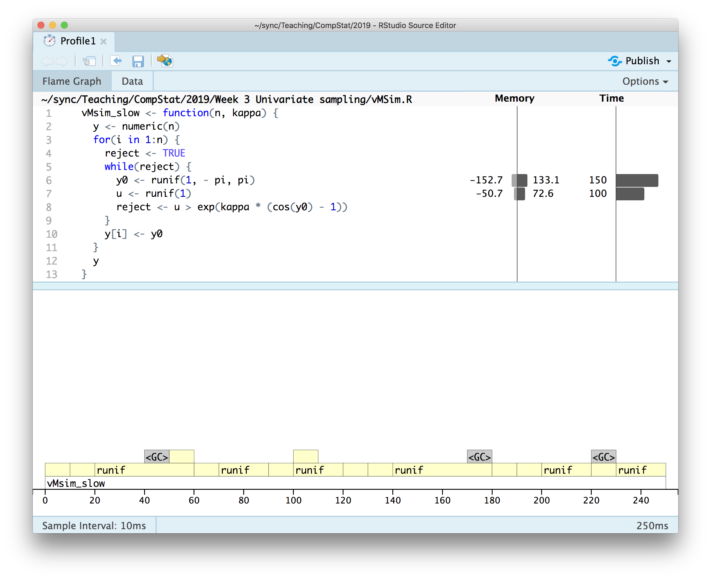

```{r setup, include=FALSE}
knitr::knit_hooks$set(crop = knitr::hook_pdfcrop)

knitr::opts_chunk$set(
  fig.width = 8,
  fig.height = 5,
  fig.retina = 3,
  fig.align = "center",
  cache = FALSE,
  autodep = TRUE,
  dev.args = list(pointsize = 16),
  crop = TRUE
)

library(tidyverse)

source("R/vMSim.R", keep.source = TRUE)

theme_set(theme_grey(base_size = 16))
```

## Questions 

### Rule of Thumb Bandwidth for Non-Gaussian Kernels

- Depends on kernel $K$ and reference distribution $\tilde{f}$ (plugin for $f$).
- R's `density()` uses Silverman's rule of thumb and adapt to kernel but not reference distribution.

--

### Alternative Loss Functions for Smoothing Splines

- Definitely several alternatives
- L1 loss for data-fitting term exists.
- Not sure about L1 loss on penalty term. Should work but not 
  sure what the optimal spline would look like.

---

## Today

### Pseudo-Random Numbers


### Rejection Sampling

---

## Random Numbers

Matter of debate whether true random numbers exist.

### Pseudo-Random Numbers

- Computers usually generate pseudo-random numbers
- Not really random, but have properties that make them appear to be so
- A research field in itself, see `?RNG` in R for available algorithms

--

### Mersenne Twister

- Default in R
- Generates integers in the range $$\{0, 1, \ldots, 2^{32} -1\}.$$
- Long period; all combinations of consecutive integers up to dimension 623
  occur equally often in a period.

--

Pseudo-random numbers in $(0, 1)$ are returned by `runif()` by division with 
$2^{32}$ and a fix to prevent the algorithm from returning 0. 

---

## Transformation Methods 

If $T : \mathcal{Z} \to \mathbb{R}$ is a map and $Z \in \mathcal{Z}$ is a random 
variable we can sample, then we can sample $X = T(Z).$
--

**Classical example:** If $F^{\leftarrow} : (0,1) \mapsto \mathbb{R}$
is the (generalized) inverse of a distribution function and $U$ is uniformly distributed 
on $(0, 1)$ then  
$$F^{\leftarrow}(U)$$
has distribution function $F$. 

---

## Gaussian Random Variables

### [Box-Muller](https://en.wikipedia.org/wiki/Box%E2%80%93Muller_transform)

A transformation of two independent uniforms into two independent Gaussian random
variables (polar coordinates).

--

### [Inversion](https://en.wikipedia.org/wiki/Inverse_transform_sampling)

$X = \Phi^{-1}(U)$ where $\Phi$ is the distribution function for the Gaussian distribution.

--

### [Rejection Sampling](https://cswr.nrhstat.org/4-3-reject-samp.html)

See [Exercise 5.1 in CSwR](https://cswr.nrhstat.org/random-number-generation#univariate:ex) or the
[Ziggurat algorithm](https://en.wikipedia.org/wiki/Ziggurat_algorithm).

--

```{r rng-kind}
RNGkind()
```

---

## How Can $\Phi^{-1}$ be Computed?

Recall that 
$$\Phi(x) = \frac{1}{\sqrt{2 \pi}} \int_{-\infty}^x e^{-z^2/2} \mathrm{d} z$$

--

This is [how R](https://github.com/wch/r-source/blob/af7f52f70101960861e5d995d3a4bec010bc89e6/src/nmath/snorm.c#L265) generates samples from $\mathcal{N}(0,1)$, with this 
[technical approximation](https://github.com/wch/r-source/blob/af7f52f70101960861e5d995d3a4bec010bc89e6/src/nmath/qnorm.c#L52) of $\Phi^{-1}$. 

--

The technical approximation is a rational function.

---

## Sampling From a $t$-Distribution 

Let $Z = (Y, W) \in \mathbb{R} \times (0, \infty)$ with $Z \sim \mathcal{N}(0, 1)$ and 
$W \sim \chi^2_k$ independent. 

--

Define $T : \mathbb{R} \times (0, \infty) \to \mathbb{R}$ by 
$$T(z,w) = \frac{z}{\sqrt{w/k}},$$
then
$$X = T(Z, W) = \frac{Z}{\sqrt{W/k}} \sim t_k.$$
--

This is how R simulates from a $t$-distribution with $W$ generated from a Gamma distribution 
with shape parameter $k / 2$ and scale parameter $2$.

???

Derive some example of the inversion sampling scheme.


---

## Exercise


### Step 1

Use that 
$$W = X_1^2 + \ldots + X_k^2 \sim  \chi^2_k$$
for $X_1, \ldots, X_k$ i.i.d. $\mathcal{N}(0, 1)$ to implement a function, 
`rchisq2()`, such that `rchisq2(n, k)` returns a
sample of $n$ i.i.d. observations from $\chi^2_k$.

--

### Step 2

Use profiling to optimize your implementation. Use benchmarking to compare two
different implementations.

You can compare to or start with this (unoptimized) [reference implementation](rchisq.R).

[Solution](rchisq_test.R).

---

## Von Mises Distribution

The density on $(-\pi, \pi]$ is

$$f(x) = \frac{1}{2 \pi I_0(\kappa)} \ e^{\kappa \cos(x - \mu)}$$

for $\kappa > 0$ and $\mu \in (-\pi, \pi]$ parameters and $I_0$ is 
a modified Bessel function.

--

```{r vMsim}
library(movMF)
xy <- rmovMF(500, 0.5 * c(cos(-1.5), sin(-1.5)))

# rmovMF represents samples as elements on the unit circle
x <- acos(xy[, 1]) * sign(xy[, 2])
```


---

class: middle

```{r vMhist, fig.height = 7, echo = FALSE, fig.cap = "Histogram of samples from rmovMF()", fig.width = 11}
hist(x, breaks = seq(-pi, pi, length.out = 15), prob = TRUE, main = NULL, )
rug(x)
density(x, bw = "SJ", cut = 0) |> lines(col = "dark orange", lwd = 2)
curve(
  exp(0.5 * cos(x + 1.5)) / (2 * pi * besselI(0.5, 0)),
  -pi,
  pi,
  col = "blue",
  lwd = 2,
  add = TRUE
)
legend(
  "topright",
  legend = c(expression(f(x)), "SJ kernel density estimate"),
  col = c("blue", "dark orange"),
  lwd = 2
)
```

---

class: center, middle

# Rejection Sampling

---

## Rejection Sampling

Let $Y_1, Y_2, \ldots$ be i.i.d. with density $g$ on $\mathbb{R}$ and $U_1, U_2, \ldots$ 
be i.i.d. uniform and independent of the $Y_i$-s. Define
$$\sigma = \inf\{n \geq 1 \mid U_n \leq \alpha f(Y_n) / g(Y_n)\},$$
for $\alpha \in (0, 1]$ and $f$ a density. 
--


**Theorem:** If $\alpha f(y) \leq g(y)$ for all $y \in \mathbb{R}$ then the 
distribution of $Y_{\sigma}$ has density $f$. 

---
## Normalizing constants

If $f(y) = c q(y)$ and $g(y) = d p(y)$ for (unknown) normalizing constants 
$c, d > 0$ and $\alpha' q \leq p$ then <br> <br>
$$\underbrace{\left(\frac{\alpha' d}{c}\right)}_{= \alpha} \ f \leq g.$$
--


Moreover, 
$$u > \frac{\alpha f(y)}{g(y)} \Leftrightarrow u > \frac{\alpha' q(y)}{p(y)},$$
and rejection sampling can be implemented without computing $c$ or $d$. 

---
## von Mises rejection sampling

Rejection sampling using the uniform proposal, $g(y) \propto 1$

--

Since
$$e^{\kappa(\cos(y) - 1)} = \alpha' e^{\kappa \cos(y)} \leq 1,$$
where $\alpha' = \exp(-\kappa)$ we reject if 
$$U > e^{\kappa(\cos(Y) - 1)}.$$

---
## Von Mises rejection sampling

```{r vM-rejection}
vMsim_slow <- function(n, kappa) {
  y <- numeric(n)

  for (i in 1:n) {
    reject <- TRUE

    while (reject) {
      y0 <- runif(1, -pi, pi)
      u <- runif(1)
      reject <- u > exp(kappa * (cos(y0) - 1))
    }

    y[i] <- y0
  }
  y
}
```

---

## Von Mises Rejection Sampling

```{r vMsim2}
f <- function(x, k) exp(k * cos(x)) / (2 * pi * besselI(k, 0))
x <- vMsim_slow(100000, 0.5)
x <- vMsim_slow(100000, 2)
```

```{r vMsim2-figs, fig.show='hold', echo = FALSE}
hist(x, breaks = seq(-pi, pi, length.out = 20), prob = TRUE)
curve(f(x, 0.5), -pi, pi, col = "blue", lwd = 2, add = TRUE)
hist(x, breaks = seq(-pi, pi, length.out = 20), prob = TRUE)
curve(f(x, 2), -pi, pi, col = "blue", lwd = 2, add = TRUE)
```

---

```{r profile-vsim}
source("R/vMSim.R")
# profvis::profvis(vMsim_slow(10000, 5))
```

```{r profvis-vMsim-image, out.width="70%", echo=FALSE} 

```

---

## Summary

- Calling random number generators in R sequentially is relatively slow. 
--

- It is faster to generate all random numbers once and store them in a vector. 
--

- How to do that for rejection sampling with an unknown number of rejections?
--

---

## Von Mises Rejection Sampling

* $Y \sim \mathrm{unif}(-\pi, \pi)$  (proposal)

* $U \sim \mathrm{unif}(0, 1)$

* Accept if $U \leq e^{\kappa(\cos(Y) - 1)}$

---

## Vectorized von Mises simulation

```{r vM-rejection-vec}
vMsim_vec_ran <- function(m, kappa) {
  y <- runif(m, -pi, pi)
  u <- runif(m)
  accept <- u <= exp(kappa * (cos(y) - 1))
  y[accept]
}
```

--

- Simple and performant expression
- But returns **random** number of samples

--

In fact, we can write a generic function factory that can convert any generator
of a random size output into a generator of a fixed size output.

---

## Vectorization Function Factory

```{r vM-rejection-fast}
vec_sim <- function(generator) {
  alpha <- 1
  function(n, ...) {
    y <- list()
    j <- 1
    l <- 0 # Number of accepted samples
    while (l < n) {
      m <- ceiling((n - l) / alpha)
      y[[j]] <- generator(m, ...) #<<
      l <- l + length(y[[j]])
      if (j == 1) {
        alpha <<- (l + 1) / (m + 1) # Estimate of alpha #<<
      }
      j <- j + 1
    }
    unlist(y)[1:n]
  }
}
```
--

```{r}
vMsim_vec <- vec_sim(vMsim_vec_ran)
```

---

## Profiling

```{r, eval=FALSE}
# profvis(vMsim_vec_ran(5000000, 5))
```

```{r profvis-vMsim-image2, out.width="50%", echo=FALSE}

```

---

## Profiling

```{r, eval=FALSE}
# profvis(vMsim_vec(1000000, 5))
```

```{r profvis-vMsim-image3, out.width="50%", echo=FALSE}

```
---

## Gamma Distribution

Can we find a suitable envelope? 

--

Perhaps, but here rejection sampling of a non-standard distribution will 
be used in combination with a simple transformation. 

--

Let $t(y) = a(1 + by)^3$ for $y \in (-b^{-1}, \infty)$, then $t(Y) \sim \Gamma(r,1)$ if
$Y$ has density 
$$f(y) \propto t(y)^{r-1}t'(y) e^{-t(y)} = e^{(r-1)\log t(y) + \log t'(y) - t(y)}.$$

[Proof: Use univariate density transformation theorem.]
--

The density $f$ will be the *target density* for a rejection sampler. 

---

## Gamma Distribution

With
$$f(y) \propto e^{(r-1)\log t(y) + \log t'(y) - t(y)},$$
$a = r - 1/3$ and $b = 1/(3 \sqrt{a})$ 
$$f(y) \propto e^{a \log t(y)/a - t(y) + a \log a} \propto \underbrace{e^{a \log t(y)/a - t(y) + a}}_{q(y)}.$$
--

An analysis of $w(y) := - y^2/2 - \log q(y)$ shows that it is convex on $(-b^{-1}, \infty)$ 
and it attains its minimum in 0 with $w(0) = 0$, whence 
$$q(y) \leq e^{-y^2/2}.$$

---

## Gamma Rejection Sampling

* $Y \sim \mathcal{N}(0,1)$  (proposal)

* $U \sim \mathrm{unif}(0, 1)$

* Accept if $U \leq q(Y) e^{Y^2/2}$

* If accept, return $t(Y)$

---

## Gamma Distribution Implementation

```{r}
# r >= 1
tfun <- function(y, a) {
  b <- 1 / (3 * sqrt(a))
  (y > -1 / b) * a * (1 + b * y)^3 # 0 when y <= -1/b
}
```

```{r}
qfun <- function(y, r) {
  a <- r - 1 / 3
  tval <- tfun(y, a)
  exp(a * log(tval / a) - tval + a)
}
```

---

## Gamma Distribution Implementation

```{r}
gammasim_ran <- function(m, r) {
  y <- rnorm(m)
  u <- runif(m)
  accept <- u <= qfun(y, r) * exp(y^2 / 2)
  tfun(y[accept], r - 1 / 3)
}
```
--

```{r}
gammasim_vec <- vec_sim(gammasim_ran)
```

---

## Gamma Distribution Test

```{r}
tmp <- gammasim_vec(10000, 8)
hist(tmp, freq = FALSE)
curve(dgamma(x, 8), col = "blue", lwd = 2, add = TRUE)
```

---

## Gamma Distribution Test

```{r}
tmp <- gammasim_vec(10000, 3)
hist(tmp, freq = FALSE)
curve(dgamma(x, 3), col = "blue", lwd = 2, add = TRUE)
```

```{r, include=FALSE, eval=FALSE, cache = TRUE}
r <- 10
bench::mark(
  gammasim(1000, r),
  gammasim_vec(1000, r),
  rgamma(1000, r),
  check = FALSE
) |> plot()
```

---

## Rejection Probabilities

```{r}
tmp <- gammasim_vec(1e5, 16)
1 - environment(gammasim_vec)$alpha
tmp <- gammasim_vec(1e5, 8)
1 - environment(gammasim_vec)$alpha
tmp <- gammasim_vec(1e5, 4)
1 - environment(gammasim_vec)$alpha
tmp <- gammasim_vec(1e5, 1)
1 - environment(gammasim_vec)$alpha
```

---

## Adaptive Envelopes

When $f$ is *log-concave* on $I$ we can construct bounds of the form 
$$f(x) \leq e^{V(x)}$$
--

where
$$V(x) = \sum_{i=1}^m  (a_i x + b_i) 1_{I_i}(x),$$
for intervals $I_i$ forming a partition of $I$.

--

Typically, $a_i x + b_i$ is tangent to the graph of $\log(f)$ at 
$x_i \in I_i = (z_{i-1}, z_i]$ for 
$$z_0 < x_1 < z_1 < x_2 < \ldots < z_{m-1} < x_m < z_m.$$

---

## Beta Distribution

```{r}
Betasim_ran <- function(m, x1, x2, alpha, beta) {
  lf <- function(x) (alpha - 1) * log(x) + (beta - 1) * log(1 - x)
  lf_deriv <- function(x) (alpha - 1) / x - (beta - 1) / (1 - x)
  a1 <- lf_deriv(x1)
  a2 <- lf_deriv(x2)
  if (a1 == 0 || a2 == 0 || a1 - a2 == 0) {
    stop("\nThe implementation requires a_1 and a_2 different and both different from zero. Choose different values of x_1 and x_2.")
  }
  b1 <- lf(x1) - a1 * x1
  b2 <- lf(x2) - a2 * x2
  z1 <- (b2 - b1) / (a1 - a2)
  Q1 <- exp(b1) * (exp(a1 * z1) - 1) / a1
  c <- Q1 + exp(b2) * (exp(a2 * 1) - exp(a2 * z1)) / a2

  y <- ratio <- numeric(m)
  uy <- c * runif(m)
  u <- runif(m)
  i <- uy < Q1
  y[i] <- z <- log(a1 * exp(-b1) * uy[i] + 1) / a1
  y[!i] <- zz <- log(a2 * exp(-b2) * (uy[!i] - Q1) + exp(a2 * z1)) / a2
  ratio[i] <- exp(lf(z) - a1 * z - b1)
  ratio[!i] <- exp(lf(zz) - a2 * zz - b2)
  accept <- u <= ratio
  y[accept]
}
```

---
## Beta Distribution Test

```{r}
Betasim_vec <- vec_sim(Betasim_ran)
```
--

```{r Beta-fig, out.width="80%", echo=FALSE}
par(mfrow = c(2, 2), mex = 0.7, cex = 0.6, font.main = 1)
envelope <- function(x, x1, x2, alpha, beta) {
  lf <- function(x) (alpha - 1) * log(x) + (beta - 1) * log(1 - x)
  lf_deriv <- function(x) (alpha - 1) / x - (beta - 1) / (1 - x)
  a1 <- lf_deriv(x1)
  a2 <- lf_deriv(x2)
  b1 <- lf(x1) - a1 * x1
  b2 <- lf(x2) - a2 * x2
  z1 <- (b2 - b1) / (a1 - a2)
  ifelse(x < z1, exp(a1 * x + b1), exp(a2 * x + b2))
}

hist(
  Betasim_vec(100000, x1 = 0.3, x2 = 0.7, alpha = 4, beta = 2),
  prob = TRUE,
  main = "",
  ylim = c(0, 3)
)
curve(x^3 * (1 - x) / beta(4, 2), col = "blue", lwd = 2, add = TRUE)
curve(
  envelope(x, x1 = 0.3, x2 = 0.7, alpha = 4, beta = 2) / beta(4, 2),
  col = "red",
  lwd = 2,
  add = TRUE,
  n = 400
)

hist(
  Betasim_vec(100000, x1 = 0.3, x2 = 0.7, alpha = 1.8, beta = 2.4),
  prob = TRUE,
  main = "",
  ylim = c(0, 3)
)
curve(x^0.8 * (1 - x)^1.4 / beta(1.8, 2.4), col = "blue", lwd = 2, add = TRUE)
curve(
  envelope(x, x1 = 0.3, x2 = 0.7, alpha = 1.8, beta = 2.4) / beta(1.8, 2.4),
  col = "red",
  lwd = 2,
  add = TRUE,
  n = 400
)

hist(
  Betasim_vec(100000, x1 = 0.2, x2 = 0.5, alpha = 4, beta = 2),
  prob = TRUE,
  main = "",
  ylim = c(0, 3)
)
curve(x^3 * (1 - x) / beta(4, 2), col = "blue", lwd = 2, add = TRUE)
curve(
  envelope(x, x1 = 0.2, x2 = 0.5, alpha = 4, beta = 2) / beta(4, 2),
  col = "red",
  lwd = 2,
  add = TRUE,
  n = 400
)

hist(
  Betasim_vec(100000, x1 = 0.2, x2 = 0.5, alpha = 1.8, beta = 2.4),
  prob = TRUE,
  main = "",
  ylim = c(0, 3)
)
curve(x^0.8 * (1 - x)^1.4 / beta(1.8, 2.4), col = "blue", lwd = 2, add = TRUE)
curve(
  envelope(x, x1 = 0.2, x2 = 0.5, alpha = 1.8, beta = 2.4) / beta(1.8, 2.4),
  col = "red",
  lwd = 2,
  add = TRUE,
  n = 400
)
```

