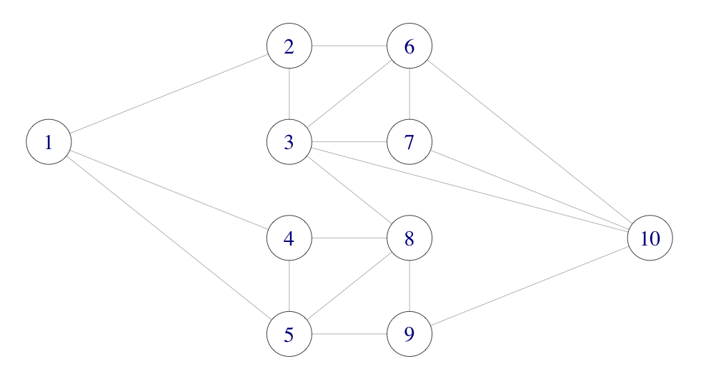

```{r setup, include=FALSE}
knitr::knit_hooks$set(crop = knitr::hook_pdfcrop)

knitr::opts_chunk$set(
  fig.width = 8,
  fig.height = 5,
  fig.retina = 3,
  fig.align = "center",
  cache = FALSE,
  autodep = TRUE,
  dev.args = list(pointsize = 16),
  crop = TRUE
)

library(tidyverse)

old_options <- options(digits = 4)

theme_set(theme_grey(base_size = 16))
```

## Today

---

## Rejection Sampling Recap

Suppose that $f(y) \propto q(y)$ is the *target* density, known up to 
normalization.

--

Suppose that $g(y) \propto p(y)$ is another density, known up to normalization,
that we can simulate from, and suppose

$$\alpha' q \leq p$$

for some $\alpha' > 0$.
--

If $Y$ has density $g$ and $U$ is uniform on $(0,1)$ then the conditional 
distribution
$$Y \mid U \leq \alpha' q(Y) / p(Y)$$
has density $f$. 

---

## Rejection Sampling Recap

To simulate one variable with density $f$, run the following code until 
it returns a value:

--

* Simulate $y$ from $g$
--

* Simulate $u$ from uniform on $(0,1)$
--

* If $u > \alpha' q(y) / p(y)$ return to step one
--

* Else return $y$

--

### Two Challenges

* To find an *envelope*, $p/\alpha'$, of $q$ in the first place
* To find a tight envelope

---

## Monte Carlo Integration

A typical usage of simulation is Monte Carlo integration. 

--

With $X_1, \ldots, X_n$ i.i.d. with density $f$
$$\hat{\mu}_{\textrm{MC}} := \frac{1}{n} \sum_{i=1}^n h(X_i) \rightarrow \mu := \mathbb{E} h(X_1) = \int h(x) f(x) \ dx$$
for $n \to \infty$ by the law of large numbers (LLN).

---

## Monte Carlo Integration

The CLT gives that 
$$\frac{1}{n} \sum_{i=1}^n h(X_i) \overset{\textrm{approx}} \sim 
\mathcal{N}(\mu, \sigma^2_{\textrm{MC}} / n)$$

where 
$$\sigma^2_{\textrm{MC}} = \mathbb{V} h(X_1) = \int (h(x) - \mu)^2 f(x) \ dx.$$

---

## Monte Carlo Integration

We can estimate $\sigma^2_{\textrm{MC}}$ using the empirical variance
$$\hat{\sigma}^2_{\textrm{MC}} = \frac{1}{n - 1} \sum_{i=1}^n (h(X_i) - \hat{\mu}_{\textrm{MC}})^2,$$

then the variance of $\hat{\mu}_{\textrm{MC}}$ is estimated as $\hat{\sigma}^2_{\textrm{MC}} / n$ and a standard 95% 
confidence interval for $\mu$ is 
$$\hat{\mu}_{\textrm{MC}} \pm 1.96 \frac{\hat{\sigma}_{\textrm{MC}}}{\sqrt{n}}.$$

---

## Gamma Example 

```{r gamma-sim, echo=-1}
set.seed(1234)
B <- 1000
x <- rgamma(B, 8) # h(x) = x
mu_hat <- (cumsum(x) / (1:B))
sigma_hat <- sd(x)
mu_hat[B] # Theoretical value 8
sigma_hat # Theoretical value sqrt(8) = 2.8284
```

---

class: middle

```{r gamma-fig1}
p <- ggplot(tibble(x = 1:B, y = mu_hat), aes(x, y)) +
  geom_line() +
  geom_point() +
  coord_cartesian(ylim = c(6, 10))
p
```

---

### Confidence Bands

```{r gamma-fig2, fig.height = 4}
p + geom_ribbon(
  aes(
    ymin = mu_hat - 1.96 * sigma_hat / sqrt(1:B),
    ymax = mu_hat + 1.96 * sigma_hat / sqrt(1:B)
  ),
  fill = "gray"
) + geom_line() + geom_point()
```

---

## Importance Sampling

When we are only interested in Monte Carlo integration, we do not 
need to sample from the target distribution.

--

Observe that 
\begin{aligned}
\mu = \int h(x) f(x) \ dx & = \int h(x) \frac{f(x)}{g(x)} g(x) \ dx \\
& = \int h(x) w^*(x) g(x) \ dx
\end{aligned}
whenever $g$ is a density fulfilling that 
$$g(x) = 0 \Rightarrow f(x) = 0.$$

---

## Importance Sampling

With $X_1, \ldots, X_n$ i.i.d. with density $g$ define the *weights*
$$w^*(X_i) = f(X_i) / g(X_i).$$

The *importance sampling* estimator is
$$\hat{\mu}_{\textrm{IS}}^* := \frac{1}{n} \sum_{i=1}^n h(X_i)w^*(X_i).$$

--

It has mean $\mu$.


---

## Gamma Importance Sampling 

```{r gamma-sim-IS, echo=-1}
set.seed(1234)
B <- 1000
x <- rnorm(B, 10, 3)
w_star <- dgamma(x, 8) / dnorm(x, 10, 3) #<<
mu_hat_IS <- (cumsum(x * w_star) / (1:B))
mu_hat_IS[B] # Theoretical value 8
```

---

class: middle

```{r gamma-IS-fig1}
p <- ggplot(
  tibble(x = 1:B, y = mu_hat_IS),
  aes(x, y)
) +
  geom_line() +
  geom_point() +
  coord_cartesian(ylim = c(6, 10))
p
```

---

## Importance Sampling Variance 

Again by the LLN 
$$\hat{\mu}_{\textrm{IS}}^* \rightarrow \mathbb{E} h(X_1) w^*(X_1) = \mu,$$
and by the CLT 
$$\hat{\mu}_{\textrm{IS}}^* \overset{\textrm{approx}} \sim 
\mathcal{N}(\mu, \sigma^{*2}_{\textrm{IS}} / n)$$
where 
$$\sigma^{*2}_{\textrm{IS}} = \mathbb{V} h(X_1)w^*(X_1) = \int (h(x) w^*(x) - \mu)^2 g(x) \ dx.$$

---

## Importance Sampling Variance

The importance sampling variance can be estimated just as the MC variance
$$\hat{\sigma}^{*2}_{\textrm{IS}} = \frac{1}{n - 1} \sum_{i=1}^n (h(X_i)w^*(X_i) - \hat{\mu}_{\textrm{IS}}^*)^2,$$

--

And a 95% standard confidence interval is
$$\hat{\mu}^*_{\textrm{IS}} \pm 1.96 \frac{\hat{\sigma}^*_{\textrm{IS}}}{\sqrt{n}}.$$

--

We may have $\sigma^{*2}_{\textrm{IS}} > \sigma^2_{\textrm{MC}}$ or 
$\sigma^{*2}_{\textrm{IS}} < \sigma^2_{\textrm{MC}}$ depending on $h$ and $g$. 

--

By choosing $g$ cleverly so that $h(x) w^*(x)$ becomes as constant as possible,
importance sampling can reduce the variance considerably compared to standard
MC.

---

## Gamma Importance Sampling  

```{r gamma-IS-sd, echo=FALSE}
sigma_hat_IS <- sd(x * w_star)
sigma_hat_IS # Theoretical value ??
```

```{r gamma-IS-fig2, echo=FALSE}
p + geom_ribbon(
  aes(
    ymin = mu_hat_IS - 1.96 * sigma_hat_IS / sqrt(1:B),
    ymax = mu_hat_IS + 1.96 * sigma_hat_IS / sqrt(1:B)
  ),
  fill = "gray"
) + geom_line() + geom_point()
```

```{r test, echo=FALSE, eval=FALSE}
mu_hat_IS <- replicate(10000, {
  x <- rnorm(B, 10, 3)
  w_star <- dgamma(x, 8) / dnorm(x, 10, 3)
  mean(x * w_star)
})
sd(mu_hat_IS) * sqrt(B)
```

---

## Computing a High-Dimensional Integral

How to compute
$$\int e^{-\frac{1}{2}\left(x_1^2 + \sum_{i=2}^p (x_i - \alpha x_{i-1})^2\right)}  \mathrm{d} x?$$

---

## Standardized Weights

If $f = c^{-1} q$ with $c$ unknown then 
$$c = \int q(x) \ dx = \int \frac{q(x)}{g(x)} g(x) \ d x.$$

--

And
$$\mu = \frac{\int h(x) w^*(x) g(x) \ d x}{\int w^*(x) g(x) \ d x},$$
where $w^*(x) = q(x) / g(x).$

---

## IS with Standardized Weights 

An importance sampling estimate of $\mu$ is thus 

\begin{align}
\hat{\mu}_{\textrm{IS}} & = \frac{\sum_{i=1}^n h(X_i) w^*(X_i)}{\sum_{i=1}^n w^*(X_i)} \\
& = \sum_{i=1}^n h(X_i) w(X_i),
\end{align}

where $w^*(X_i) = q(X_i) / g(X_i)$ and
$$w(X_i) = \frac{w^*(X_i)}{\sum_{i=1}^n w^*(X_i)}$$ 
are the *standardized weights*. This works irrespectively of the value of 
the normalizing constant $c$, and also if an unnormalized $g$ is used.

---

## Gamma Standardized Weights 

```{r gamma-sim-ISw, echo=-1}
set.seed(1234)
B <- 1000
x <- rnorm(B, 10, 3)
w_star <- numeric(B)
x_pos <- x[x > 0]
w_star[x > 0] <- exp((x_pos - 10)^2 / 18 - x_pos + 7 * log(x_pos))
mu_hat_IS <- cumsum(x * w_star) / cumsum(w_star)
mu_hat_IS[B] # Theoretical value 8
```

---

## Gamma Importance Sampling  

```{r gamma-ISw-fig1}
p <- qplot(1:B, mu_hat_IS) +
  geom_line() +
  geom_point() +
  coord_cartesian(ylim = c(6, 10))
p
```

---

## Importance Sampling Variance

The variance of the IS estimator with standardized weights is a little more complicated,
because the estimator is a ratio of random variables. 

--

From the multivariate CLT, we have 
$$\frac{1}{n} \sum_{i=1}^n \left(\begin{array}{c}
 h(X_i) w^*(X_i) \\
 w^*(X_i) 
\end{array}\right) \overset{\textrm{approx}}{\sim} 
\mathcal{N}\left( c \left(\begin{array}{c} \mu  \\   {1} \end{array}\right),
\frac{1}{n} \left(\begin{array}{cc} \sigma^{*2}_{\textrm{IS}} & \gamma \\ \gamma & \sigma^2_{w^*}
\end{array} \right)\right),$$
where 
\begin{aligned}
\sigma^{*2}_{\textrm{IS}} & = \mathbb{V} h(X_1)w^*(X_1) \\
\gamma & = \mathrm{cov}(h(X_1)w^*(X_1), w^*(X_1)) \\
\sigma_{w^*}^2 & = \mathbb{V} w^*(X_1).
\end{aligned}

---

## Importance Sampling Variance

We can then apply the $\Delta$-method with $t(x, y) = x / y$. 

--

Observe that $Dt(x, y) = (1 / y, - x / y^2)$, whence 
$$Dt(c\mu, c)   \left(\begin{array}{cc} \hat{\sigma}^{*2}_{\textrm{IS}} & \gamma \\ \gamma & \sigma^2_{w^*}
\end{array} \right) Dt(c\mu, c)^T = c^{-2} (\sigma^{*2}_{\textrm{IS}} + \mu^2 \sigma_{w^*}^2 - 2 \mu \gamma).$$

--

By the $\Delta$-method 
$$\hat{\mu}_{\textrm{IS}} \overset{\textrm{approx}}{\sim} 
\mathcal{N}(\mu, c^{-2} (\sigma^{*2}_{\textrm{IS}} + \mu^2 \sigma_{w^*}^2 - 2 \mu \gamma) / n).$$

--

For $c = 1$, the asymptotic variance can be 
estimated by plugging in empirical estimates. For $c \neq 1$ it is necessary to estimate $c$ as
$\hat{c} = \frac{1}{n} \sum_{i=1}^n w^*(X_i)$.

---
## Gamma Standardized Weights, Variance

```{r}
c_hat <- mean(w_star)
sigma_hat_IS <- sd(x * w_star)
sigma_hat_w_star <- sd(w_star)
gamma_hat <- cov(x * w_star, w_star)
sigma_hat_IS_w <- sqrt(sigma_hat_IS^2 + mu_hat_IS[B]^2 * sigma_hat_w_star^2 -
  2 * mu_hat_IS[B] * gamma_hat) / c_hat
sigma_hat_IS_w
```

```{r test-2, echo=FALSE, eval=FALSE}
mu_hat_IS <- replicate(10000, {
  x <- rnorm(B, 10, 3)
  w_star <- numeric(B)
  x_pos <- x[x > 0]
  w_star[x > 0] <- exp((x_pos - 10)^2 / 18 - x_pos + 7 * log(x_pos))
  sum(x * w_star) / sum(w_star)
})
sd(mu_hat_IS) * sqrt(B)
```

---

## Gamma Importance Sampling

```{r gamma-ISw-fig2, fig.height = 4}
p + geom_ribbon(
  aes(
    ymin = mu_hat_IS - 1.96 * sigma_hat_IS_w / sqrt(1:B),
    ymax = mu_hat_IS + 1.96 * sigma_hat_IS_w / sqrt(1:B)
  ),
  fill = "gray"
) + geom_line() + geom_point()
```

---

class: middle, center

# Examples

---

## Network Failure

```{r, echo = FALSE, out.width=700}

```
--

The different edges "fail" independently with probability $p$. 

--

What is the probability that nodes 1 and 10 are disconnected?

---

## Representing Graphs

```{r network_adj, echo=12}
A <- matrix(0, 10, 10)
A[1, c(2, 4, 5)] <- 1
A[2, c(1, 3, 6)] <- 1
A[3, c(2, 6, 7, 8, 10)] <- 1
A[4, c(1, 5, 8)] <- 1
A[5, c(1, 4, 8, 9)] <- 1
A[6, c(2, 3, 7, 10)] <- 1
A[7, c(3, 6, 10)] <- 1
A[8, c(3, 4, 5, 9)] <- 1
A[9, c(5, 8, 10)] <- 1
A[10, c(3, 6, 7, 9)] <- 1
A # Graph adjacency matrix
```
--

We will use the upper triangular part of the matrix to represent the graph.

```{r}
Aup <- A
Aup[lower.tri(Aup)] <- 0
```

---

## Check Connectivity

```{r discon-def}
discon <- function(Aup) {
  A <- Matrix::forceSymmetric(Aup, "U")
  i <- 3
  Apow <- A %*% A %*% A # A^3

  while (Apow[1, 10] == 0 && i < 9) {
    Apow <- Apow %*% A
    i <- i + 1
  }

  Apow[1, 10] == 0 # TRUE if nodes 1 and 10 are not connected
}
```

---
## Sampling a Graph


```{r simNet}
sim_net <- function(Aup, p) {
  ones <- which(Aup == 1)
  Aup[ones] <- sample(
    c(0, 1),
    length(ones),
    replace = TRUE,
    prob = c(p, 1 - p)
  )
  Aup
}
```

--

```{r sim-bench, cache = TRUE, dependson = "simNet"}
bench::bench_time(replicate(1e5, sim_net(Aup, 0.5)))
```

---

### Estimating Probability of Nodes 1 and 10 Disconnected

```{r sim, cache = TRUE}
set.seed(27092016)
n <- 1e5
tmp <- replicate(n, discon(sim_net(Aup, 0.05)))
mu_hat <- mean(tmp)
mu_hat
```

--

Estimate with confidence interval using $\sigma^2 = \mu (1 - \mu)$.

```{r sim-confint, dependson = "sim"}
mu_hat + 1.96 * sqrt(mu_hat * (1 - mu_hat) / n) * c(-1, 0, 1)
```

---

## Importance Sampling

We will simulate with failure probability $p_0$ and compute the 
importance weights.

```{r impw}
weights <- function(Aup, Aup0, p0, p) {
  w <- discon(Aup0)
  if (w) {
    s <- sum(Aup0)
    w <- (p / p0)^18 * (p0 * (1 - p) / (p * (1 - p0)))^s
  }
  as.numeric(w)
}
```

--

For the IS estimator the weights will be multiplied by the indicator that 1 and 10
are disconnected.

---

### Estimating Probability of Nodes 1 and 10 Disconnected

```{r sim2, cache = TRUE, dependson = "impw"}
tmp <- replicate(n, weights(Aup, sim_net(Aup, 0.2), 0.2, 0.05))
mu_hat_IS <- mean(tmp)
mu_hat_IS
```

--

Confidence interval using empirical variance estimate $\hat{\sigma}^2$.

```{r, dependson = "sim2"}
mu_hat_IS + 1.96 * sd(tmp) / sqrt(n) * c(-1, 0, 1)
```

```{r}
c(sd(tmp), sqrt(mu_hat * (1 - mu_hat))) # The estimated standard deviations
```

---

## Comparison

The ratio of variances is estimated as

```{r}
mu_hat * (1 - mu_hat) / var(tmp)
```

We need around `r round(mu_hat * (1 - mu_hat) / var(tmp))` times more naive samples
when compared to importance sampling to obtain the same precision.

--

A benchmark will show that the extra computing time for importance sampling is small compared 
to the reduction of variance.

--

It is worth the coding effort if used repeatedly, but not 
if it is a one-off computation.

---

## Enumeration

There are $2^{18} = 262,144$ different networks with any number of the edges failing, 
so complete enumeration is possible.

```{r, cache = TRUE}
ones <- which(Aup == 1)
Atmp <- Aup
p <- 0.05
prob <- numeric(2^18)
for (i in 0:(2^18 - 1)) {
  on <- as.numeric(intToBits(i)[1:18])
  Atmp[ones] <- on
  if (discon(Atmp)) {
    s <- sum(on)
    prob[i + 1] <- p^(18 - s) * (1 - p)^s
  }
}
```

---

## Probability of 1 and 10 Being Disconnected

```{r}
sum(prob) # True value
# MC estimate and interval
mu_hat + 1.96 * sqrt(mu_hat * (1 - mu_hat) / n) * c(-1, 0, 1)
# IS estimate and interval
mu_hat_IS + 1.96 * sd(tmp) / sqrt(n) * c(-1, 0, 1)
```

---

## A High-Dimensional Integral

$$\mu := (2 \pi)^{-p/2} \int e^{-\frac{1}{2}\left(x_1^2 + \sum_{i=2}^p (x_i - \alpha x_{i-1})^2\right)}  \mathrm{d} x.$$

--

\begin{align*}
\mu & =  (2 \pi)^{-p/2} \int e^{- \frac{1}{2} \sum_{i = 2}^p \alpha^2 
x_{i-1}^2 - 2\alpha x_i x_{i-1}}  e^{-\frac{||x||_2^2}{2}} \mathrm{d} x \\
& =  \int \underbrace{e^{- \frac{1}{2} \sum_{i = 2}^p \alpha^2 
x_{i-1}^2 - 2\alpha x_i x_{i-1}}}_{h(x)} f(x) \mathrm{d} x
\end{align*}
where $f$ is the density for the  $\mathcal{N}(0, I_p)$ distribution. 

--

In fact, 
$$\mu = 1.$$

---

## A High-Dimensional Integral

First we define the function we want to integrate.

```{r MC_hfun}
h <- function(x, alpha = 0.1) {
  p <- length(x)
  tmp <- alpha * x[1:(p - 1)]
  exp(-sum((tmp / 2 - x[2:p]) * tmp))
}
```

---

## A High-Dimensional Integral

Then we specify various parameters and implement the simulations as a
simple loop.

```{r MC_loop, dependson="MC_hfun"}
n <- 10000 # The number of random variables to generate
p <- 100 # The dimension of each random variable
alpha <- 0.2
evaluations <- numeric(n)
set.seed(123)

for (i in 1:n) {
  x <- rnorm(p)
  evaluations[i] <- h(x, alpha = alpha)
}
```

---

## Results with Confidence Band

```{r MC_CLT, dependson="MC_loop", fig.height=6}
plot(cumsum(evaluations) / 1:n, pch = 20)
abline(h = 1, col = "red")
mu_hat <- cumsum(evaluations) / 1:n
sigma_hat <- sd(evaluations)
lines(1:n, mu_hat + 1.96 * sigma_hat / sqrt(1:n))
lines(1:n, mu_hat - 1.96 * sigma_hat / sqrt(1:n))
```

---
## Different Target

```{r MC4}
alpha <- 0.4 #<<
evaluations <- numeric(n)
set.seed(123)

for (i in 1:n) {
  x <- rnorm(p)
  evaluations[i] <- h(x, alpha = alpha)
}
```

---

## Results with "Confidence Band"

```{r MC4_CLT, dependson="MC4", echo=FALSE, fig.height=6}
plot(cumsum(evaluations) / 1:n, pch = 20)
abline(h = 1, col = "red")
mu_hat <- cumsum(evaluations) / 1:n
sigma_hat <- sd(evaluations)
lines(1:n, mu_hat + 1.96 * sigma_hat / sqrt(1:n))
lines(1:n, mu_hat - 1.96 * sigma_hat / sqrt(1:n))
```

Setting $\alpha = 0.4$ illustrates a limitation of importance sampling 
when the target and proposal are too different. The results cannot be trusted,
and the estimated confidence band is too small.

```{r, echo=FALSE}
options(digits = old_options$digits)
```

