```{r setup, include=FALSE}
knitr::knit_hooks$set(crop = knitr::hook_pdfcrop)

knitr::opts_chunk$set(
  fig.width = 8,
  fig.height = 5,
  fig.retina = 3,
  fig.align = "center",
  cache = FALSE,
  autodep = TRUE,
  dev.args = list(pointsize = 18),
  crop = TRUE
)

library(tidyverse)
library(patchwork)

old_options <- options(digits = 4)

theme_set(theme_grey(base_size = 18))
```

```{r data, echo=FALSE, cache = TRUE}
vegetables <- read.table(
  "data/vegetables.txt",
  header = TRUE,
  colClasses = c(
    "numeric",
    "numeric",
    "factor",
    "factor",
    "numeric",
    "numeric",
    "numeric"
  )
)[, c(1, 2, 3)]
```

## Today

### Optimization

- What is an optimization problem?
--

- Types of optimization problems
--

- Zero, first, and second order methods
--

- Line search and backtracking
--

- Poisson regression example

---

class: middle, center

# Optimization

---

## Optimization

- Optimization is the process of trying to optimize
an objective function $f$.
--

- Typically, we are interested in either
  **minimizing** or **maximizing** the function.
--

- Since minimizing $f$ is equivalent to maximizing
  $-f$, we will focus on minimization.

--

### Examples

- Fitting a generalized linear model by minimizing the negative log-likelihood
--

- Finding the shortest path in a network
--

- Minimizing variance in a portfolio
--

- Finding the best hyperparameters for a model

---

## Standard Form

An optimization problem is typically written in the form
$$\begin{aligned}
  &\operatorname*{minimize}_x     && f(x) \\
  &\operatorname{subject to}      && g_i(x) \leq 0, \quad i = 1, \ldots, m \\
  &                               && h_j(x) = 0, \quad j = 1, \ldots, k.
  \end{aligned}$$

where

- $f$ is the objective function,
- $g_i$ are inequality constraints, and
- $h_j$ are equality constraints.

--

### Solution

$$x^* = \operatorname{argmin}_x f(x)$$

---

### Example: OLS

Ordinary least squares is an optimization problem.

In standard form, it is

$$\begin{align*}
  &\operatorname*{minimize}_{\beta \in \mathbb{R}^p}     &&f(\beta) = \frac{1}{2} \lVert y - X\beta\rVert_2^2.
  \end{align*}$$

--

### Solution

$$\beta^* = \operatorname{argmin}_{\beta \in \mathbb{R}^p} f(\beta).$$


---

class: middle, center

# Types of Problems

---

## Taxonomy

### Convexity

- **Convex**
- Quasiconvex
- Nonconvex

--

### Smoothness

- **Smooth**
- Nonsmooth

--

### Constraints

- **Unconstrained**
- Constrained

---

## Convex Optimization Problems

Standard form:
$$\begin{aligned}
  &\operatorname*{minimize}_x     && f(x) \\
  &\operatorname{subject to}      && g_i(x) \leq 0, \quad i = 1, \ldots, m, \\
  &                               && a_i^T x = b_i, \quad j = 1, \ldots, k,
  \end{aligned}$$
where $f$ and $g_i$ are convex.

---

### Convex Functions

A function $f$ is convex iff for all $x, y \in \operatorname{dom} f$ and $\lambda \in [0, 1]$
$$f(\lambda x + (1 - \lambda) y) \leq \lambda f(x) + (1 - \lambda) f(y).$$

--

#### First-Order Conditions

If $f$ is **differentiable**, then the condition is equivalent to
$$f(y) \geq f(x) + \nabla f(x)^T(y - x).$$

--

#### Second-Order Conditions

Assume $f$ twice-differentiable, then $f$ is convex if
$$\nabla^2 f(x) \succeq 0.$$

---

### Optimality

Any (local) minimum is **global** (but not neccessarily unique).

#### First-Order Conditions

For differentiable $f$, $x$ is optimal iff
$$\nabla f(x)^T(y - x) \geq 0\quad\text{for all}\quad y \in C,$$
where $C$ is the feasible set.

--

#### Second-Order Conditions

If $f$ is twice-differentiable, then $x$ is optimal iff
$$\nabla^2f(x) \succeq 0.$$


---

### Quasiconvex Optimization Problems

Standard form:
$$\begin{aligned}
  &\operatorname*{minimize}_x     && f(x) \\
  &\operatorname{subject to}      && g_i(x) \leq 0, \quad i = 1, \ldots, m, \\
  &                               && A^T x = b,
  \end{aligned}$$
where $g_i$ are convex but $f$ is **quasiconvex**.

--

**Biggest difference:** local minima are not necessarily global.

#### Examples

- Utility functions (economics)
- The floor function $f(x) = \lfloor x \rfloor$

--

#### Algorithms

Won't cover here, but for instance the **bisection** method.

---

## Nonconvex Optimization Problems

- Generally hard to solve.
- No standard form (can be anything).
- Local minima are not necessarily global.

--

### Examples

- Deep learning
- Hyperparameter tuning (cross-validation)
- Combinatorial problems

--

### Algorithms

Won't cover here, but typically **stochastic algorithms** (next week) or **global optimization methods** (not in this course).

---

class: middle

$x^2$ (convex), $\sin(x + \pi)$ (non-convex), and $\sqrt{|x|}$ (quasi-convex).

```{r convexity-types, echo = FALSE, fig.width = 11, fig.height = 7, warning = FALSE }
library(patchwork)

convex_function <- function(x) x^2
non_convex_function <- function(x) sin(x + pi)
quasi_convex_function <- function(x) sqrt(abs(x))

# Define the gradients
convex_gradient <- function(x) 2 * x
non_convex_gradient <- function(x) cos(x + pi)
quasi_convex_gradient <- function(x) sign(x) * 0.5 * abs(x)^(-0.5)

# Create a sequence of x values
x_vals <- seq(-2, 2, length.out = 100)

# Create data frames for plotting
convex_df <- data.frame(
  x = x_vals,
  y = convex_function(x_vals),
  gradient = convex_gradient(x_vals),
  type = "Convex"
)
non_convex_df <- data.frame(
  x = x_vals,
  y = non_convex_function(x_vals),
  gradient = non_convex_gradient(x_vals),
  type = "Non-Convex"
)
quasi_convex_df <- data.frame(
  x = x_vals,
  y = quasi_convex_function(x_vals),
  gradient = quasi_convex_gradient(x_vals),
  type = "Quasi-Convex"
)

# Combine data frames
df <- bind_rows(convex_df, non_convex_df, quasi_convex_df)

# Function to add Jensen's inequality line segment
add_jensens_line <- function(df, func) {
  x1 <- -1.5
  x2 <- 0.1
  y1 <- func(x1)
  y2 <- func(x2)
  df %>%
    mutate(jensens_y = ifelse(x >= x1 & x <= x2, y1 + (y2 - y1) * (x - x1) / (x2 - x1), NA))
}

# Add Jensen's inequality line segments
convex_df <- add_jensens_line(convex_df, convex_function)
non_convex_df <- add_jensens_line(non_convex_df, non_convex_function)
quasi_convex_df <- add_jensens_line(quasi_convex_df, quasi_convex_function)

# Combine data frames with Jensen's line
df_with_jensens <- bind_rows(convex_df, non_convex_df, quasi_convex_df)

# Plot the objective functions with Jensen's inequality line segments using facets
p1 <- ggplot(df_with_jensens, aes(x = x)) +
  geom_line(aes(y = y)) +
  geom_line(aes(y = jensens_y), linetype = "dashed", color = "steelblue4") +
  labs(y = expression(objective(x))) +
  facet_wrap(~type, scales = "free_y")

# Plot the gradients using facets
p2 <- ggplot(df, aes(x = x, y = gradient)) +
  geom_line() +
  labs(y = expression(nabla * objective(x))) +
  facet_wrap(~type, scales = "free_y")

# Print the plots
p1 / p2 + plot_layout(axis_title = "collect", guides = "collect", axes = "collect")
```

---

class: middle, center

# Solving Optimization Problems

---

## Types of Optimization Methods

### Direct Methods

- Solve a system of equations
--

- Get solution up to machine precision
--

- **Examples:** solving a linear system of equations

--

### Iterative Optimization

- Incrementally update optimization variable
--

- Stop after some number of iterations based on convergence
  criterion.
--

- **Examples:** gradient descent, hill-climbing

---

### Direct Methods

Analytical solution, up to machine precision.

#### Example: OLS

Solve
$$X^TX \beta = X^Ty$$
for $\beta \in \mathbb{R}^p$.

How do you solve this in practice? In R you simply call

```r
solve(crossprod(X), crossprod(X, y))
```

but what happens under the hood?

--

---

.pull-left[
### Zero-Order Methods

Use only the function value.

#### Examples

- Grid search (cross validation)
- Genetic algorithms
- Bisection
]

.pull-right[
### First-Order Methods

Use the gradient of the function (**first** derivative).

#### Examples

- **Gradient descent**
- Conjugate gradient
]

### Second-Order Methods

Use the gradient of the function (**first** derivative).

#### Examples

- **Newton's Method**
- Trust-region methods
]

---

## Gradient Descent

The quintessential first-order method

Repeat until convergence:
$$x^{(k+1)} = x^{(k)} - t \nabla f(x^{(k)}).$$
with $t > 0$ being the step size.

--

### Properties

- Converges to a local minimum if $f$ is convex and differentiable and $t$ small enough.
--

- Requires $f$ to be differentiable and the gradient to be continuous.

---

### Derivation of Update

Take the second-order Taylor expansion of $f$ around $x$:
$$f(y) \approx \hat{f}(y) = f(x) + \nabla f(x)^T (y - x) + \frac{1}{2}(y- x)^T \nabla^2 f(x) (y - x).$$

--

.pull-left[

Replace $\nabla^2 f(x)$ with $\frac{1}{t} I$ and minimize w.r.t $y$ to get
$$x^+ = x - t\nabla f(x).$$

But how do we choose $t$?
]

.pull-right[
```{r gd-step, echo = FALSE, out.width = "85%", fig.align = "right"}
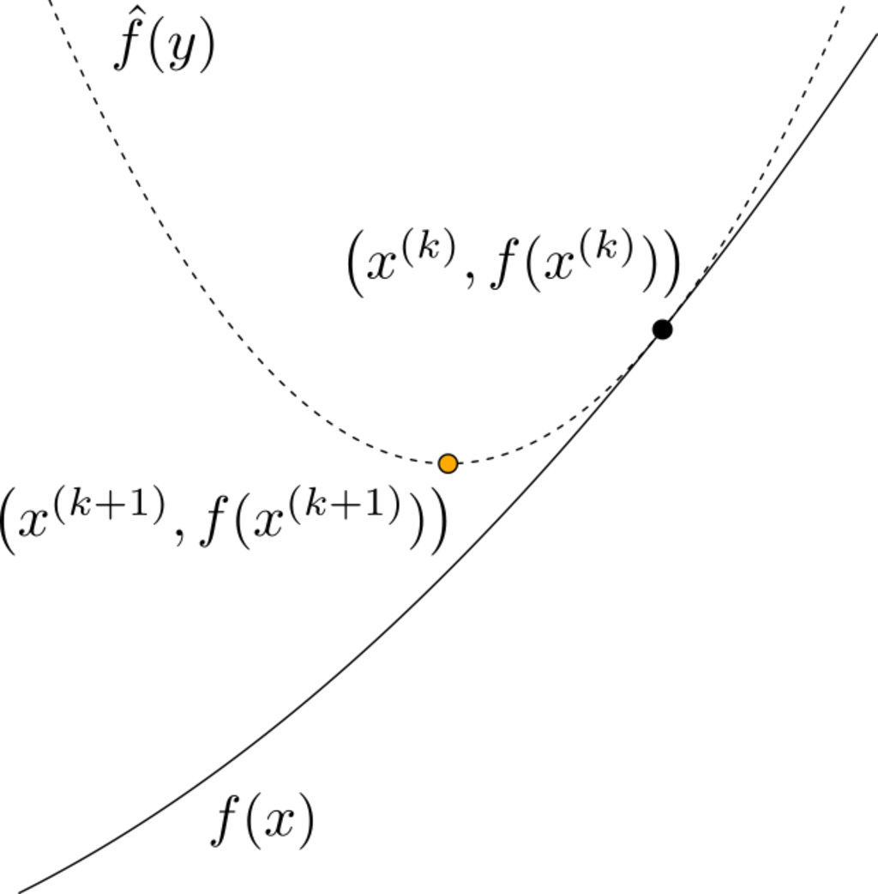
```
]

---

### Too Small Step Size

```{r stepsize-small, echo=FALSE, out.width = "50%"}
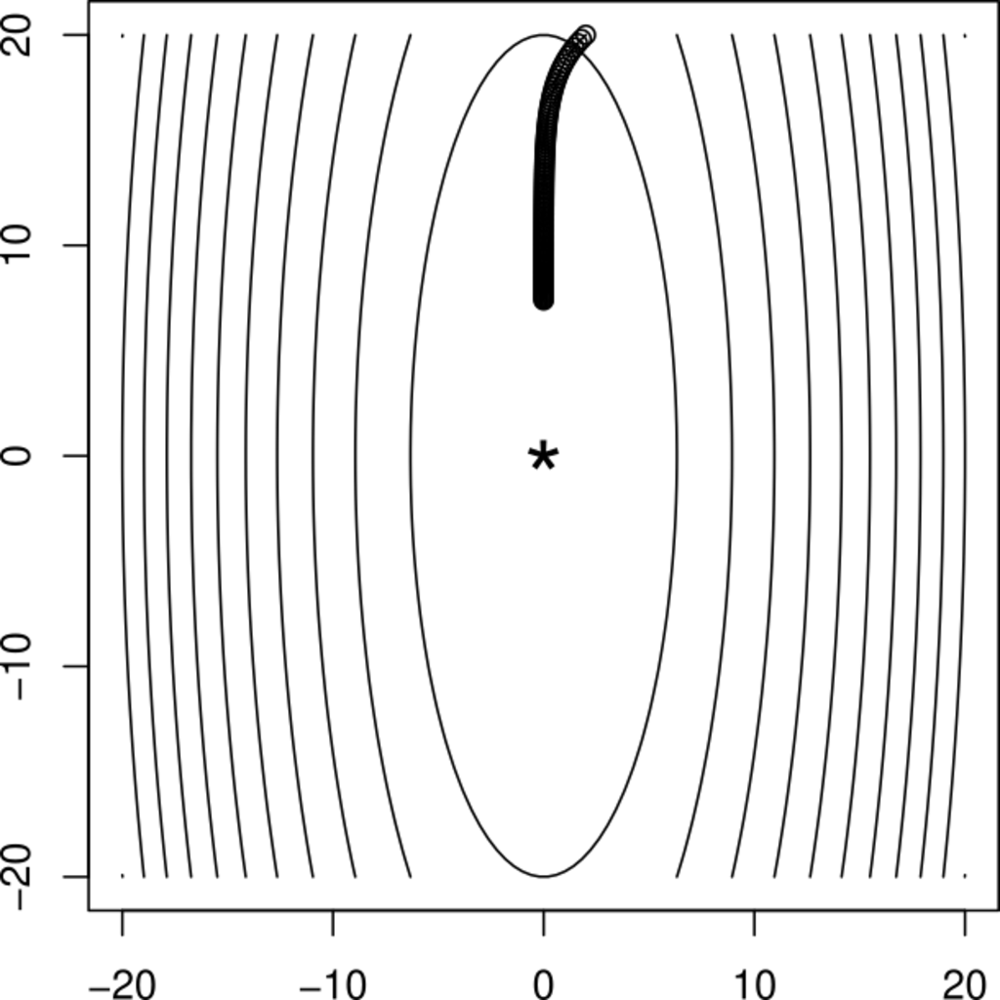
```

---

### Too Large Step Size

```{r stepsize-large, echo=FALSE, out.width = "50%"}
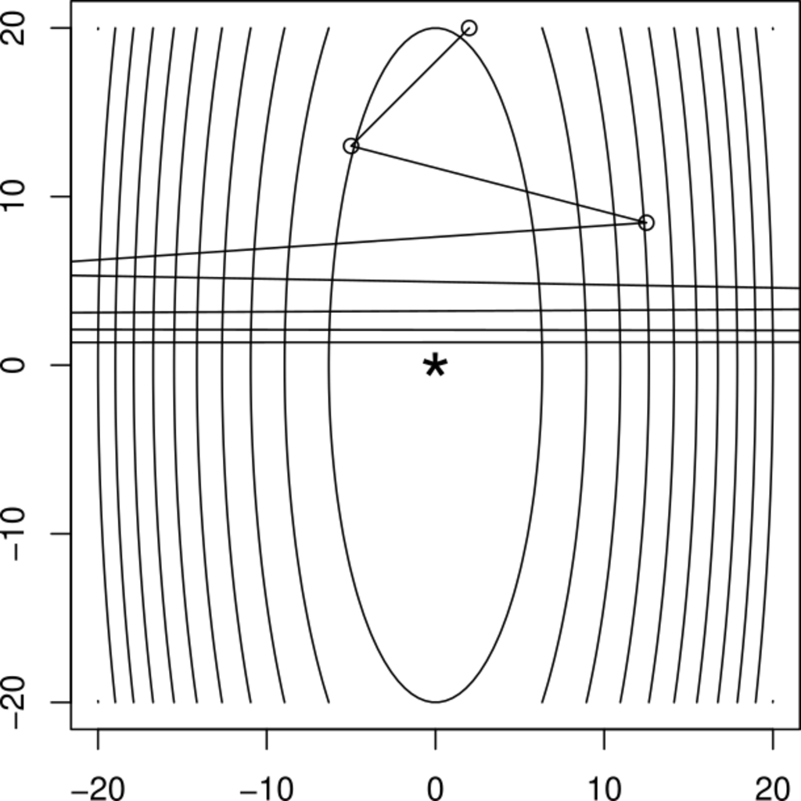
```

---

### Perfect!

```{r stepsize-good, echo=FALSE, out.width = "50%"}
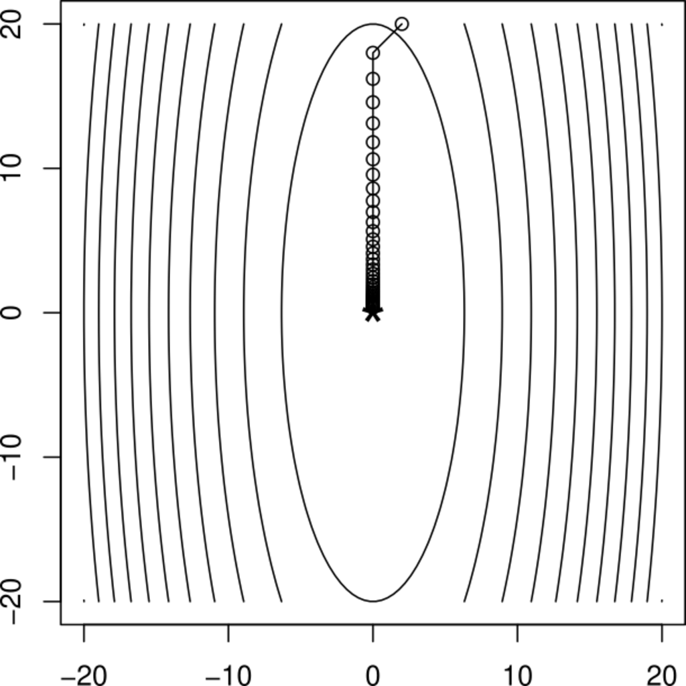
```

---

### Analytical Step Size

#### Theorem

For gradient descent with step size $t \leq 1/L$ and Lipschitz constant of $\nabla f$ being $L$, we have
$$f(x^{(k)}) - f(x^*) \leq \frac{1}{2tk} \lVert x^{(0)} - x^*\rVert_2^2.$$

--

Convergence rate: $O(1/k)$.

--


.pull-left[
#### Lipschitz Constant

If
$$\lVert \nabla f(x) - \nabla f(y)\rVert_2 \leq L \lVert x - y\rVert_2$$
then $L$ is the Lipschitz constant of $\nabla f$.
]

.pull-right[
```{r lipschitz, echo = FALSE, out.width = "50%"}
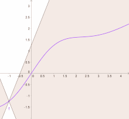
```
]

---

### Example: OLS

$$L = \lVert X^TX \rVert_2$$

--

### Line Searching

In practice, we may not know $L$ or it may be difficult to compute.

--

#### Exact Line Search

It may be tempting to try to solve
$$t^* = \arg_t\min f(x - t\nabla f(x))$$
but this is typically too expensive.

---

### Backtracking Line Search


Set $\beta \in (0, 1)$ and $\alpha \in (0, 1/2]$. At each iteration, start with $t \gets t_0$, and while
$$f(x - t \nabla f(x)) > f(x) - \alpha t \lVert \nabla f(x)\rVert_2^2$$
set $t = t \beta.$


```{r backtracking, echo = FALSE, out.width = "65%"}
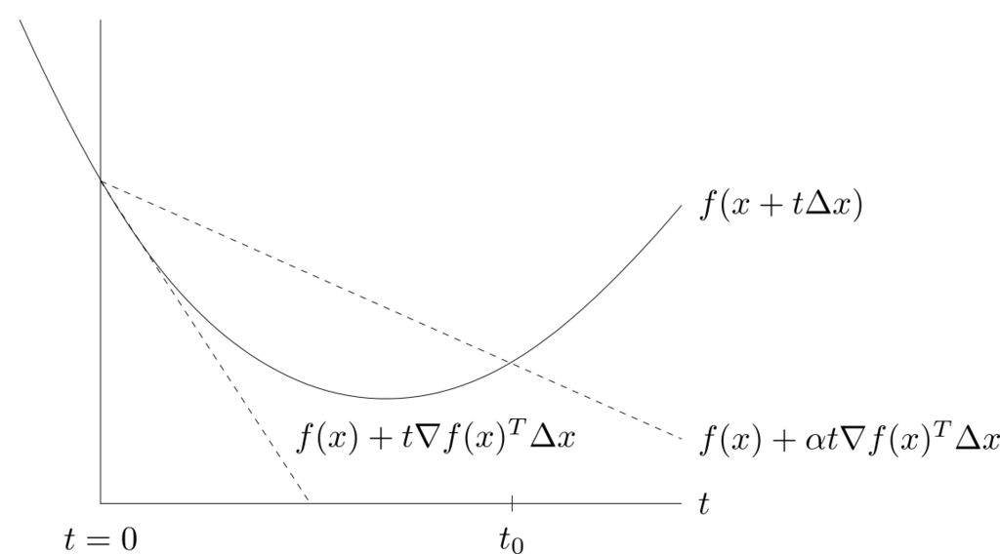
```

---

### Backtracking Line Search Step Size

```{r backtracking-convergence, echo = FALSE, out.width = "50%"}
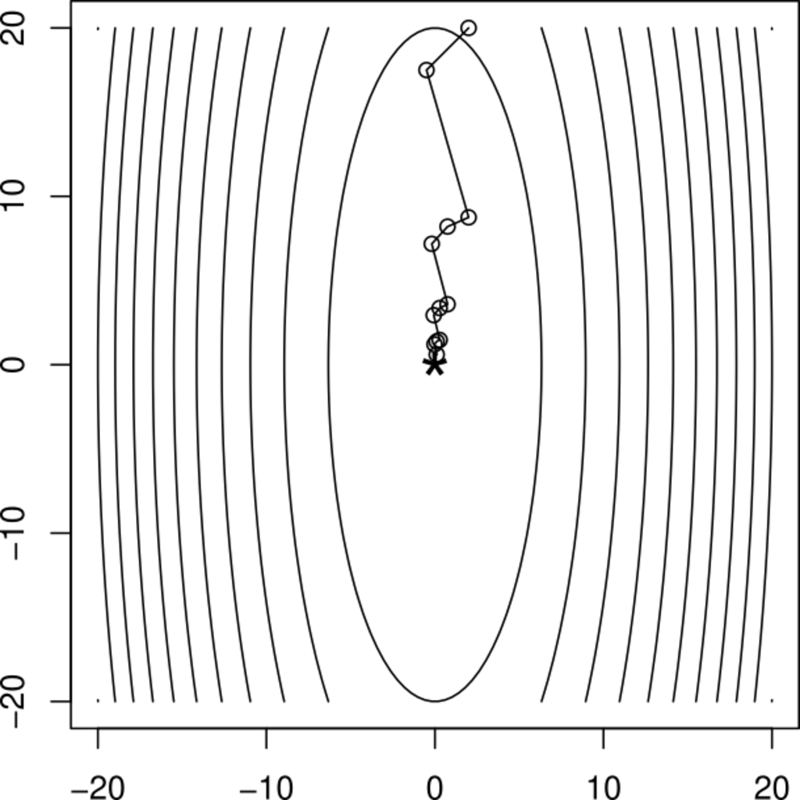
```

---

### Stopping Criteria

.pull-left[

#### Common (ad-hoc) choices

- Small gradient: $$\lVert \nabla f(x) \rVert_r \leq \epsilon$$
- Small relative change in $x$: $$\frac{\lVert x^{(k+1)} - x^{(k)} \rVert_r}{\lVert x^{(k)} + 10^{-q}\rVert_2} \leq \epsilon$$
- Small relative change in $f$: $$\frac{f(x^{(k+1)}) - f(x^{(k)})}{f(x^{k})} \leq \epsilon$$
]

--

.pull-right[
#### Duality Gap

If $f$ is **strongly** convex and $x$ optimal, then
the duality gap is zero at the optimum.


Most principled stopping criterion, but not always available.
]

---

### Problems with Gradient Descent

Sensitive to conditioning.

```{r gd-conditioning, echo = FALSE, out.width = "70%"}
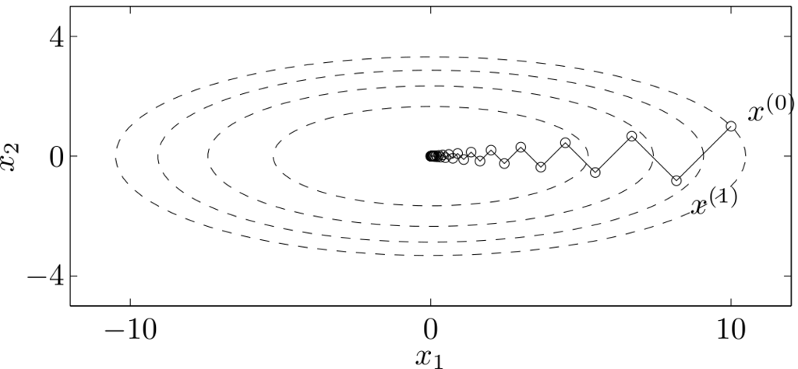
```

---

## Newton's Method

Recall second-order expansion of $f$ around $x$:
$$f(y) \approx \hat{f}(y) = f(x) + \nabla f(x)^T (y - x) + \frac{1}{2}(y- x)^T \nabla^2 f(x) (y - x).$$

--

.pull-left[
### Newton Update

Instead of replacing $\nabla^2 f(x)$ with $\frac{1}{t} I$ (gradient descent update),
minimize $\hat{f}(y)$ directly:
$$x^+ = x - \big(\nabla^2 f(x)\big)^{-1} \nabla f(x).$$
]

.pull-right[
```{r newton-approx, echo = FALSE, out.width = "52%"}
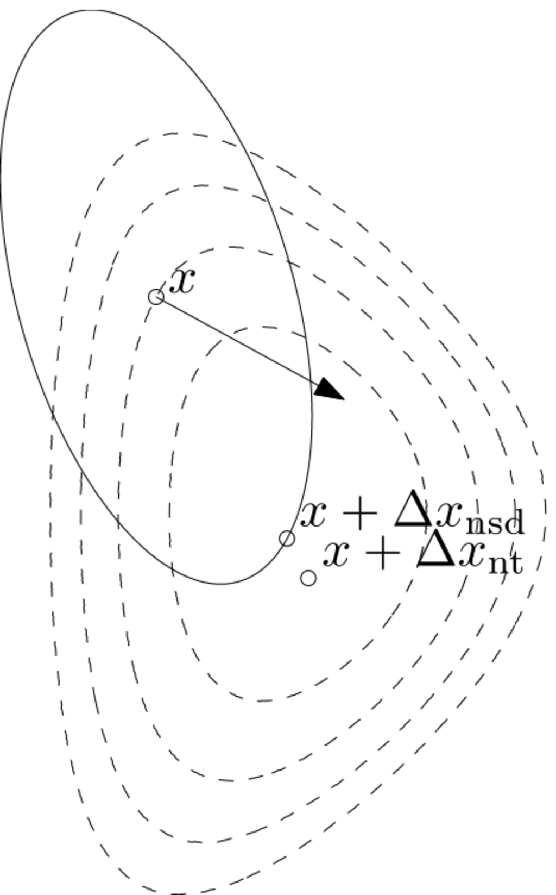
```
]

---

### Damped Newton

In practice this might not converge, so we use **damped** Newton:
$$x^+ = x - t\nabla^2 f(x)^{-1} \nabla f(x),$$
with $t > 0$ chosen by backtracking line search.

--

In practice, this is often just called Newton's method.

--
.pull-left[

#### Backtracking Line Search

At each iteration $t \gets 1$ and while
$$f(x + t v) > f(x) + \alpha t \nabla f(x)^T v$$
with $v = -(\nabla^2 f(x)^{-1} \nabla f(x))$
set $$t \gets \beta t.$$
]

--

.pull-right[
#### Phases

- As long as $t < 1$, we are in the **damped** phase.
- When $t = 1$, we enter the **pure** phase and $t$ will remain $1$.
- In pure phase, we have quadratic convergence.
]

---

### Gradient Descent vs Newton

.pull-left[
#### Pros

- Faster convergence: quadratic (eventually)
- Independent of conditioning

#### Cons

- Higher memory cost
- Higher computational cost $O(p^3)$ vs $O(p)$ for GD
- Needs twice differentiable $f$.
]

.pull-right[
```{r newton-vs-gd, echo = FALSE, out.width = "100%", fig.cap = "GD in black, Newton in blue"}
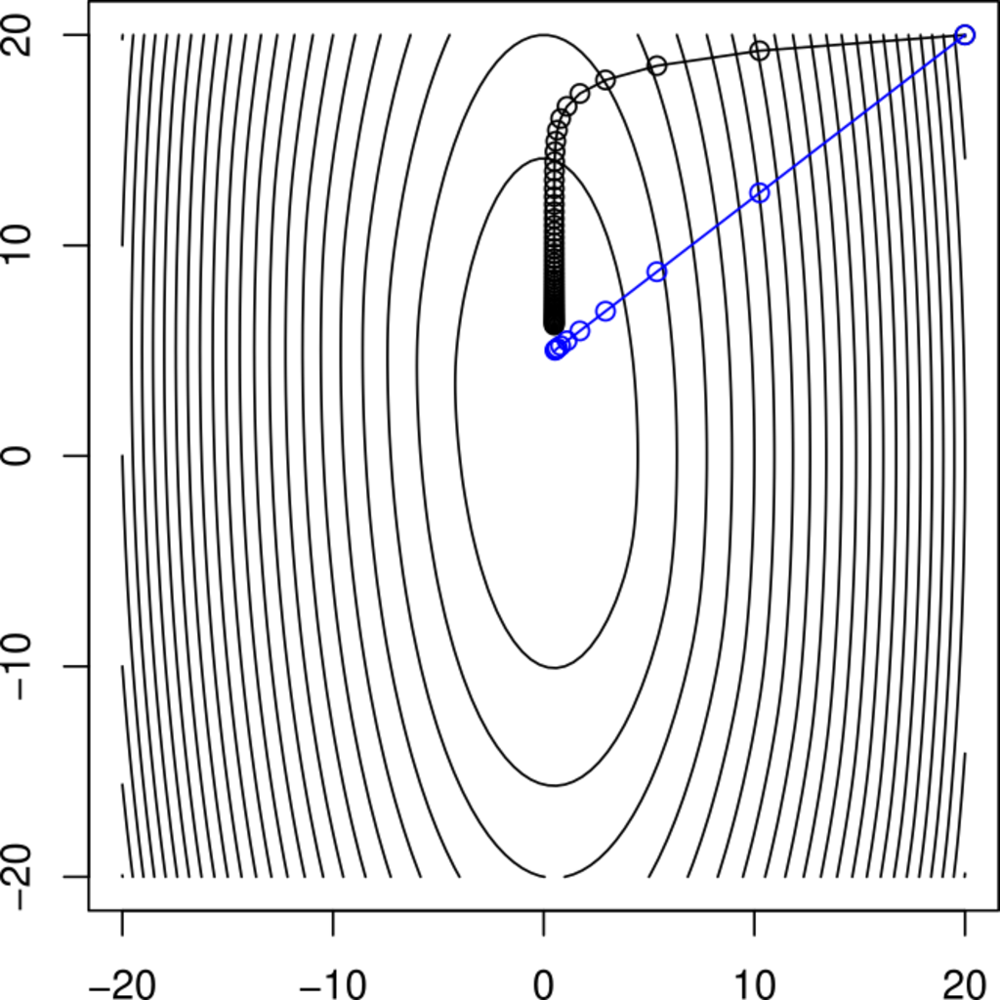
```
]

---

### Convergence

.pull-left[
```{r newton-convergence-iteration, echo = FALSE, out.width = "100%"}
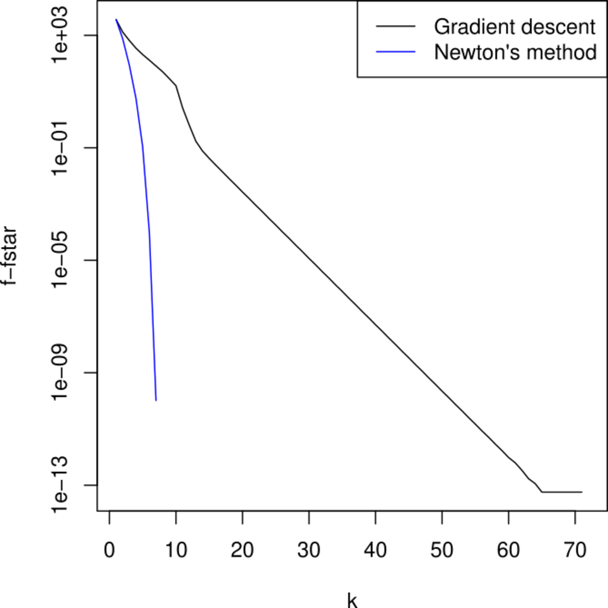
```
]

.pull-right[
```{r newton-convergence-time, echo = FALSE, out.width = "100%"}
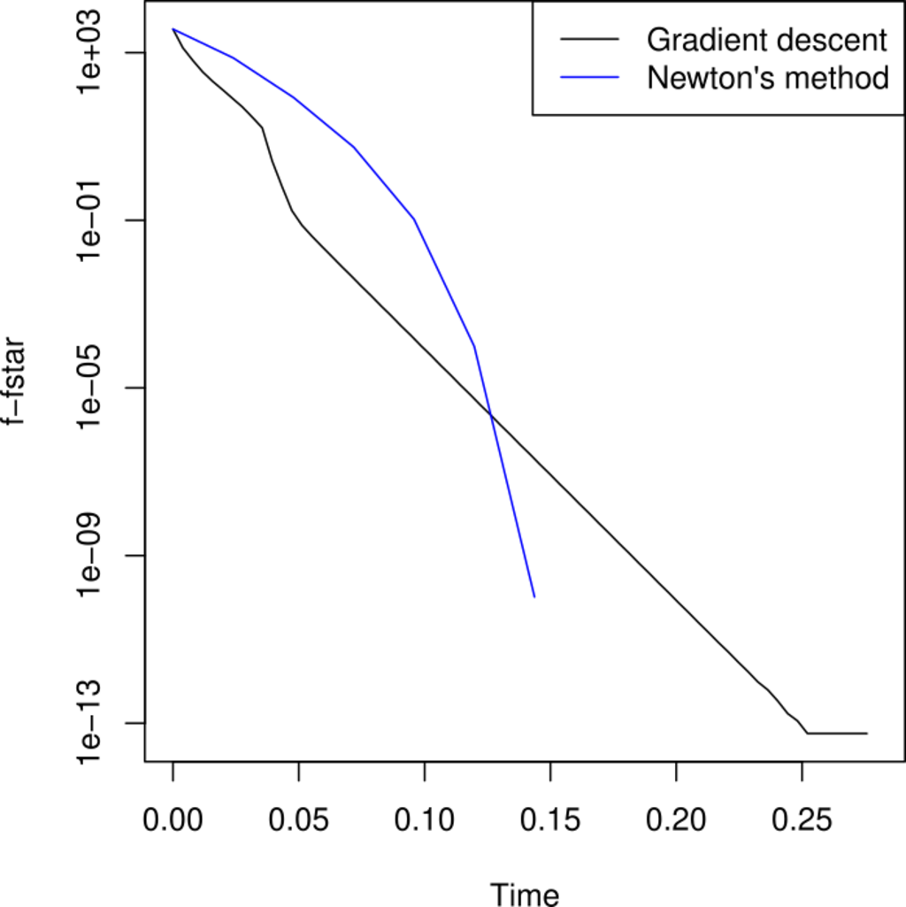
```
]

In practice, results depend on the problem.

---

## Quasi-Newton Methods

Replace $\nabla^2 f(x)$ with an approximation $B_k$.

--

#### BFGS

Complexity: $O(p^2)$, still same memory cost.

--

### L-BFGS

Same complexity but lower memory cost.

---

class: middle, center

## Example: Poisson Regression

---

## Poisson Regression

Consider observations $y_i \in \mathbb{N}_0$, $x_i \in \mathbb{R}^p$ for
$i = 1, \ldots, n$, and Poisson point probabilities
$$f_i(y_i) = e^{-\mu(x_i)} \frac{\mu(x_i)^{y_i}}{y_i!}.$$

--


If $\log(\mu(x_i)) = x_i^T \beta$ we rewrite

$$f_i(y_i) = e^{\beta^T x_i y_i - \exp( x_i^T \beta)} \frac{1}{y_i!}.$$

This is a *Poisson regression model*.

---

### Example

```{r vegetables-summary}
summary(vegetables)
dim(vegetables)
```

---

### Model

$$\log(E(\text{sale})) = \beta_0 + \beta_1 \log(\text{normalSale}) + \beta_{\text{store}}.$$

--

```{r pois-model, dependson="data", cache = TRUE}
## Note, variable store is a factor with 352 levels!
pois_model <- glm(
  sale ~ log(normalSale) + store,
  data = vegetables,
  family = poisson()
)
```

--

```{r pois-sum, echo=2, dependson="pois-model"}
old_options <- options(digits = 2)
summary(pois_model) |>
  coefficients() |>
  head()
options(digits = old_options$digits)
```

---

### Exponential Families

Joint density:
$$f(\mathbf{y} \mid \theta) = \prod_{i=1}^n \frac{1}{\varphi_i(\theta)} e^{\theta^T t_i(y_i)} = e^{\theta^T \sum_{i=1}^n t_i(y_i) - \sum_{i=1}^n \kappa_i(\theta)}$$
where $\varphi_i(\theta) = \int e^{\theta^T t_i(u)} \mu_i(\mathrm{d}u)$ and $\kappa_i(\theta) = \log(\varphi_i(\theta)).$
The log-likelihood is
$$\ell(\theta) = \theta^T t(\mathbf{y}) - \kappa(\theta)$$
where
$$t(\mathbf{y}) = \sum_{i=1}^m t_i(y_i) \quad \text{and} \quad
\kappa(\theta) = \sum_{i=1}^m \log \varphi_i(\theta).$$

The gradient is
$$\nabla \ell(\theta) = t(\mathbf{y}) - \nabla \kappa(\theta).$$

---

### The Poisson Regression model

For the Poisson regression model we find that
$$t(\mathbf{y}) = \sum_{i=1}^n x_i y_i = \mathbf{X}^T \mathbf{y} \quad \text{and} \quad
\kappa(\beta) = \sum_{i=1}^n e^{x_i^T \beta}.$$

Moreover,
$$\nabla \kappa(\beta) = \sum_{i=1}^n x_i e^{x_i^T \beta} = \mathbf{X}^T \mathbf{w}(\beta)$$
where
$$ \mathbf{w}(\beta) = \exp(\mathbf{X}^T \beta)$$
with $\exp$ applied coordinatewisely.

---

### Model Matrix and `glm.fit()`

```{r implement, dependson="data", cache = TRUE}
X <- model.matrix(
  sale ~ log(normalSale) + store,
  data = vegetables
)
y <- vegetables$sale

dim(X)
```

--

```{r glm.fit}
bench::bench_time(
  pois_fit <- glm.fit(X, y, family = poisson())
)
```

---

### `glm.fit()`

```{r}
pois_fit$iter
pois_fit$converged
```

--

#### Deviance

Two times (log-likelihood of null (intercept-only) model minus log-likelihood of the full model)

```{r}
pois_fit0 <- glm.fit(X[, 1], y, family = poisson())
pois_fit0$deviance - pois_fit$deviance
```

---

### `glm.fit()`

```{r glm.fit-trace}
pois_fit <- glm.fit(X, y, family = poisson(), control = list(trace = TRUE))
```
--

### Stopping criterion

$$|\mathrm{deviance}_{n-1} - \mathrm{deviance}_n| < \varepsilon (\mathrm{deviance}_n + 0.1)$$
with the default tolerance parameter $\varepsilon = 10^{-8}$ and with a maximal
number of iterations set to 25.

---

### Implementation of Objective Function

```{r implement_H, dependson="implement", cache = TRUE}
t_map <- drop(crossprod(X, y))

objective <- function(beta) {
  drop(sum(exp(X %*% beta)) - beta %*% t_map) / nrow(X)
}

gradient <- function(beta) {
  (drop(crossprod(X, exp(X %*% beta))) - t_map) / nrow(X)
}
```

--

Recomputing the deviance difference,

```{r objective-value-deviance}
2 * nrow(X) * (objective(c(pois_fit0$coefficients, rep(0, 352))) - objective(pois_fit$coefficients))
```

--

and the value of the negative log-likelihood:


```{r objective-value}
objective(pois_fit$coefficients)
```

---

### Using `optim()` with Conjugate Gradient


```{r CG, dependson="implement_H", cache = TRUE}
bench::bench_time(
  pois_CG <- optim(
    rep(0, length = ncol(X)),
    objective,
    gradient,
    method = "CG",
    control = list(maxit = 10000)
  )
)
```

--

```{r CG-results, dependson="CG"}
pois_CG$value
pois_CG$counts
```

---

### Using `optim()` with BFGS

```{r BFGS, dependson="implement_H", cache = TRUE}
bench::bench_time(
  pois_BFGS <- optim(
    rep(0, length = ncol(X)),
    objective,
    gradient,
    method = "BFGS",
    control = list(maxit = 10000)
  )
)
```

--


```{r BFGS-results, dependson="BFGS"}
pois_BFGS$value
pois_BFGS$counts
```


---

### Using Sparse Matrices

```{r Matrix, message=FALSE, cache=FALSE}
library(Matrix)
```

```{r sparse, dependson="implement", cache = TRUE}
X <- Matrix(X)
```

--

```{r BFGS-sparse, dependson=c("implement_H", "sparse"), cache = TRUE}
bench::bench_time(
  pois_BFGS_sparse <- optim(
    rep(0, length = ncol(X)),
    objective,
    gradient,
    method = "BFGS",
    control = list(maxit = 10000)
  )
)
```

--


```{r BFGS-sparse-results, dependson="BFGS-sparse"}
range(pois_BFGS$par - pois_BFGS_sparse$par)
```

---

### Implementation

```{r GD, cache = TRUE}
source("R/optim_alg.R")
```

[Source code](R/optim_alg.R)

---

### Poisson Regression Problem

```{r poisson-def}
poisson_model <- function(form, data, response) {
  X <- model.matrix(form, data)
  y <- data[[response]]
  t_map <- drop(crossprod(X, y))
  n <- nrow(X)
  p <- ncol(X)

  objective <- function(beta) {
    drop(sum(exp(X %*% beta)) - beta %*% t_map) / n
  }

  gradient <- function(beta) {
    (drop(crossprod(X, exp(X %*% beta))) - t_map) / n
  }

  hessian <- function(beta) {
    crossprod(X, drop(exp(X %*% beta)) * X) / n
  }

  list(par = rep(0, p), H = objective, grad_H = gradient, Hessian_H = hessian)
}
```

---

### Test

Gradient descent is very slow for the full Poisson model, so
we consider a much smaller problem.

```{r GD-test, dependson=c("Implement", "GD"), cache = TRUE}
veg_pois <- poisson_model(~ log(normalSale), vegetables, response = "sale")
pois_gd <- gradient_descent(veg_pois$par, veg_pois$H, veg_pois$grad_H)
```

--

```{r GD-comp, dependson="GD-test", echo=2:3, cache = TRUE}
old_options <- options(digits = 5)
pois_glm <- glm(sale ~ log(normalSale), data = vegetables, family = poisson())
rbind(pois_glm = coefficients(pois_glm), pois_gd)
options(digits = old_options$digits)
```

---

### Test

```{r GD-object, dependson=c("Implement", "GD-test"), echo=2:3}
old_options <- options(digits = 15)
veg_pois$H(coefficients(pois_glm))
veg_pois$H(pois_gd)
options(digits = old_options$digits)
```

---

### Tracer

```{r GD-trace, dependson=c("GD-test", "vegetables-data"), results='hide', echo=-3, cache = TRUE, message = FALSE, warning = FALSE}
library(CSwR)
gd_tracer <- tracer(c("value", "h_prime", "gamma"), N = 50)
gc() # Garbage collection
```

--

```{r pois-trace, dependson=c("GD-trace", "GD-test", "vegetables-data"), cache = TRUE}
pois_gd <- gradient_descent(
  veg_pois$par,
  veg_pois$H,
  veg_pois$grad_H,
  cb = gd_tracer$tracer
)
```

---

### Trace Information

```{r trace-sum, dependson=c("GD-trace", "pois-trace"), cache = TRUE}
trace_sum_gd <- summary(gd_tracer)
head(trace_sum_gd, 3)
```

--

```{r trace-sum2, dependson="trace-sum"}
tail(trace_sum_gd, 3)
val_min <- veg_pois$H(coefficients(pois_glm))
```

---

### Trace Information

```{r trace-info, warning=FALSE}
ggplot(trace_sum_gd, aes(.time, value - val_min)) +
  geom_line() +
  scale_y_log10()
```

---

### Trace Information

```{r trace-sum3}
ggplot(trace_sum_gd, aes(.time, h_prime)) +
  geom_line() +
  scale_y_log10()
```

```{r prof1, eval=FALSE, echo=FALSE}
library(profvis)
profvis(
  replicate(40, {
    gradient_descent(veg_pois$par, veg_pois$H, veg_pois$grad_H, epsilon = 1e-10)
    NULL
  })
)
```


---

### Newton Method

```{r pois2, cache = TRUE}
veg_pois <- poisson_model(
  ~ store + log(normalSale) - 1,
  vegetables,
  response = "sale"
)
```

```{r Newton-test, dependson=c("Implement", "GD-test", "pois2"), cache = TRUE}
system.time(
  pois_newton <- newton(
    veg_pois$par,
    veg_pois$H,
    veg_pois$grad_H,
    veg_pois$Hessian_H
  )
)
```

---

### Test

```{r Newton-comp, dependson="Newton-test", cache = TRUE}
pois_glm <- glm(
  sale ~ store + log(normalSale) - 1,
  data = vegetables,
  family = poisson()
)
range(pois_newton - pois_glm$coefficients)
```
--

```{r Newton-object, dependson=c("Implement", "Newton-test"), echo=2:3, results='hold'}
old_options <- options(digits = 20)
veg_pois$H(pois_newton)
veg_pois$H(pois_glm$coefficients)
options(digits = old_options$digits)
```

--

`glm()` (and the workhorse `glm.fit()`) uses a
Newton-type algorithm.


---

### Tracing

```{r Newton-trace, cache = TRUE}
newton_tracer <- tracer(c("value", "grad_norm_sq"),
  N = 0,
  expr = expression(grad_norm_sq <- sum(grad^2))
)
pois_newton <- newton(
  veg_pois$par,
  veg_pois$H,
  veg_pois$grad_H,
  veg_pois$Hessian_H,
  epsilon = 8e-28,
  cb = newton_tracer$tracer
)

gd_tracer <- tracer(c("value"), N = 0)
pois_gd <- gradient_descent(
  veg_pois$par,
  veg_pois$H,
  veg_pois$grad_H
)
```

---

### Tracing

```{r Newton-summary-trace, dependson="Newton-trace", cache = TRUE}
trace_sum_newton <- summary(newton_tracer)
val_min <- veg_pois$H(pois_newton)
trace_sum_newton
```

---

### Newton Convergence

```{r trace-sum-Newton, warning=FALSE, dependson="Newton-summary-trace", fig.width = 11, echo = FALSE}
pl1 <- ggplot(trace_sum_newton, aes(.time, value - val_min)) +
  geom_point() +
  geom_line() +
  scale_y_log10()

pl2 <- ggplot(trace_sum_newton, aes(.time, grad_norm_sq)) +
  geom_point() +
  geom_line() +
  scale_y_log10()

pl1 + pl2
```

```{r prof2, eval=FALSE, echo=FALSE}
library(profvis)
profvis(
  newton(
    veg_pois$par,
    veg_pois$H,
    veg_pois$grad_H,
    veg_pois$Hessian_H
  )
)
```

---

## Exercise

### Step 1

Implement the gradient descent algorithm to solve ridge regression:
$$\operatorname{minmize}_{\beta \in \mathbb{R}^p}\left( \frac{1}{2} \lVert X\beta - y\rVert_2^2 + \frac{\lambda \lVert \beta \rVert_2^2}{2} \right)$$

--

### Step 2

Implement a method for solving ridge regression directly.

Explicitly factorize (i.e. don't use `solve()`)

---

## Summary

### Today

- Optimization problems
- Algorithms to solve optimization problems
  - Gradient descent
  - The Newton method

--

### Things We Did Not Cover

- Accelerated gradient methods
- Conjugate gradient
- Constrained optimization
- Nonsmooth objectives


