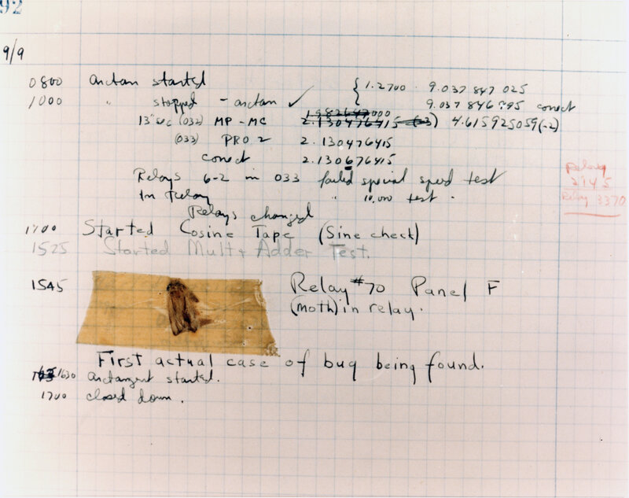
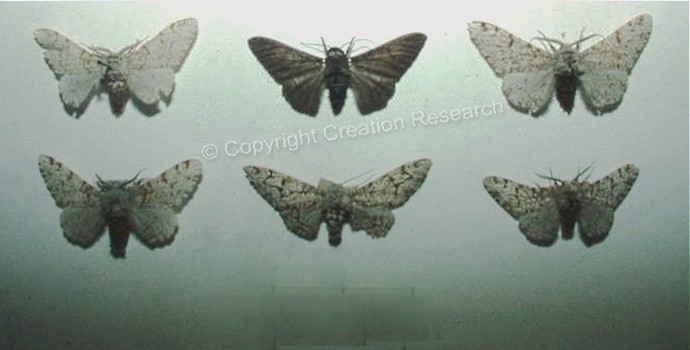
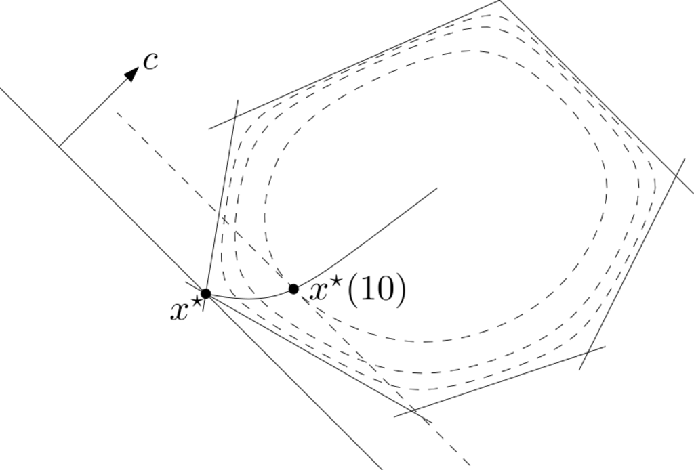

```{r setup, include=FALSE}
knitr::knit_hooks$set(crop = knitr::hook_pdfcrop)

knitr::opts_chunk$set(
  fig.width = 8,
  fig.height = 5,
  fig.retina = 3,
  fig.align = "center",
  cache = FALSE,
  autodep = TRUE,
  dev.args = list(pointsize = 16),
  crop = TRUE
)

error_hook <- knitr::knit_hooks$get("error")
knitr::knit_hooks$set(error = function(x, options) {
  if (!is.null(n <- options$linewidth)) {
    x <- knitr:::split_lines(x)
    if (any(nchar(x) > n)) {
      x <- strwrap(x, width = n)
    }
    x <- paste(x, collapse = "\n\t")
  }
  error_hook(x, options)
})

library(tidyverse)
library(patchwork)

options(width = 80)
old_options <- options(digits = 4)

theme_set(theme_grey(base_size = 18))
```

---

## Today

### Debugging

- How to detect and fix bugs in your R code

### Optimization for Multinomial Models

- Likelihood optimization
- Intro to constrained optimization

---

## Debugging

- Bugs are common (inevitable)
- The more complex the code, the more bugs (and the harder to find them)
- Debugging is the process of finding and fixing bugs.
- Complemetary to **testing**, which is about identifying existence of bugs.

</br>

```{r debugging-image, echo =FALSE, fig.align = "right"}

```

---

class: inverse

```{r first-bug, out.width = "80%", echo = FALSE, fig.cap = "The original bug(?), 1947"}

```

---

## Poisson Regression

```{r poisson-regression}
n <- 1000
x <- rnorm(n)
y <- rpois(n, exp(x))
X <- model.matrix(y ~ x)
```
--

```{r poisson-implementations}
Xty <- drop(crossprod(X, y))

objective <- function(beta) {
  (sum(exp(X %*% beta)) - beta %*% Xty) / nrow(X)
}

gradient <- function(beta) {
  (colSums(drop(exp(X %*% beta)) * X) - Xty) / nrow(X)
}
```

--

Gradient descent and Newton method implementations can be found in
[`debugging.R`](R/debugging.R).

```{r source-debugging-file, cache=FALSE}
source("R/debugging.R")
```

---

## Testing

```{r run-gd}
gradient_descent(c(0, 0), objective, gradient, t0 = 1, epsilon = 1e-8)
```

--

```{r run-glm}
glm(y ~ x, family = "poisson")
```

---

### Traceback

- Sometimes enough to simply look at the call stack

---

### Entering Debug Mode

Two common ways to enter debug mode:
  - `browser()`: Stops execution and enters debug mode
  - Set a breakpoint in RStudio.

--

.pull-left[
#### `browser()`

- Can be placed anywhere in the code
- Stops execution and enters debug mode
]

--

.pull-right[
#### RStudio Breakpoints

- Visual breakpoints
- Easy to set and remove (click in the margin)
- No need to modify the code
- But cannot be conditionally set
- Sometimes won't work
]

---

## Buggy Newton Method

```{r def-hessian}
hessian <- function(beta) {
  (crossprod(X, drop(exp(X %*% beta)) * X)) / nrow(X)
}
```

```{r run-newton, error=TRUE, linewidth = 80}
newton_method(c(0, 0), objective, gradient, hessian)
```

---

### Exercise: Debugging `newton_method()`

- Download and open [`debugging.R`](R/debugging.R) in RStudio.
--

- Create another script and define `objective()`, `gradient()`, and `hessian()` by copying
  from these slides.
--

- Source `debugging.R` and test that `gradient_descent()` works. Now try `newton_method()`. Oh no, there's an error!
--

- Insert a breakpoint before the `while` loop and inspect the values
  of `objective(x_new)`, `values`, `alpha`, `beta` and `grad_d_prod`
  from within the browser.
--

- Explain and fix the bug. Remove the breakpoint.
--

- Source the fixed code and try calling `newton_method()`. What happens?
--

- Debug the code again, using breakpoints or `browser()`. Finally
  verify that `newton_method()` works.

???

```{r buggy-newton-definition}
newton_method <- function(
    x,
    objective,
    gradient,
    hessian,
    alpha = 0.1,
    beta = 0.5,
    t0 = 1,
    epsilon = 1e-10,
    maxit = 50) {
  obj_history <- rep(NA, maxit)

  for (i in 1:maxit) {
    # Bug 1: objective not stored in obj_history
    obj <- objective(x) #<<
    grad <- gradient(x)

    if (sum(grad^2) <= epsilon) {
      break
    }

    hess <- hessian(x)

    ## Bug 2: Sign error
    d <- drop(solve(hess, grad)) #<<
    t <- t0
    x_new <- x + t * d
    grad_d_prod <- crossprod(grad, d)

    while (objective(x_new) > obj_history[i] + alpha * t * grad_d_prod) {
      gamma <- beta * t
      x_new <- x + gamma * d
    }

    x <- x_new
  }
  list(par = x, values = obj_history[!is.na(obj_history)])
}
```

---

## Debugging C++ Code (Rcpp)

- Unfortunately **not** easy.
--

- General problem is that C++ code is compiled, so
  what you see in C++ is not necessarily what is executed.
--

- We won't cover it here, but it **is** possible: see [these notes](https://github.com/wch/r-debug/blob/master/debugging-r.md) for instance.

---

class: center, middle

# Multinomial Models

---

## The Peppered Moth

.pull-left[
### Alleles

C, Ci, T with frequencies $p_C$, $p_I$, $p_T$
and $p_C + p_I + p_T = 1.$

### Genotypes

CC, CI, CT, II, IT, TT

### Phenotypes

Black, mottled, light-colored
]

.pull-right[

```{r moth-picture, echo = FALSE, out.width="100%", fig.align='center'}

```

|       | C       | I          | T            |
|-------|---------|------------|--------------|
| **C** | Black   | Black      | Black        |
| **I** | Black   | Mottled    | Mottled      |
| **T** | Black   | Mottled    | Light-colored|

]


???

The Peppered Moth is called 'Birkemåler' in Danish. There is a nice collection
of these in different colors in the Zoological Museum. The alleles are ordered
in terms of dominance as C > I > T. Moths with genotype including C are dark. Moths
with genotype TT are light colored. Moths with genotypes II and IT are mottled.

The peppered moth provided an early demonstration of evolution in the 19th centure England,
where the light colored moth was outnumered by the dark colored variety. The dark
color became advantageous due to the increased polution, where trees were darkened
by soot.

https://en.wikipedia.org/wiki/Peppered_moth_evolution

---

### Hardy–Weinberg Equilibrium

According to the [Hardy–Weinberg equilibrium](https://en.wikipedia.org/wiki/Hardy%E2%80%93Weinberg_principle), the genotype frequencies are
$$p_C^2, 2p_Cp_I, 2p_Cp_T, p_I^2,  2p_Ip_T, p_T^2.$$

--

The complete multinomial log-likelihood is
\begin{aligned}
 &2n_{CC} \log(p_C) + n_{CI} \log (2 p_C p_I) + n_{CT} \log(2 p_C p_I) \\
 &+ 2 n_{II} \log(p_I) + n_{IT} \log(2p_I p_T) + 2 n_{TT} \log(p_T),
\end{aligned}

--

We only observe $(n_C, n_I, n_T)$, where
$$n = \underbrace{n_{CC} + n_{CI} + n_{CT}}_{= n_C} +
\underbrace{n_{IT} + n_{II}}_{=n_I} + \underbrace{n_{TT}}_{=n_T}.$$

--

As a specific data example we have the observation $n_C= 85$, $n_I = 196$, and
$n_T = 341.$

---

### Multinomial Cell Collapsing

The Peppered Moth example is an example of *cell collapsing* in a multinomial model.

--

In general, let $A_1 \cup \ldots \cup A_{K_0} = \{1, \ldots, K\}$ be a partition and let
$$M : \mathbb{N}_0^K \to \mathbb{N}_0^{K_0}$$
be the map given by
$$M((n_1, \ldots, n_K))_j = \sum_{i \in A_j} n_i.$$

---

### Multinomial Distribution

If $Y \sim \textrm{Mult}(p, n)$ with $p = (p_1, \ldots, p_K)$ then
$$X = M(Y) \sim \textrm{Mult}(M(p), n).$$

--

For the peppered moths, $K = 6$ corresponding to the six genotypes, $K_0 = 3$ and
the partition corresponding to the phenotypes is
$$\{1, 2, 3\} \cup \{4, 5\} \cup \{6\} = \{1, \ldots, 6\},$$
--

and
$$M(n_1, \ldots, n_6) = (n_1 + n_2 + n_3, n_4 + n_5, n_6).$$

---

### Cell Collapsing

In terms of the $(p_C, p_I)$ parametrization, $p_T = 1 - p_C - p_I$ and
$$p = (p_C^2, 2p_Cp_I, 2p_Cp_T, p_I^2,  2p_Ip_T, p_T^2).$$

--

Hence
$$M(p) = (p_C^2 + 2p_Cp_I + 2p_Cp_T, p_I^2 +2p_Ip_T, p_T^2).$$

--

The log-likelihood is,
\begin{aligned}
\ell(p_C, p_I) & = n_C \log(p_C^2 + 2p_Cp_I + 2p_Cp_T) \\
               & \phantom{={}}+ n_I \log(p_I^2 +2p_Ip_T) + n_T \log (p_T^2)
\end{aligned}

---

### Standard Form

This is an optimization problem of the following standard form:
$$\begin{aligned}&\operatorname*{minimize}_{p_C,p_I} && -\ell(p_C, p_I) \\
&\operatorname*{subject to} && p_C + p_C - 1 \leq 0\\
&                           && -p_C \leq 0\\
&                           && -p_I \leq 0\\
&                           && p_I - 1 \leq 0\\
&                           && p_C -1 \leq 0.
\end{aligned}$$

--

#### Convex?

--

**Yes**, because the negative log-likelihood is convex and
so are the constraints (affine).

#### Can We Solve it Using Gradient Descent or Newton's Method?

--

**No** (not directly), since the problem is constrained.

```{r likelihood, include = FALSE}
# x is the data vector of length 3 of counts
neg_loglik_pep <- function(par, x) {
  pC <- par[1]
  pI <- par[2]
  pT <- 1 - pC - pI

  if (pC > 1 || pC < 0 || pI > 1 || pI < 0 || pT < 0) {
    return(Inf)
  }

  p_dark <- pC^2 + 2 * pC * pI + 2 * pC * pT
  p_mottled <- pI^2 + 2 * pI * pT
  p_light <- pT^2

  -(x[1] * log(p_dark) + x[2] * log(p_mottled) + x[3] * log(p_light))
}
```

---


### Objective Surface

```{r surface, echo = FALSE, fig.width = 7.5, fig.height = 8, warning = FALSE}
n <- 100

pC <- seq(0, 1, length.out = n)
pI <- seq(0, 1, length.out = n)
z <- matrix(NA, n, n)

x <- c(85, 196, 341)

for (i in seq_len(n)) {
  for (j in seq_len(n)) {
    z[i, j] <- neg_loglik_pep(c(pC[i], pI[j]), x)
  }
}
pal <- function(n) hcl.colors(n, "viridis", rev = FALSE)

min_z <- min(z)

levels <- exp(seq(log(min_z), log(3000), length.out = 25))

contour(pC, pI, z, levels = levels, col = pal(30), asp = 1, drawlabels = FALSE)
```

---

### Change of Variables?

Let $$p_j = \frac{\exp{(\theta_j)}}{\sum_{i = 1}^K \exp(\theta_i)}.$$

--

.pull-left[
Seems like a good idea! Constraints are automatically satisfied.

#### But... Convex?

**No**, $f$ is no longer convex.

]

--

.pull-right[
```{r, echo = FALSE, fig.width = 5, fig.height = 5.4, warning = FALSE}
other_negloglik <- function(theta, x) {
  theta <- c(theta, 0)

  pC <- exp(theta[1]) / sum(exp(theta))
  pI <- exp(theta[2]) / sum(exp(theta))
  pT <- 1 / sum(exp(theta))

  p_dark <- pC * (pC + 2 * pI + 2 * pT)
  p_mottled <- pI * (pI + 2 * pT)
  p_light <- pT^2

  -(x[1] * log(p_dark) + x[2] * log(p_mottled) + x[3] * log(p_light))
}

n <- 100

theta1 <- seq(-19, 19, length.out = n)
theta2 <- seq(-15, 15, length.out = n)
z <- matrix(NA, n, n)

x <- c(40, 196, 50)

for (i in seq_len(n)) {
  for (j in seq_len(n)) {
    z[i, j] <- other_negloglik(c(theta1[i], theta2[j]), x)
  }
}
pal <- function(n) hcl.colors(n, "viridis", rev = FALSE)

min_z <- min(z)

contour(theta1, theta2, z, col = pal(30), asp = 1, drawlabels = FALSE)
x1 <- c(2.25, 8.9)
x2 <- c(-5, 6)
points(x1, x2, pch = 19)
lines(x1, x2, lty = "dotted", lwd = 2)
```
]

---

### Optimization

So, we cannot use our existing toolbox. What to do?

--

We will try two different options.

#### General Optimization

- Define **extended-value** function, and use general (zero-order)
  optimization

--

#### Constrained Optimization (Barrier Method)

Use the barrier method to directly solve the **constrained** optimization problem.

---

### Negative Log-Likelihood

We can code a problem-specific (extended-value) version of the negative log-likelihood.

```{r likelihood-again, ref.label="likelihood"}
```

---

### Zero-Order Nelder-Mead

.pull-left[
```{r moth-optim-NM}
x <- c(85, 196, 341)
x0 <- c(1 / 3, 1 / 3)

optim(x0, neg_loglik_pep, x = x)
```
]

--

.pull-right[
#### Feasible Starting Point

Some thought has to go into the initial parameter choice.

```{r moth-error, error = TRUE, linewidth = 38}
optim(
  c(0, 0), #<<
  neg_loglik_pep,
  x = x
)
```
]

---

### Log-Likelihood Function Factory

`M()` sums the cells that are collapsed,
which we specify in `group` argument.

```{r M-collapse}
M <- function(y, group) {
  as.vector(tapply(y, group, sum))
}
```

--

```{r mult-likelihood-factory}
mult_likelihood <- function(x, group, prob, constraint = function(par) TRUE) {
  force(x)
  force(group)
  force(prob)

  function(par) {
    pr <- prob(par)
    if (!constraint(par) || any(pr > 1) || any(pr < 0)) {
      return(Inf)
    }
    -sum(x * log(M(pr, group)))
  }
}
```

---

### Peppered Moths Specifics

Problem-specific functions

.pull-left[
#### Multinomial Probabilities

`prob()` maps parameters to the multinomial probability vector.

```{r prob}
prob <- function(p) {
  p[3] <- 1 - p[1] - p[2]
  c(
    p[1]^2,
    2 * p[1] * p[2],
    2 * p[1] * p[3],
    p[2]^2,
    2 * p[2] * p[3],
    p[3]^2
  )
}
```
]

--

.pull-right[
#### Constraints

Check of constraints.

```{r constraint}
constraint <- function(par) {
  par[1] <= 1 &&
    par[1] >= 0 &&
    par[2] <= 1 &&
    par[2] >= 0 &&
    1 - par[1] - par[2] >= 0
}
```
]

---

### Putting it All Together

.pull-left[

```{r moth_likelihood}
neg_mult_loglik <- mult_likelihood(
  x = x,
  group = c(1, 1, 1, 2, 2, 3),
  prob = prob,
  constraint = constraint
)
```
]

--

.pull-right[
```{r moth-optim}
moth_optim <- optim(
  x0,
  neg_mult_loglik
)
moth_optim
```
]

---

### Barrier Function

Second (and better) option is to use the barrier method.

Transform
$$\begin{aligned}
      & \text{minimize}   &  & f(x)                               \\
      & \text{subject to} &  & g_i(x) \leq 0, & \quad i =1,\dots,m. \\
  \end{aligned}$$

--

.pull-left[
into
$$\begin{aligned}
       \text{minimize}   &  & tf(x) + \phi(x)
  \end{aligned}$$
with the barrier function $$\phi(z) = -\sum_{i=1}^m \log(-g_i(z)).$$
]
.pull-right[
```{r barrier-image, echo = FALSE, out.width = "100%"}

```
]

---

### `constrOptim()`

Solves problems with affine/linear inequality constraints of the form
$$Ax \succeq b$$
or, in terms of arguments: `ui %*% theta >= ci`.

--

.pull-left[
#### Moths Example

$$A = \begin{bmatrix}1 & 0\\-1 & 0\\0 & 1\\0 & -1\\ -1 & -1\end{bmatrix},
\quad b = \begin{bmatrix}0\\-1\\0\\-1\\-1\end{bmatrix}.$$
]

--

.pull-right[
#### Optimization Problem
$$\begin{aligned}&\operatorname*{minimize}_{p} && -\ell(p) \\
&\operatorname*{subject to} && Ap  \succeq b.
\end{aligned}$$
with $p = (p_C, p_I)$.
]

--

**Not** standard form, but what `constrOptim()` expects.


---

### `constrOptim()`

```{r constr-optim-ex}
A <- rbind(
  c(1, 0),
  c(-1, 0),
  c(0, 1),
  c(0, -1),
  c(-1, -1)
)

b <- c(0, -1, 0, -1, -1)

constrOptim(x0, neg_loglik_pep, NULL, ui = A, ci = b, x = x)$par
```

--

#### Still Requires Feasible Initial Point

```{r const-error, error = TRUE, linewidth = 80}
constrOptim(c(0.0, 0.3), neg_loglik_pep, NULL, ui = A, ci = b, x = x)
```

---

### Interior-Point Method

#### Phase I: Initialization

Find a feasible point $x^{(0)}$ by solving the optimization problem
$$\begin{aligned}&\operatorname*{minimize}_{(x,s)} && s \\
&\operatorname*{subject to} && g_i(x) \leq s, & \quad i = 1, \dots, m.\end{aligned}$$

--

If $s^* \leq 0$, then $x^* = x^{(0)}$ is feasible.

--

Easy in the peppered moths case! But this is not always the case.

--

#### Phase II: Barrier Method

Use a barrier method to solve the constrained problem, starting at $x^{(0)}$.


---

### Multinomial Conditional Distributions

Distribution of $Y_{A_j} = (Y_i)_{i \in A_j}$ conditional on
$X$ can be found too:
$$Y_{A_j} \mid X = x \sim \textrm{Mult}\left( \frac{p_{A_j}}{M(p)_j}, x_j \right).$$

--

#### Expected Genotype Frequencies

Hence for $k \in A_j$, $$\operatorname{E} (Y_k \mid X = x) = \frac{x_j p_k}{M(p)_j}.$$

--

```{r moth_cond_exp, echo=2:4}
old_options <- options(digits = 3)
group <- c(1, 1, 1, 2, 2, 3)
p <- prob(moth_optim$par)
x[group] * p / M(p, group)[group]
options(digits = old_options$digits)
```

---

## Summary

### Debugging

- First check traceback and see if error is obvious.
--

- Use `browser()` or breakpoints to enter debug mode.
--

- Typically painful, but necessary.

--

### Multinomial Models and Optimization

- Peppered moths example is simple and the log-likelihood for the observed
  data can easily be computed.
--

- Constrained optmimization can be solved using the barrier method.
--

- `optim()` in R is general interface to optimization methods.
--

- `constOptim()` is used for linearly constrained optimization.
--

---

## Exercise: Absolute-Value Constraints

Solve the following optimization problem:
$$\begin{aligned} &\operatorname*{minimize}_{x} && \frac{1}{2}(x - 2)^2 \\
                  &\operatorname{subject to} && |x| \leq 1.\end{aligned}$$

### Steps

- First rewrite the problem in standard form.
- Then use `constrOptim()` with `ui` and `ci` arguments to specify the constraints.
- If you have time, try implementing the barrier method yourself on top of
  a gradient descent method.

```{r exercise-optim, include = FALSE}
a <- 2

f <- function(x, a) {
  0.5 * (x - a)^2
}

g <- function(x, a) {
  x - a
}

A <- rbind(1, -1)
b <- c(-1, -1)

constrOptim(c(0.5), f, g, ui = A, ci = b, a = a)
```


