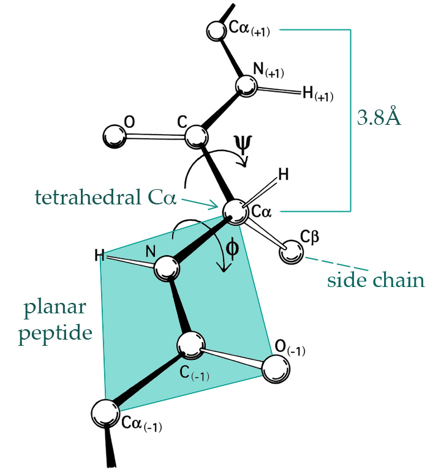
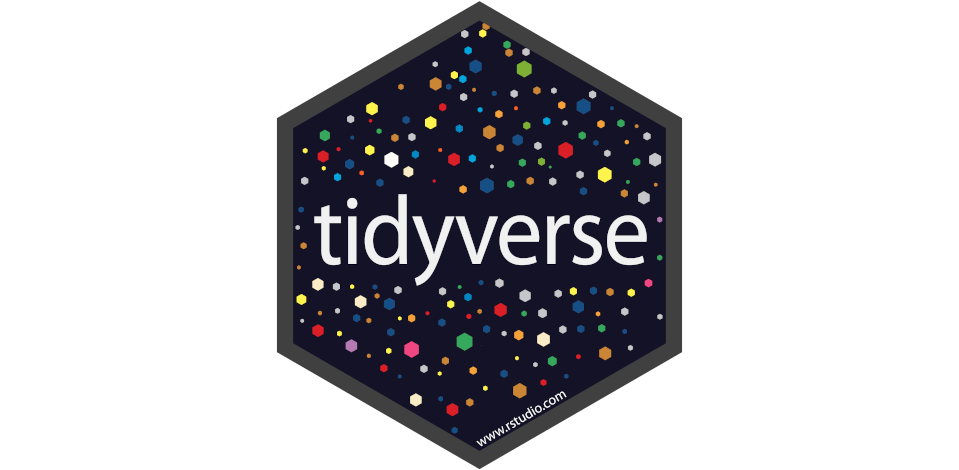



```{r}
#| label: init
#| echo: false
#| message: false
#| warning: false

load(here::here("data", "top100dih.RData"))
phipsi <- read.table(here::here("data", "phipsi.tsv"), header = TRUE)
phipsi[, c("phi", "psi")] <- pi * phipsi[, c("phi", "psi")] / 180

options(width = 50)
```

## What is Computational Statistics?

Not a coherent field, but rather an umbrella term for a number of techniques and
methods.

\bigskip

. . .

Broadly speaking, it is **the use of computational methods to solve statistical
problems**, for instance

. . .

- simulating probabilities,
- maximizing likelihood functions,
- integrating numerically, and
- visualizing data.

## A First Example

::: {.columns}
::::: {.column width="47%"}
To get a sense of what we will be doing in the course, we will start with an
example of a data set of angles, $\Phi$ and $\Psi$, formed between two planes in
protein structures.
:::::

::::: {.column width="47%"}
{width=90%}
:::::
:::

## Histograms

A simple way to analyze the distributions of the angles $\Phi$ and $\Psi$ is the
**histogram**.

\bigskip

. . .

A histogram divides the range of the data into bins and counts how many
observations fall into each bin.

\bigskip

. . .

::: {.columns}
::::: {.column width="47%"}
```{r}
#| label: hist1-src
#| eval: false
#| fig-cap: A histogram of the $\Phi$ variable in the amino acid data

library(ggplot2)

ggplot(phipsi, aes(x = phi)) +
  geom_histogram() +
  geom_rug(alpha = 0.5) +
  labs(x = expression(Phi))
```
:::::

::::: {.column width="47%"}
```{r}
#| label: hist1-show
#| ref-label: hist1-src
#| fig-height: 2.1
#| echo: false
```
:::::
:::

## Density Estimation

Histograms are not smooth, but if we make stronger assumptions, we can smooth
out the estimate of the distribution with **kernel density estimation** (KDE).

. . .

\medskip

::: {.columns}
::::: {.column width="47%"}
```{r}
#| label: dens-src
#| eval: false

ggplot(phipsi, aes(x = phi)) +
  geom_density() +
  geom_rug(alpha = 0.5) +
  labs(x = expression(Phi))
```
:::::

::::: {.column width="47%"}
```{r}
#| label: dens-fig
#| echo: false
#| ref-label: dens-src
#| fig-height: 2
```
:::::
:::

. . .

\bigskip

But how is this KDE actually computed? Doing this efficiently is a
**computational statistics** problem, and is part of the first topic of the
course: **smoothing**.

## Statistical Topics of the Course

The course can be broken down into a number of **statistical** and
**computational** topics.

\medskip

. . .

There are three statistical topics in the course:

. . .

### Smoothing

Descriptive tool for summarizing and visualizing data, as well as a
nonparametric estimation method.

. . .

### Monte Carlo Methods

Broad class of methods for using random input for computations, such as sampling
from a distribution.

. . .

### Optimization

Methods for optimizing (minimizing or maximizing) functions, such as likelihood
functions.

## Computational Topics of the Course

There are also three **computational** topics in the course:

### Implementation

We will learn how to implement statistical methods in R, using various
programming techniques and paradigms.

. . .

### Correctness

We will learn how to ensure that our code is correct, using testing and
debugging.

. . .

### Efficiency

We will learn how to measure performance and find bottlenecks in our code using
profiling and benchmarking, and how to optimize it.

## Teaching Staff

::: {.columns}
::::: {.column width="47%"}
### Instructor

Johan Larsson, postdoctoral researcher

{width=50%}

. . .

#### Contact

Use Absalon discussions for course-related questions and email
([jola@math.ku.dk](mailto:jola@math.ku.dk)) for personal matters.
:::::

. . .

::::: {.column width="47%"}
### Teaching Assistant

Jinyang Liu, PhD student in machine learning

{width=50%}

#### Kasper

Kasper Niss (PhD student) will cover for Jin on September 17.
:::::
:::

## Assignments

Four assignments make up the bulk of the coursework.

. . .

\bigskip

For each assignment, there are two alternatives (A and B). You will pick one.

. . .

\bigskip

Each assignment is tied to a particular **topic**:

1. Smoothing
2. Univariate simulation
3. The expectation-maximization (EM) algorithm
4. Stochastic optimization

## Presentations

There will be four presentation sessions (weeks 3, 4, 6, and 7)^[Not counting
the potato harvesting week when you are off.]

. . .

\medskip

You will divide into groups of 2--3 students and present your solution to one of
the assignments during one of the sessions.

. . .

\medskip

You will register for groups and assignments in
[Absalon](https://absalon.ku.dk).

. . .

\medskip

The presentations are compulsory but not graded. We expect solutions to be work
in progress.

## Oral Examination

The main examination is an oral exam based on your assignments.

\bigskip

. . .

You will prepare four presentations, one for each assignment you picked.

\bigskip

. . .

At the exam, you will present one of these at random.

## Schedule

::: {.columns}
::::: {.column width="47%"}
### Lectures

- Tuesdays and Thursdays, 10:15--12:00 (Johan)

. . .

### Exercise Sessions

- Thursdays, 08:15--10:00 (Jinyang)

. . .

### Presentations

- Thursdays, 13:15--15:00 (Johan)
- Only weeks 3, 4, 6, and 7
:::::

. . .

::::: {.column width="47%"}
### Examination

- November 4-6 (9.15-16.30, tentative)
:::::
:::

## Exercise Sessions

An opportunity to get help with the exercises. To make the best use of your
time, make sure you have *tried* each of them.

\medskip

. . .

Later on, the exercise sessions are where you will get assistance with your
projects.

. . .

\medskip

Exercise sessions will revolve around a central topic, for instance

. . .

- How to organize your code
- How to use generative AI effectively

## Course Literature

### Computational Statistics with R

Main textbook for the course, written by Niels Richard Hansen and me.

\medskip

. . .

It is available online at [cswr.nrhstat.org](https://cswr.nrhstat.org). Some
parts are still a work in progress, but the parts that are relevant for this
course are complete.

. . .

\medskip

There is a [companion package](https://cran.r-project.org/package=CSwR) for the
book:

```{r}
#| label: cswr-package
#| eval: false

install.packages("CSwR")
```

. . .

### Advanced R

Auxiliary textbook, written by Hadley Wickham.

\medskip

. . .

Available online at [adv-r.hadley.nz](https://adv-r.hadley.nz/).

. . .

\medskip

Covers more advanced R programming topics, a few of which we use.

## Online Resources

::: {.columns}
::::: {.column width="70%"}
### Absalon

Communication channel for the course. Accessed at
[absalon.ku.dk](https://absalon.ku.dk/).

. . .

### Resources Page

Course content will be uploaded to
[github.io/math-ku/compstat](https://math-ku.github.io/compstat/).

. . .

\medskip

This is where you will find a detailed schedule of the course, slides, and the
assignments.
:::::

::::: {.column width="25%"}
{width=100%}
:::::
:::

## Generative AI

Generative AI (e.g., GPT, Claude, and Gemini) has changed the way we work with
code and data.

\bigskip

. . .

You are allowed to use them in this course, but you must

. . .

- understand and take responsibility for the results, and
- acknowledge if and how you used them in your assignments

. . .

\bigskip

::: {.columns}
::::: {.column width="47%"}
### Copilot

Access to GitHub Copilot is available for free to students, via [GitHub
Education](https://education.github.com).

\medskip\pause

Used to be generous, now not so much.
:::::

::::: {.column width="47%"}
{width=100%}
:::::
:::

## Why Learn to Code When AI Can?

AI can write, run, debug, test, and optimize code.

\medskip\pause

So what is left for us?

. . .

\bigskip

The less we understand a computation, the more completely we must trust the
system that produced it.

. . .

\bigskip

Learning to program gives us a way to **inspect, challenge, and independently
reason about computational work**---including work produced by AI.^[Including
this slide...]

# Programming in R

## What is R?

R is a programming language and application (command-line interface) for
statistical computing and graphics.

. . .

\bigskip

It is widely used among statisticians and data miners for developing statistical
software and analyzing data.

. . .

### Why R?

It is free, open source, and cross-platform.

. . .

### Why not Python/Julia?

R has a large number of packages for statistical computing and graphics.

. . .

\bigskip

My personal opinion is that:

- R is better suited for visualization and exploratory data analysis, while
- Python is better suited for general-purpose programming and machine learning,
  and
- Julia is best for numerical computing.

## Prerequisite R Knowledge

We expect knowledge of

- data structures (vectors, lists, data frames),
- control structures (loops, if-then-else),
- function calling,
- interactive and script usage (`source`) of R.

. . .

All of this is covered in chapters 1-5 of [Advanced
R](https://adv-r.hadley.nz/).

. . .

\bigskip

We do not expect that you are an expert in R.

## RStudio and Positron

### RStudio

An integrated development environment (IDE) for R. Stable and full-featured.

. . .

### Positron

A newer alternative that supports other programming languages as well.

\medskip\pause

If you haven't tried either of these before, we recommend that you use Positron.

## Tidyverse

The [tidyverse](https://www.tidyverse.org/) is a suite of packages for
wrangling, exploring, and visualizing data.

. . .

\medskip

Throughout the lectures, I assume that you have it installed and loaded.

```{r}
#| label: tidyverse
#| eval: false

install.packages("tidyverse")
library(tidyverse)
```

\medskip

{fig-align="right" width="40%"}

## Best Practices

### Code Organization

Write your code in scripts (`.R` files). Organize your files in project
directories, one for each project.

. . .

### Presentations

Use [Quarto](https://quarto.org) to combine text and code in reproducible
notebooks.

. . .

### Write Functions

Write functions for repeated tasks!

## Getting Help with R

### Google It

Especially good for error messages.

. . .

### Generative AI

- Also great for error messages and debugging
- *Caution*: You need to understand the results, especially when you ask it to
  create something for you.

. . .

### Absalon Discussion Forum

Use the fact that there are twenty other people in the course with exactly the
same problem.

. . .

### Reproducible Examples

Use [reprex](https://reprex.tidyverse.org/) to create minimal, reproducible
examples of your problem.

::: {.standout}
## Questions

Any questions so far?
:::

# Functions

## Functions in R

Everything that happens in R is the result of a function call. Even `+`, `[`,
and `<-` are functions.

. . .

\medskip

An R function takes a number of *arguments* and computes a *return value* when
called.

. . .

\medskip

Functions can return any R object, including functions!

. . .

\medskip

Implementations of R functions are collected into source files, which can be
organized into packages.

## Why Functions?

Technically, you could write all your code in a single script. So why use
functions?

. . .

\bigskip

Functions help you structure your code, make it reusable, and make it easier to
test and debug.

. . .

\bigskip

A well-designed function has a single purpose, which makes it easier to
understand and reason about.

. . .

### Rule of Thumb

If you find yourself writing the same piece of code more than twice, then it is
probably a good idea to turn it into a function.

## Function Syntax

::: {.columns}
::::: {.column width="47%"}
Here is a simple function that takes two arguments and returns their sum.

```{r}
#| label: simple-function

f <- function(x, y) x + y
```

. . .

A function has three components: **arguments**, **body**, and **environment**.

\bigskip

. . .

### Arguments

In this case, `x` and `y` are the arguments.
:::::

. . .

::::: {.column width="47%"}
### Body

The body of the function is `x + y`.

. . .

### Environment

The environment is where the function was created. It is used to look up
variables that are not defined inside the function.

```{r}
#| label: function-environment

environment(f)
```
:::::
:::

## Arguments

::: {.columns}
::::: {.column width="47%"}
### Arguments can have default values

```{r}
#| label: default-values

g <- function(x, y = 2) x + y

g(3) # y = 2
```

. . .

### Named arguments can be passed in any order

```{r}
#| label: named-arguments

g(y = 3, x = 2)
```
:::::

::::: {.column width="47%"}
. . .

### Use `NULL` for optional arguments

```{r}
#| label: null-optional-arguments

g <- function(x, y = NULL) {
  if (!is.null(y)) {
    return(x * y)
  }
  x
}

g(5)

g(5, 2)
```
:::::
:::

## Copy-on-Write

R uses **copy-on-write** semantics for function arguments, which means that
arguments are only copied if they are modified inside the function.

. . .

\bigskip

This makes function calls efficient, and also means that you can modify
arguments without shooting yourself in the foot.

. . .

::: {.columns}
::::: {.column width="47%"}
```{r}
#| label: copy-on-write

h <- function(x) {
  x[1] <- 100
  x
}

a <- 1:5

h(a) # a is not modified
```

. . .
:::::

::::: {.column width="47%"}
```{r}
#| label: cow-value

a # a is still 1:5
```

. . .

### `<<-` Operator

You can use the `<<-` operator to modify variables in the parent environment,
but please don't.
:::::
:::

## Environment and Scoping

When a function is called, a new environment is created for the function.

\medskip

. . .

This environment is used to look up variables that are not defined inside the
function.

\medskip

. . .

The new environment has as its parent the environment where the function was
created.

\medskip

. . .

::: {.columns}
::::: {.column width="47%"}
This is called **lexical scoping**.

```{r}
#| label: lexical-scoping

x <- 10
f <- function(y) x + y
f(5)
```
:::::

::::: {.column width="47%"}
Assuming that `x` is not defined inside `f()`, R looks for `x` in the
environment where `f()` was created, which is the global environment in this
case.

. . .

\medskip

As a rule of thumb, avoid using variables from the parent environment inside
functions.
:::::
:::

## Return Values

The return value of a function is usually the value of the last expression in
the body.

. . .

\bigskip

The `return()` function instead immediately exits the function and returns the
specified value.

```{r}
#| label: return-value

f <- function(x, y) {
  return(x + y)
  x * y # This line is never reached
}
```

. . .

Whether or not to use `return()` is a matter of style. Personally, I prefer not
to use it unless returning early.

## Functional Programming

Functions are **first-class citizens**: they can be passed as arguments to other
functions, returned as values from functions, and assigned to variables. R is a
**functional programming** language.

\bigskip

. . .

This allows for a high degree of abstraction and code reuse, for instance
through the use of the `apply` family of functions.

\medskip\pause

Let's write our own apply function.

\bigskip

```{r}
#| label: own-apply

our_apply <- function(x, fun) {
  val <- numeric(length(x))
  for (i in seq_along(x)) {
    val[i] <- fun(x[[i]])
  }
  val
}
```

## Testing Our Apply Function

```{r}
#| label: test-our-apply

sapply(1:10, exp)
```

. . .

```{r}
#| label: test-our-apply-2

our_apply(1:10, exp)
```

. . .

### Assumptions of `our_apply()`

`x` is a "list-like" structure, `fun` takes a single argument, and `fun` returns
a numeric value.

## What if `fun` Needs Additional Arguments?

Then we get an error:

```{r, echo=-1}
#| label: test-our-apply-3
#| error: true

set.seed(1)
our_apply(1:10, rpois)
```

. . .

### Anonymous Functions

We can use an anonymous function to pass additional arguments to `fun()`.

```{r}
#| label: test-our-apply-4

our_apply(1:10, function(lambda) rpois(1, lambda = 0.9))
```

## Ellipsis (`...`)

Arguments can be forwarded via `...` (ellipsis), which allows us to pass
additional arguments to `fun()`.

. . .

```{r}
#| label: own-apply-2

our_apply <- function(x, fun, ...) {
  # <1>
  val <- numeric(length(x))
  for (i in seq_along(x)) {
    val[i] <- fun(x[[i]], ...) # <2>
  }
  val
}
```

1. `...` in the argument list of `our_apply()` collects additional arguments.
2. `...` in the call to `fun()` passes these additional arguments to `fun()`.

. . .

```{r}
#| label: test-our-apply-5

our_apply(1:10, rpois, n = 1) # n is passed to fun
```

## Assertions

Assert that arguments to a function are valid and stop early if they are not.

. . .

\bigskip

The simplest way to do this is to use `stopifnot()`:

```{r}
#| label: stopifnot
#| error: true

my_mean <- function(x) {
  stopifnot(is.numeric(x))
  sum(x) / length(x)
}

my_mean(c("asdf", "qwer"))
```

. . .

If `x` is not numeric, we would otherwise get an error deep inside `sum()`.

. . .

## Custom Error Messages

For more control over the error message, use `if` and `stop()`.

```{r}
#| label: custom-error

my_mean <- function(x) {
  if (!is.numeric(x)) {
    stop("x must be numeric")
  }
  sum(x) / length(x)
}
```

## Document Your Functions

Document your functions, including their arguments, return values, and any side
effects.

. . .

\medskip

Documentation can be written using simple comments or a documentation system
like [roxygen2](https://roxygen2.r-lib.org/).

. . .

\medskip

### Why, not What

Prefer documenting **why** the code does what it does, not **what** it does.

. . .

\medskip

In good code, the **what** is often clear from the code itself.

. . .

\medskip

Well-written functions are often largely **self-documenting**.

## Naming Functions

> There are only two hard things in Computer Science: cache invalidation and
> naming things.
>
> \medskip
>
> \hfill _--Phil Karlton_

. . .

::: {.columns}
::::: {.column width="47%"}
### Favor Descriptive Names

Use *verbs* to signal **intent**.

\medskip

. . .

Prefer descriptive but long names to short but cryptic ones.

. . .

### Honor Common Conventions

Avoid `.`, which is used in **methods** (upcoming).

. . .
:::::

::::: {.column width="47%"}
### Be Consistent

- `lowercase`
- `snake_case` (tidyverse)
- `camelCase`
- `UpperCamelCase`

. . .

### Namespace Clashes

Avoid names that clash with existing functions.
:::::
:::

## Best Practices

### Keep Functions Short and Focused

Functions should do one thing and do it well. If a function is long or complex,
consider breaking it up.

. . .

### Testing

Write unit tests for your functions to ensure that they work as expected. (More
on this later in the course.)

. . .

### Debugging

Use `browser()`, `traceback()`, and `debug()` to debug your functions. (More on
this later in the course.)

## Summary

Functions are the building blocks of R code and are first-class citizens.

\medskip

. . .

They help make your code organized, reusable, testable, and easy to debug.

\medskip

. . .

Write short functions and name them descriptively.

## Exercises

### Exercise 1: Hello, world!

Write a function `greet` that takes a name as an argument and prints "Hello,
Name!". If no name is given, it should print "Hello, World!".

*Hint: use `is.null()` to check if an argument was provided.*

. . .

### Exercise 2: Check If a Number is Even

Write a function `is_even()` that returns `TRUE` if its argument is even,
`FALSE` otherwise. Stop early if the argument is not numeric.

. . .

### Exercise 3: Weighted mean

Write a function that computes the weighted mean of a numeric vector, $x$, given
a vector of weights, $w$:
$$
  \frac{\sum_{i=1}^N w_i x_i}{\sum_{i=1}^N w_i}
$$

Pass arguments to `sum()` via `...`. Use it to handle the case where `x`
contains `NA`s.
