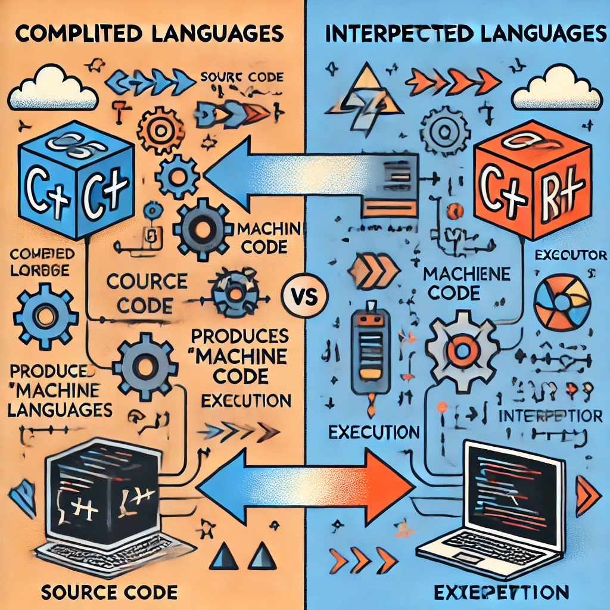
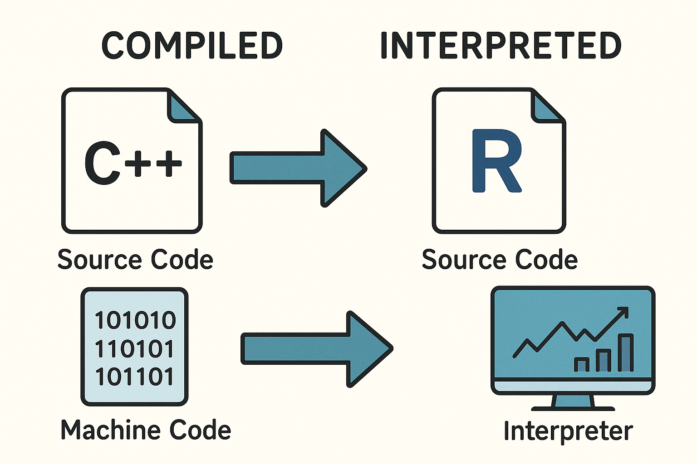
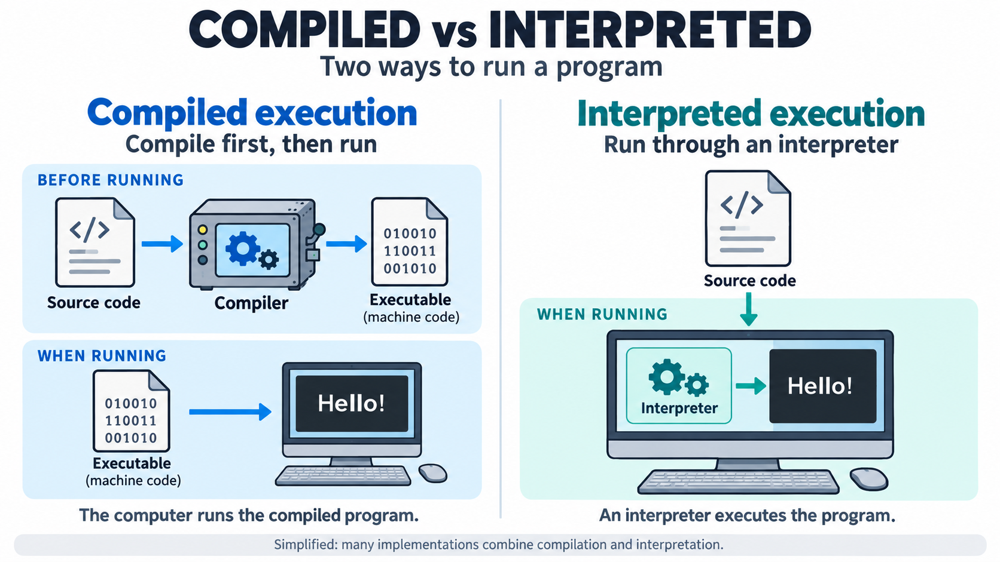
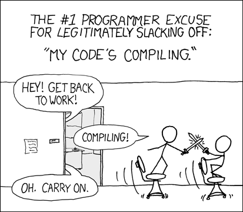
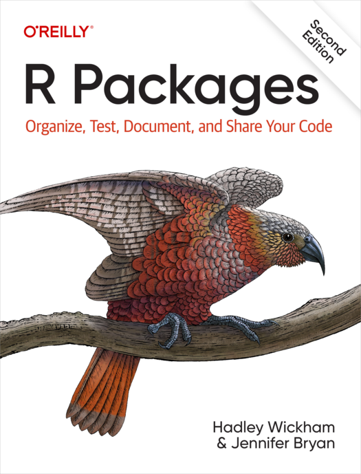



```{r}
#| label: setup
#| include: false

library(patchwork)

old_options <- options(digits = 4)
```

```{Rcpp, ref.label=knitr::all_rcpp_labels()}
//| label: source-rcpp
//| include: false
```

```{Rcpp}
//| label: namespace
//| include: false

#include <Rcpp.h>
using namespace Rcpp;
```

## Last Time: Stochastic Gradient Descent

A version of gradient descent that samples observations (functions) to estimate
the gradient. It can converge under suitable assumptions on the objective,
gradient estimates, and step sizes.

\medskip\pause

\begin{algorithm}[H]
  \caption{Stochastic gradient descent (with mini-batches)}
  \KwData{Initial parameter $x$ and step size $t_0 > 0$}
  \For{$k = 1,2,\dots$}{
    $A_k \gets$ batch of data\;

    $t_k \gets$ step size from a suitable diminishing schedule\;

    $x \gets x - t_k \frac{1}{|A_k|} \sum_{i \in A_k} \nabla f_i(x)$\;
    \If{converged}{
      \Return{$x$}
    }
  }
\end{algorithm}

\medskip\pause

Slow convergence, but cheap iterations.

\medskip\pause

We mentioned that R is ill-suited for this type of algorithm. Today, we will
learn how to fix this through C++.

## Today

### C++

What is **compiled** code?

\medskip\pause

Why do we want to use C++?

. . .

### Rcpp

We learn how to connect R and C++ using the Rcpp package.

## Why R?

::: {.columns}
::::: {.column width="30%"}
Why are we even using R?

\bigskip


:::::

::::: {.column width="60%"}
\pause

Because R lets us

- work interactively,\pause
- explore and visualize data via a rich toolset,\pause
- easily retrieve or generate data,\pause
- summarize and report (via R Markdown or Quarto), and\pause
- make use of a comprehensive ecosystem of packages.
:::::
:::

## Why *Not* R?

R loops often incur overhead from interpreting code and handling dynamic types.

. . .

::: {.columns}
::::: {.column width="47%"}
### Interpreted Languages

An interpreter executes expressions or bytecode at runtime.

\medskip\pause

R can compile code to bytecode. Many R functions also call compiled C or Fortran
code.

\medskip\pause

**Examples:** R and Python commonly execute bytecode in an interpreter.
:::::

. . .

::::: {.column width="47%"}
### Ahead-of-Time Compilation

Code is translated into machine code before execution.

\medskip\pause

**Examples:** C, C++, Fortran, and Rust.
:::::
:::

## Difference Between Compiled and Interpreted Languages

I have asked various version of OpenAI's image generation models to illustrate
the difference between compiled and interpreted languages, using this
prompt:\bigskip

> Give me an image that illustrates the difference between a compiled computer
> language and an interpreted computer language.

\bigskip\pause

I started doing this the first time the course was taught in 2024 and did it
again 2025 and now in 2026.

##

{width=55%}

##

{width=75%}

##

{width=85%}

##

\begin{figure}
  \centering
  \begin{tikzpicture}[
      node distance=0.5cm and 1cm,
      process/.style={rectangle, draw, rounded corners, minimum width=2.2cm, minimum height=1cm},
      arrow/.style={->, thick}
    ]

    % Interpreted pipeline
    \node[process, fill=yellow!10] (src) {Source code};
    \node[diamond, draw, fill=green!15, above=of src] (user) {User};
    \node[process, fill=blue!10, right=of src] (interp) {Interpreter};
    \node[circle, draw, fill=gray!15, right=of interp] (cpu) {CPU};

    \draw[arrow] (src) -- (interp);
    \draw[arrow] (user) -- (src);
    \draw[arrow] (interp) -- (cpu);
  \end{tikzpicture}
  \caption{An interpreter executes source code or bytecode (R, Python).}
\end{figure}

\pause

\begin{figure}
  \centering
  \begin{tikzpicture}[
      node distance=0.5cm and 1cm,
      process/.style={rectangle, draw, rounded corners, minimum width=2.2cm, minimum height=1cm, align=center},
      arrow/.style={->, thick}
    ]
    % Compiled pipeline
    \node[process, fill=yellow!10] (src) {Source code};
    \node[process, fill=blue!10, right=of src] (comp) {Compiler};
    \node[process, fill=red!15, right=of comp] (bin) {Machine code};
    \node[circle, draw, fill=gray!15, right=of bin] (cpu) {CPU};
    \node[diamond, draw, fill=green!15, above=of bin] (user) {User};

    \draw[dashed,arrow] (src) -- (comp);
    \draw[dashed,arrow] (comp) -- (bin);
    \draw[arrow] (user) -- (bin);
    \draw[arrow] (bin) -- (cpu);
  \end{tikzpicture}
  \caption{Ahead-of-time compilation (C++, Fortran, Rust)}
\end{figure}

## C++ Code

Here's a small program in C++.

```cpp
#include <iostream>

int
add(int a, int b)
{
  return a + b;
}

int
main()
{
  std::cout << add(2, 3) << std::endl;
  return 0;
}
```

## Assembly Representation

A disassembly of the program on the previous slide might look like this. The
hexadecimal bytes encode machine instructions; the mnemonics describe them.

```assembly
0000000000401130 <main>:
  401130:       55                      push   %rbp
  401131:       48 89 e5                mov    %rsp,%rbp
  401134:       48 83 ec 10             sub    $0x10,%rsp
  ···           ···                     ···    ···
  401149:       8b 45 f8                mov    -0x8(%rbp),%eax
  401165:       c9                      leaveq
  401166:       c3                      retq
```

. . .

### Binary Representation

Machine code is stored as binary (0s and 1s). The bytes above are displayed in
hexadecimal.

## Why C++?

C++ compilers generate efficient machine code: you no longer have to be scared
of `for` loops.

\medskip\pause

Compilation catches type errors and some other bugs early.

\medskip

. . .

::: {.columns align="center"}
::::: {.column width="47%"}
{width=100%}
:::::

::::: {.column width="47%" align="center"}
### Why *Not* C++?

Compiling adds overhead and complicates debugging.

\medskip\pause

Distributing code is more involved.
:::::
:::

## Bridging R and C++ with Rcpp

R is actually built partially in compiled languages (C, Fortran).

\medskip\pause

But, writing your own C/C++ code and connecting it to R has historically been
painful.

\medskip\pause

This has changed with the Rcpp package.

## The Sum Function in C++

```{Rcpp}
//| label: rcpp-sum
//| eval: false

// [[Rcpp::export]]
double
sum_cpp(Rcpp::NumericVector x) {
  double total = 0;
  const int n = x.size();

  for (int i = 0; i < n; ++i) {
    total += x[i];
  }

  return total;
}
```

. . .

As you can see, it looks quite similar to R code. We will explore the
similarities and differences in the rest of this lecture.

## What Rcpp Brings

### A Link to C++

Rcpp provides an easy way to link functions written in C++ to R.

\medskip\pause

No need to manually compile and link code. Rcpp takes care of this for you!

. . .

### Classes

Rcpp defines a number of classes that wrap R objects, including

- `Rcpp::NumericVector`
- `Rcpp::DataFrame`
- `Rcpp::List`

. . .

### Functions

Rcpp offers counterparts to many R functions through its sugar interface,
including

- `Rcpp::sum()`
- `Rcpp::runif()`

## Installing Rcpp

### Linux

The required tools depend on your distribution. On Ubuntu, run:

```bash
sudo apt install r-base-dev
```

. . .

### macOS

You need the Xcode Command Line Tools. Open a terminal and run:

```sh
xcode-select --install
```

. . .

### Windows

Install [Rtools](https://cran.r-project.org/bin/windows/Rtools/) for your
version of R.

\medskip

On each platform, also install the Rcpp package in R:

```r
install.packages("Rcpp")
```

## Side-By-Side Comparison

::: {.columns}
::::: {.column width="40%"}
### R

```{r}
#| label: r-sum

library(Rcpp)

sum_r <- function(x) {
  total <- 0

  for (i in seq_along(x)) {
    total <- total + x[i]
  }

  total
}
```
:::::

. . .

::::: {.column width="54%"}
### C++

```cpp
#include <Rcpp.h>
using namespace Rcpp;

// [[Rcpp::export]]
double
sum_cpp(NumericVector x)
{
  double total = 0;

  for (int i = 0; i < x.size(); ++i)
    total += x[i];

  return total;
}
```
:::::
:::

# Writing Code in C++ (Rcpp)

## Return and Argument Types

C++ is **statically typed**: types are checked at compile time. In these
examples, you specify types for return values and arguments.

. . .

```cpp
double   // Return type: double
f(int x) // Argument type: int
{
  return x / 3.0;
}
```

. . .

If your function returns nothing, use `void`:

```cpp
void
f()
{
  Rcpp::Rcout << "Hello world" << std::endl;
}
```

## Syntax

### Assignment

You assign values using `=` (not `<-`, as in R).

. . .

### Statements

Statements end with a semicolon (`;`). A new line is not enough!

. . .

### Explicit Return

You need to use `return` to return a value.

::: {.columns}
::::: {.column width="47%"}
```r
f <- function(x) {
  y <- x + 1
  y
}
```
:::::

::::: {.column width="47%"}
```cpp
int
f(int x)
{
  int y = x + 1;
  return y;
}
```
:::::
:::

## Zero-Based Indexing

In C++, vector and array indices start at 0 (not 1)!

\medskip\pause

Don't do this!

```cpp
void
ooops(Rcpp::NumericVector x)
{
  for (int i = 0; i <= x.size(); ++i) {
    x[i] = x[i] / 5;
  }
}
```

. . .

Will look at one element past the end of the vector!

## Declaration Order Matters

This will not compile:\footnote{But would work just fine in R.}

```cpp
double
f(double x)
{
  return g(x) + 1;
}

double
g(double x)
{
  return x * 2;
}
```

. . .

You need to declare `g()` before `f()`.

## References

In C++, you can explicitly pass arguments by reference using `&`.

. . .

```cpp
void
f(double& x)
{
  x = x + 1;
}
```

. . .

```cpp
double
g()
{
  double x = 2;
  f(x);
  return x; // returns 3
}
```

## Pointers

You can also use pointers (`*`).

. . .

```cpp
void
f(double x)
{
  double* p = &x;
  *p = *p + 1;

  return;
}
```

. . .

But you don't need them with Rcpp and they are often a source of bugs.

## In-Place Modification

Unlike ordinary R vector arguments, C++ arguments passed by reference can be
modified in place.

. . .

```cpp
void
f(int& x)
{
  x += 1; // identical to x = x + 1;
}

int
g()
{
  int x = 2;
  f(x);
  return x; // returns 3
}
```

```{Rcpp}
//| label: rcpp-sum-ref
//| eval: false
//| echo: false

// [[Rcpp::export]]
double
sum_cpp_ref(Rcpp::NumericVector& x) {
  double total = 0.0;
  const int n = x.size();

  for (int i = 0; i < n; ++i) {
    total += x[i];
  }

  return total;
}
```

## Classes and Objects

C++ is an object-oriented programming language.

```cpp
class Point
{
public: // can also use private
  double x;
  double y;
};
```

. . .

```cpp
Point
create_point(double x, double y)
{
  Point p;
  p.x = x;
  p.y = y;

  return p;
}
```

## Methods in C++

In C++, methods belong to classes.

. . .

```cpp
class Point
{
public:
  double x;
  double y;
  double distance_from_origin() { return std::sqrt(x * x + y * y); }
};
```

. . .

You call methods using `.` for objects and references, or `->` for pointers.

. . .

```cpp
double
distance(Point p)
{
  return p.distance_from_origin();
}
```

## Functional Programming Features in C++

C++ supports several programming styles, including functional programming.

\medskip\pause

You can, for instance, pass functions as arguments.

```cpp
int
add(int a, int b)
{
  return a + b;
}

int
compute(int x, int y, int (*func)(int, int))
{
  return func(x, y);
}
```

## Function Arguments

In R, the same function can take different types of arguments.

\medskip\pause

This works differently in C++:

```cpp
double
f(int x)
{
  return x + 1;
}

int
main()
{
  f(3);   // OK (an integer, result is 4)
  f(2.5); // Look out! (Compiles, but `x` -> 2, result is 3)
  f("2"); // Error! (Cannot convert string to int.)
}
```

## Function Overloading

Instead, you can define multiple functions with the same name but different
argument types:

```cpp
double
f(double x)
{
  return x + 1;
}

int
f(int x)
{
  return x + 1;
}
```

## Constants

In C++, we can use `const` to declare constants.

```cpp
const double pi = 3.14159;
pi = 3.14; // Error!
```

. . .

After declaration, the variable cannot be modified.

\medskip\pause

`const` signals intent and helps prevent accidental modification. It does not
guarantee faster code.

## Including C++ Code in R

```{r}
#| label: rcpp-setup

library(Rcpp)
```

. . .

Pass C++ code to `cppFunction()` as a text string. It compiles the code and
creates an R interface.

```{r}
#| label: rcpp-one

cppFunction("int one() {return 1;}")
```

. . .

And then the function can be called from R.

```{r}
#| label: rcpp-one-call

one()
```

## Source Files

But it's better to use `.cpp` files (for instance in the `src/` folder) and call
`sourceCpp()` (or RStudio's UI tool).

\medskip\pause

In `scripts/my_r_experiment.R` (or similar), call

```r
sourceCpp(here::here("src", "my_cpp_functions.cpp"))
```

```
my_project/
├── scripts/
│   └── my_r_experiment.R    # R script
├── src/
│   └── my_cpp_functions.cpp # Source for C++ functions
└── my_rproject.Rproj        # RStudio project file
```

## Rcpp Syntax

Each file should start with

```cpp
#include <Rcpp.h>
```

. . .

Before each function you want to export to R, add the comment

```cpp
// [[Rcpp::export]]
```

## Sum Functions

Let's see if we can beat R's own `sum()` (see
[here](https://github.com/wch/r-source/blob/3b69aff4083ee81d6c4fe7177eb2b2a2ca41a240/src/main/summary.c#L152)
for the implementation).

```{r}
#| label: bench-sum
#| cache: true
#| fig-width: 5
#| fig-height: 2.2

x <- runif(1e5)
bench::mark(sum(x), sum_cpp(x), sum_r(x)) |>
  plot()
```

## References in Rcpp

You might think that this would create a copy of the R input vector.

```cpp
// [[Rcpp::export]]
double
sum_cpp_ref(Rcpp::NumericVector x)
{
  return Rcpp::sum(x);
}
```

. . .

But no, copying the `Rcpp::NumericVector` wrapper does not copy the underlying R
vector. Both wrappers refer to the same R object.

## Pitfall: Modifying R Objects

```{Rcpp}
//| label: rcpp-uhoh
//| eval: false

// [[Rcpp::export]]
void
uh_oh(Rcpp::NumericVector x)
{
  x = x + 1.0;
}
```

. . .

```{r}
#| label: uh-oh

x <- 1.5:4.5
uh_oh(x)
x
```

. . .

The input vector `x` has been modified in place! You can use `Rcpp::clone()` to
avoid this.

## `const` References

A `const` reference restricts modification through the parameter.

. . .

```{Rcpp}
//| label: rcpp-sum-constref
//| eval: false

// [[Rcpp::export]]
double
sum_cpp_const_ref(const Rcpp::NumericVector& x) {
  double total = 0.0;
  const int n = x.size();

  for (int i = 0; i < n; ++i) {
    total += x[i];
  }

  return total;
}
```

For ordinary C++ containers, passing by reference avoids copying their data.
`NumericVector` already shares the underlying R vector when passed by value, so
a reference usually provides little performance benefit. `const` still helps
prevent accidental modification.

## Printing

Printing to the R console can be done using `Rcpp::Rcout`.

```{Rcpp}
//| label: rcpp-print
//| eval: false

// [[Rcpp::export]]
void
print_cpp(const Rcpp::NumericVector& x) {
  Rcpp::Rcout << "x = " << x << std::endl;
}
```

. . .

```{r}
#| label: rcpp-print-call

print_cpp(1:5)
```

## Errors and Warnings

You can signal errors and warnings using `Rcpp::stop()` and `Rcpp::warning()`.

```{Rcpp}
//| label: rcpp-error
//| eval: false

// [[Rcpp::export]]
double
safe_log(double x) {
  if (x <= 0) {
    Rcpp::stop("x must be positive");
  }

  return std::log(x);
}
```

## Premature Optimization

Measure performance before optimizing. C++ compilers remove some overhead, but
algorithm choice, memory access, and allocation still matter.

\medskip\pause

What you see in the source code is **not** what you get.

\medskip\pause

Copies and temporaries are often optimized away.

## Example: Von Mises Rejection Sampling

### R Version

```{r}
#| label: vM-rejection
#| cache: true

rvonmises <- function(N, kappa) {
  if (!is.finite(kappa) || kappa < 0) {
    stop("kappa must be finite and nonnegative")
  }
  y <- numeric(N)
  for (i in seq_len(N)) {
    reject <- TRUE
    while (reject) {
      y0 <- runif(1, -pi, pi)
      u <- runif(1)
      reject <- u > exp(kappa * (cos(y0) - 1))
    }
    y[i] <- y0
  }
  y
}
```

##

### Rcpp Version

```{Rcpp}
//| label: vMsim-cpp
//| eval: false

// [[Rcpp::export]]
Rcpp::NumericVector
rvonmises_cpp(const int N, const double kappa)
{
  if (!std::isfinite(kappa) || kappa < 0) {
    Rcpp::stop("kappa must be finite and nonnegative");
  }
  Rcpp::NumericVector y(N);
  int i = 0;

  while (i < N) {
    double y0 = R::runif(-M_PI, M_PI);
    bool accept = R::runif(0, 1) <= std::exp(kappa * (std::cos(y0) - 1));
    if (accept) {
      y[i] = y0;
      i++;
    }
  }
  return y;
}
```

##

```{r, dependson=c("vMsim-cpp", "vM-rejection")}
#| label: vMsim-cpp-runtime
#| echo: false
#| fig-width: 5
#| fig-cap: "Benchmark of R and Rcpp implementations of the von Mises rejection sampler."

bench::mark(
  rvonmises(1000, kappa = 5),
  rvonmises_cpp(1000, kappa = 5),
  check = FALSE
) |>
  plot()
```

## Batch Sizes Revisited: R versus C++

The same logistic regression as last time: $N = 1000$, $p = 2$, and 25 epochs.
Both implementations use the same batches and learning rates.

```{r}
#| label: batch-size-rcpp-runtime
#| echo: false
#| cache: false
#| fig-width: 5
#| fig-height: 2.4
#| fig-cap: "Median of 10 runs. Times include gradient updates, but exclude
#|   compilation, batch sampling, rate tuning, and loss evaluation."

source(here::here("R", "lecture12-batch-sizes.R"))
Rcpp::sourceCpp(here::here("R", "lecture12-batch-sizes.cpp"))
batch_timings <- benchmark_logreg_batches()

ggplot(
  batch_timings,
  aes(batch_size, milliseconds, color = language)
) +
  geom_line() +
  geom_point() +
  scale_x_log10(breaks = c(1, 10, 100, 1000)) +
  scale_y_log10() +
  scale_color_manual(
    values = c("C++" = "royalblue", "R" = "darkorange")
  ) +
  labs(
    x = "Batch size",
    y = "Time for 25 epochs (ms)",
    color = NULL
  )
```

\pause

Small batches pay for many R calls and temporary objects. The C++ loop avoids
this R overhead; arithmetic and the single call from R still have a cost.

\pdfpcnote{
- Compare implementation costs for fixed work, not time to a target loss.\\
- Use the same gradients as lecture 11, without loss evaluation or coefficient history.\\
}

## The Standard Template Library (STL)

A library of generic algorithms, data structures, and iterators for C++.

\medskip\pause

It's like R's base package, but for C++.

\medskip\pause

Accessed via the `std` namespace.

\medskip\pause

Provides a number of useful functions for working with vectors and other
containers.

. . .

### Efficiently Growing Vectors

Unlike R and Rcpp vectors, `std::vector` supports efficient growth through
amortized constant-time insertion at the end.

```cpp
std::vector<int> x;

for (int i = 0; i < 10; ++i) {
  x.emplace_back(i);
}
```

## Linear Algebra with RcppArmadillo

Armadillo is a user-friendly C++ library for linear algebra.

```cpp
#include <RcppArmadillo.h>

// [[Rcpp::depends(RcppArmadillo)]]
// [[Rcpp::export]]
arma::mat
armaMatMul(const arma::mat& A, const arma::mat& B)
{
  return A * B;
}
```

. . .

Intuitive syntax, depends on BLAS and LAPACK.

## Linear Algebra with RcppEigen

Eigen is another popular C++ library for linear algebra.

```cpp
#include <RcppEigen.h>

// [[Rcpp::depends(RcppEigen)]]
// [[Rcpp::export]]
Eigen::MatrixXd
eigenMatMul(const Eigen::MatrixXd& A, const Eigen::MatrixXd& B)
{
  return A * B;
}
```

. . .

More low-level than Armadillo, but does not depend on BLAS/LAPACK.

## Parallelization

Parallelization has overhead in both R and C++. C++ threads can reduce the
communication and serialization overhead of separate R processes.

\medskip\pause

Two main ways to parallelize C++ code in R are OpenMP and the
[RcppParallel](https://rcppcore.github.io/RcppParallel/) package.

```cpp
#include <RcppParallel.h>
using namespace Rcpp;

// [[Rcpp::depends(RcppParallel)]]
// [[Rcpp::export]]
double
parallel_function(const Rcpp::NumericVector& x)
{
  // Implement a parallel reduction and return its result here.
  return 0.0; // Placeholder result.
}
```

. . .

We won't cover the details here. Speedups depend on the workload and how work is
divided. Parallel workers generally must avoid calling the R or Rcpp APIs.

## Packages

Like tests, Rcpp code works best in packages.

\medskip\pause

We will cover this in our final lecture.

\medskip\pause

Not as complicated as you might think!

::: {.columns align="center"}
::::: {.column width="62%"}
. . .

### R Packages

Great book to get started; free and available online at <https://r-pkgs.org>.
:::::

::::: {.column width="25%"}
{width=100%}
:::::
:::

## The cpp11 Package

Nowadays, you can also use the [cpp11](https://cpp11.r-lib.org/) package, which
works similarly to Rcpp but is more lightweight.

\medskip\pause

Won't cover it here, but has some advantages and disadvantages compared to Rcpp.

. . .

::: {.columns}
::::: {.column width="47%"}
### Advantages

- Compiles faster
- Grows vectors efficiently
- Enforces copy-on-write semantics (like R)
:::::

. . .

::::: {.column width="47%"}
### Disadvantages

- Smaller ecosystem
- Fewer built-in functions (sugar)
- Less established Armadillo and Eigen bindings:
  [cpp11armadillo](https://cran.r-project.org/package=cpp11armadillo) and
  [cpp11eigen](https://cran.r-project.org/package=cpp11eigen)
:::::
:::

## Getting Help

- [The many official
  vignettes](https://cran.r-project.org/web/packages/Rcpp/index.html)\pause
- [Rcpp For Everyone](https://teuder.github.io/rcpp4everyone_en/) by Masaki E.
  Tsuda\pause
- [Rcpp Gallery](https://gallery.rcpp.org/)\pause
- [The unofficial Rcpp API
  documentation](https://thecoatlessprofessor.com/programming/cpp/unofficial-rcpp-api-documentation/)

## Exercise

1. Implement a function using Rcpp that computes the sample standard deviation
   of a (numeric) vector.\footnote{Don't use `Rcpp::sd()`, please!}\pause
2. Test your function against R's `sd()` function to make sure it works
   correctly.\pause
3. Benchmark your function against R's `sd()` function to see if it is faster.
4. Return `NA` when the input vector has length 0 or 1, as R's `sd()` does.

```{Rcpp}
//| label: rcpp-sd
//| eval: false
//| echo: false

// [[Rcpp::export]]
double
cpp_sd(NumericVector x) {
  double out = 0.0;
  double x_mean = 0.0;

  int n = x.size();
  if (n < 2) return NA_REAL;

  for (int i = 0; i < n; ++i) {
    x_mean += x[i] / n;
  }

  for (int i = 0; i < n; ++i) {
     out += std::pow(x[i] - x_mean, 2);
  }

  return std::sqrt(out / (n - 1));
}
```

## Summary

R supports interactive work, but interpreted loops and dynamic typing can add
overhead.

\medskip\pause

You can use C++ to speed up your code, and it is not as difficult as you might
think.

\medskip\pause

But there are pitfalls, so be careful!

\medskip\pause

Debugging C++ code is tricky and failures can crash R.

## Course Evaluations

The course evaluations are open!

\medskip

Please take a few minutes to fill them out. Your feedback is valuable!

## Next Time

### Variations on Stochastic Gradient Descent

We expand on the stochastic gradient descent algorithm, looking at momentum and
adaptive step sizes.
