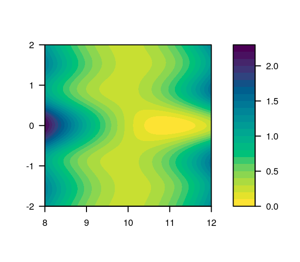



```{r}
#| label: momentum-surface
#| echo: false

source(here::here("R", "gd.R"))

library(mvtnorm)

set.seed(622)

N <- 1000
Sigma <- matrix(c(1, 0.7, 0.7, 1), 2, 2)
mu <- c(0, 0)
X <- rmvnorm(N, mu, Sigma)
beta <- c(0.5, 1)
y <- X %*% beta + rnorm(N)

res <- gd(X, y)
beta_mom <- 0.3
res_momentum <- gd(X, y, beta_mom = beta_mom)

plot_trajectory <- function(betas) {
  b1 <- betas[1, ]
  b2 <- betas[2, ]
  lines(b1, b2)
  points(b1, b2, cex = 0.5, pch = 19)
}

b1 <- seq(-0.3, 1.4, length.out = 100)
b2 <- seq(0, 1.6, length.out = 100)
f_vec <- Vectorize(function(b1, b2) 0.5 * norm(X %*% c(b1, b2) - y, "2")^2)
z <- outer(b1, b2, f_vec)

beta_mom_values <- c(0, 0.3, 0.9)
```

## Last Times: Rcpp and SGD

### Rcpp

We introduced Rcpp and how to use it to speed up R code.

. . .

## Stochastic Gradient Descent

::: {.columns align="center"}
::::: {.column width="39%"}
### SGD

Introduced stochastic gradient descent (SGD) and mini-batch version thereof.
:::::

::::: {.column width="51%"}
\begin{algorithm}[H]
  \KwData{Learning-rate schedule $(\gamma_n)$} \For{$n \gets 1, 2, \dots$}{
  $I_n \gets$ random mini-batch of $m$ indices\;
  $\theta_n \gets \theta_{n-1} - \frac{\gamma_n}{m} \sum_{i \in I_n} \nabla_\theta L(y_i,x_i,\theta_{n-1})$\;
  }
  \caption{Mini-Batch SGD}
\end{algorithm}
:::::
:::

. . .

### Problems

We indicated that there were problems with vanilla SGD: poor convergence,
erratic behavior.

## Today

How can we improve stochastic gradient descent?

. . .

### Momentum

Replace the current gradient by a smoothed direction that remembers past
gradients.

\medskip\pause

Two versions: Polyak momentum and Nesterov acceleration

. . .

### Adaptive Gradients

Adapt learning rate to particular feature.

## Momentum

::: {.columns align="center"}
::::: {.column width="47%"}
### Basic Idea

Average recent gradients so that the update has **memory**.

\medskip\pause

Not specific to SGD! To simplify, we will discuss standard gradient descent
first.

. . .

### Book Convention

The direction $\rho_n$ is an exponentially weighted average of gradients.

\medskip\pause

The memory parameter $\beta \in [0,1)$ determines how long past gradients remain
influential; $\beta = 0$ gives gradient descent.
:::::

::::: {.column width="47%"}
\begin{algorithm}[H]
  \KwData{$\gamma >0$, $\beta \in [0,1)$, $\theta_0$, $\rho_0 = 0$}
    \For{$n \gets 1, 2, \dots$}{
      $g_n \gets \nabla H(\theta_{n-1})$\;
      $\rho_n \gets \alert{\beta \rho_{n-1} + (1 - \beta)g_n}$\;
      $\theta_n \gets \theta_{n-1} - \gamma \rho_n$\;
  }
  \caption{Polyak momentum}
\end{algorithm}
:::::
:::

## Relation to the Heavy-Ball Form

For a fixed learning rate $\gamma$, the previous update implies
$$
  \theta_n = \theta_{n - 1}
             - \gamma(1 - \beta)\nabla H(\theta_{n - 1})
             + \beta(\theta_{n - 1} - \theta_{n - 2}).
$$

. . .

As introduced by @polyakMethodsSpeedingConvergence1964, the classical heavy-ball
form
$$
  \theta_n = \theta_{n - 1}
             - \alpha \nabla H(\theta_{n - 1})
             + \beta(\theta_{n - 1} - \theta_{n - 2}),
$$
uses $\alpha = \gamma(1 - \beta)$.

\medskip\pause

With a learning-rate schedule, the displacement coefficient also contains
$\gamma_n / \gamma_{n - 1}$, so the two forms are not related by a single
rescaling.

## Polyak Momentum in Practice


## Local Minima

::: {.columns align="center"}
::::: {.column width="47%"}
For nonconvex $H$, gradient descent may get stuck at a local minimum.
:::::

::::: {.column width="47%"}
\begin{figure}[htpb]
  \centering
  \multiinclude[<+>][format=pdf]{lecture13/images/escape-minima-gd}
  \caption{%
    No momentum ($\beta = 0$).
  }
\end{figure}
:::::
:::

## Escaping Local Minima

::: {.columns align="center"}
::::: {.column width="47%"}
With momentum, we can (sometimes) remedy this problem.
:::::

::::: {.column width="47%"}
\begin{figure}[htpb]
  \centering
  \multiinclude[<+>][format=pdf]{lecture13/images/escape-minima-mom}
  \caption{%
    With momentum ($\beta = 0.8$).
  }
\end{figure}
:::::
:::

## Convergence Failure

::: {.columns}
::::: {.column width="41%"}
For some problems, the momentum method may fail to
converge\ [@lessardAnalysisDesignOptimization2016].

\medskip\pause

### Example {.example}

Consider $$

  H(\theta) =
\begin{cases}
  \frac{25\theta^2}{2}                 & \text{if } \theta < 1,        \\
  \frac{\theta^2}{2} + 24\theta - 12   & \text{if } 1 \leq \theta < 2, \\
  \frac{25\theta^2}{2} - 24\theta + 36 & \text{if } \theta \geq 2.
\end{cases}

$$

. . .

With heavy-ball coefficients $\alpha = 1/9$ and $\beta = 4/9$, the method
converges to three limit points. In the book convention, the equivalent learning
rate is $\gamma = \alpha / (1 - \beta) = 1/5$.
:::::

::::: {.column width="47%"}

:::::
:::

## Nesterov Acceleration

::: {.columns align="center"}
::::: {.column width="43%"}
First extrapolate to a look-ahead point $y_n$, then evaluate the gradient there.

\medskip\pause

Unlike Polyak momentum, Nesterov acceleration has an $O(1/n^2)$ guarantee for
general smooth, convex objectives.

\medskip\pause

First appeared in @nesterovMethodSolvingConvex1983.
:::::

::::: {.column width="53%"}
\begin{algorithm}[H]
  \KwData{$\gamma >0$, $(\beta_n)$, $\theta_{-1} = \theta_0$}
  \For{$n \gets 1,2,\dots$}{
    $y_n \gets \theta_{n-1} + \beta_n(\theta_{n-1} - \theta_{n-2})$\;
    $\theta_n \gets y_n - \gamma \nabla H(y_n)$\;
  }
  \caption{Nesterov acceleration}
\end{algorithm}
:::::
:::

##


## Optimal Nesterov Weights

::: {.columns}
::::: {.column width="47%"}
For gradient descent with $\gamma = 1/L$, the optimal choice of $\beta_n$ for
general convex and smooth $H$ is
$$
  \beta_n = \frac{a_{n - 1} - 1}{a_{n}}
$$
for a series of
$$
  a_n = \frac{1 + \sqrt{4a_{n - 1}^2 + 1}}{2}
$$
with $a_0 = 1$ (and hence $\beta_1 = 0$).

\medskip\pause

First step ($n = 1$) is just standard gradient descent.
:::::

::::: {.column width="47%"}

:::::
:::

## Convergence

::: {.columns align="center"}
::::: {.column width="47%"}
Convergence rate with Nesterov acceleration goes from $O(1/n)$ to $O(1/n^2)$

\medskip\pause

This is **optimal** for a first-order method. But it is no longer a *descent*
method!

\medskip\pause

Convergence improves further for quadratic and strongly convex!
:::::

::::: {.column width="47%"}

:::::
:::

##

```{r}
#| label: momentum-comparison
#| fig-width: 5.2
#| fig-height: 4.3
#| fig-cap: "Comparison of Polyak momentum and Nesterov acceleration for a
#|   least-squares problem with $\\beta = 0.8$ and $30$ iterations."
#| echo: false

opar <- par(no.readonly = TRUE)
par(mfrow = c(1, 2), mai = c(1, 0, 1, 0.0), oma = c(0, 4, 0.1, 0.1), cex = 1)

maxit <- 30
beta_mom <- 0.8

source(here::here("R", "gd.R"))

for (method in c("polyak", "nesterov")) {
  res <- gd(X, y, beta_mom = beta_mom, type = method, maxit = maxit)
  first_plot <- method == "polyak"
  contour(
    b1,
    b2,
    z,
    asp = 1,
    col = "dark grey",
    drawlabels = FALSE,
    axes = FALSE,
    frame.plot = TRUE,
    xlab = expression(beta[1])
  )
  axis(1)
  if (first_plot) {
    axis(2)
    mtext(expression(beta[2]), side = 2, line = 3, outer = TRUE)
  }
  plot_trajectory(res$betas)
  text(
    x = par("usr")[1] + 0.05 * diff(par("usr")[1:2]),
    y = par("usr")[4] - 0.07 * diff(par("usr")[3:4]),
    labels = method,
    adj = 0
  )
}
par(opar)
```

## What About SGD?

So far, we have mostly talked about standard GD, but we can use momentum (Polyak
or Nesterov) for SGD as well.

\medskip\pause

For standard GD, Nesterov is the dominating method for achieving acceleration;
for SGD, Polyak momentum is actually quite common.

\medskip\pause

### Stochastic Gradient Descent

In term of convergence, all bets are now off.

\medskip\pause

No optimal rates anymore, just heuristics.

\medskip\pause

But momentum helps in another way: it **reduces variance** of the iterates.

##

::: {.columns align="center"}
::::: {.column width="47%"}
### Variance Reduction

Momentum smooths out the updates, reducing variance of the iterates.

\medskip\pause

And also adds inertia, accelerating progress in low-variance directions.
:::::

::::: {.column width="47%"}
```{r}
#| label: momentum-variance
#| echo: false
#| fig-height: 4
#| fig-width: 3.2

# Load the updated SGD implementation
source(here::here("R", "sgd.R"))

# Generate logistic regression data
set.seed(123)

N <- 1000
p <- 2
Sigma <- matrix(c(1, 0.8, 0.8, 1), nrow = 2)
mu <- c(0, 0)

X <- rmvnorm(N, mean = mu, sigma = Sigma)
beta <- c(1, 2)
y <- rbinom(N, 1, plogis(X %*% beta))

res_glm <- glm.fit(X, y, family = binomial())

loss_2d <- function(beta1, beta2, X, y) {
  beta <- c(beta1, beta2)
  z <- X %*% beta
  p_hat <- 1 / (1 + exp(-z))
  -mean(y * log(p_hat) + (1 - y) * log(1 - p_hat))
}

beta1 <- seq(-1, 3, length = 51)
beta2 <- seq(-0.5, 5, length = 51)

loss_2d_vectorized <- Vectorize(function(b1, b2) loss_2d(b1, b2, X, y))

z <- outer(beta1, beta2, loss_2d_vectorized)

# SGD parameters - use small batch and more epochs to show variance clearly
batch_size <- 5
beta_mom <- 0.9
max_epochs <- 1
K <- 5

set.seed(123)
res_sgd <- logreg_sgd(
  X,
  y,
  max_epochs = max_epochs,
  batch_size = batch_size,
  K = K,
  beta_mom = 0
)
set.seed(123)
res_sgd_mom <- logreg_sgd(
  X,
  y,
  max_epochs = max_epochs,
  batch_size = batch_size,
  K = K,
  beta_mom = beta_mom
)
loss_optim <- loss_2d(res_glm$coefficients[1], res_glm$coefficients[2], X, y)

loss1 <- loss_2d_vectorized(
  res_sgd_mom$beta_history[1, ],
  res_sgd_mom$beta_history[2, ]
)
loss2 <- loss_2d_vectorized(
  res_sgd$beta_history[1, ],
  res_sgd$beta_history[2, ]
)

pal <- palette.colors(palette = "Okabe-Ito")

contour(beta1, beta2, z, col = "dark grey", drawlabels = FALSE, asp = 1)

lines(res_sgd$beta_history[1, ], res_sgd$beta_history[2, ], col = pal[3])
points(
  res_sgd$beta_history[1, ],
  res_sgd$beta_history[2, ],
  col = pal[3],
  pch = 19,
  cex = 0.5
)

lines(
  res_sgd_mom$beta_history[1, ],
  res_sgd_mom$beta_history[2, ],
  col = pal[1]
)
points(
  res_sgd_mom$beta_history[1, ],
  res_sgd_mom$beta_history[2, ],
  col = pal[1],
  pch = 19,
  cex = 0.5
)

points(
  res_glm$coefficients[1],
  res_glm$coefficients[2],
  col = pal[2],
  pch = 19,
  cex = 1
)

legend(
  "bottomright",
  legend = c("SGD", "SGD + Momentum"),
  col = pal[c(3, 1)],
  pch = 19,
  cex = 0.8
)
```
:::::
:::

## Iterate Averaging (Polyak--Ruppert)

::: {.columns align="center"}
::::: {.column width="47%"}
Keep a running average of SGD iterates to reduce variance:
$$
  \bar{\theta}_n = \frac{1}{n} \sum_{i = 1}^n \theta_i.
$$

. . .

Update incrementally:
$$
  \bar{\theta}_n = \bar{\theta}_{n - 1}
                   + \frac{1}{n}(\theta_n - \bar{\theta}_{n - 1}).
$$
:::::

::::: {.column width="47%"}
\begin{algorithm}[H]
  \KwData{$\theta_0$, schedule $(\gamma_n)$}
  $\bar{\theta}_0 \gets \theta_0$\;
  \For{$n \gets 1,2,\dots$}{
    Sample $i_n$\;
    $\rho_n \gets \nabla_\theta L(y_{i_n},x_{i_n},\theta_{n-1})$\;
    $\theta_n \gets \theta_{n-1} - \gamma_n \rho_n$\;
    $\bar{\theta}_n \gets \bar{\theta}_{n-1} + \frac{1}{n}\left(\theta_n - \bar{\theta}_{n-1}\right)$\;
  }
  \caption{SGD with Polyak--Ruppert averaging}
\end{algorithm}
:::::
:::

\medskip\pause

Improves asymptotic variance at negligible cost.

\medskip\pause

Works with momentum and batches.

##

```{r}
#| label: momentum-variance-comparison
#| echo: false
#| fig-width: 5.2
#| fig-height: 3.3
#| fig-cap: >-
#|   Comparison of SGD with and without Polyak-Ruppert averaging for a logistic
#|   regression problem.

# Generate logistic regression data
set.seed(123)
N <- 1000
p <- 2
X_logistic <- matrix(rnorm(N * p), N, p)
beta_true <- c(0.5, 1.5)
logits <- X_logistic %*% beta_true
probs <- plogis(logits)
y_logistic <- rbinom(N, 1, probs)

# Logistic regression loss and gradient functions
logistic_loss <- function(beta, X, y) {
  logits <- X %*% beta
  -sum(y * logits - log(1 + exp(logits)))
}

logistic_grad <- function(beta, X, y) {
  logits <- X %*% beta
  probs <- plogis(logits)
  t(X) %*% (probs - y)
}

# SGD with Polyak-Ruppert averaging for logistic regression
sgd_polyak_ruppert <- function(X, y, batch_size = 10, maxit = 500, lr = 0.19) {
  N <- nrow(X)
  p <- ncol(X)

  # Initialize parameters
  beta <- rnorm(p, 0, 0.1)
  beta_avg <- beta

  # Storage for trajectories
  betas <- matrix(0, p, maxit)
  betas_avg <- matrix(0, p, maxit)

  betas[, 1] <- beta
  betas_avg[, 1] <- beta_avg

  for (k in 2:maxit) {
    # Sample mini-batch
    batch_idx <- sample(N, batch_size, replace = FALSE)
    X_batch <- X[batch_idx, , drop = FALSE]
    y_batch <- y[batch_idx]

    # Compute gradient on mini-batch
    grad <- logistic_grad(beta, X_batch, y_batch) / batch_size

    # SGD update
    beta <- beta - lr * grad

    # Polyak-Ruppert averaging: running average of iterates
    beta_avg <- beta_avg + (1 / k) * (beta - beta_avg)

    # Store results
    betas[, k] <- beta
    betas_avg[, k] <- beta_avg
  }

  list(betas = betas, betas_avg = betas_avg, beta_true = beta_true)
}

# Run SGD with and without averaging
result <- sgd_polyak_ruppert(X_logistic, y_logistic)

# Create comparison plot
par(mfrow = c(1, 2), mar = c(4, 4, 3, 1))

# Plot parameter trajectories
iterations <- 1:ncol(result$betas)

# First parameter
plot(
  iterations,
  result$betas[1, ],
  type = "l",
  col = "darkorange",
  xlab = "Iteration",
  ylab = expression(beta[1]),
  ylim = range(c(result$betas[1, ], result$betas_avg[1, ]))
)
abline(h = result$beta_true[1], col = "black", lty = 2)
lines(iterations, result$betas_avg[1, ], col = "steelblue")

# Second parameter
plot(
  iterations,
  result$betas[2, ],
  type = "l",
  col = "darkorange",
  xlab = "Iteration",
  ylab = expression(beta[2]),
  ylim = range(c(result$betas[2, ], result$betas_avg[2, ]))
)
lines(iterations, result$betas_avg[2, ], col = "steelblue")
abline(h = result$beta_true[2], col = "black", lty = 2)
legend(
  "bottomright",
  legend = c("SGD", "Polyak-Ruppert", "True value"),
  col = c("darkorange", "steelblue", "black"),
  lty = c(1, 1, 2)
)

par(mfrow = c(1, 1))
```

## Adaptive Gradients

### General Idea

Some directions may be important, but feature information is **sparse**.

. . .

### AdaGrad

::: {.columns}
::::: {.column width="47%"}
Store matrix of gradient history,
$$
  G_n = \sum_{i = 1}^n \nabla H(\theta_i) \nabla H(\theta_i)^\intercal,
$$
and update by multiplying gradient with $G_n^{-1/2}$.
:::::

. . .

::::: {.column width="47%"}
\begin{algorithm}[H]
  \KwData{$\gamma >0$, $G = 0$} \For{$n \gets 1, 2, \dots$}{
    $G_n \gets G_{n-1} + \nabla H(\theta_{n-1}) \nabla H(\theta_{n-1})^\intercal$\;
    $\theta_n \gets \theta_{n-1} - \gamma G_n^{-1/2} \nabla H(\theta_{n-1})$\; }
\caption{AdaGrad}
\end{algorithm}
:::::
:::

. . .

### Effects

- Larger learning rates for sparse features\pause
- Step-sizes adapt to curvature.

## AdaGrad In Practice

### Simplified Version

Computing $\nabla H \nabla H^\intercal$ is $O(p^2)$: expensive!

\medskip\pause

Replace $G^{-1/2}_n$ with $\operatorname{diag}(G_n)^{-1/2}$

. . .

### Avoid Singularities

Add a small $\epsilon$ to diagonal.

\bigskip

\begin{algorithm}[H]
  \KwData{$\gamma >0$, $\epsilon > 0$}
    \For{$n \gets 1, 2, \dots$}{
      $G_n \gets G_{n-1} + \operatorname{diag}\big(\nabla H(\theta_{n-1})^2\big)$\;
      $\theta_n \gets \theta_{n-1} - \gamma \operatorname{diag}\big(\epsilon I_p + G_n\big)^{-1/2} \nabla H(\theta_{n-1})$\;
    }
  \caption{Simplified AdaGrad}
\end{algorithm}

## RMSProp

Acronym for **R**oot **M**ean **S**quare **Prop**agation\ [@hintonLecture62018].

. . .

### Idea

Divide learning rate by running average of magnitude of recent gradients:
$$
  v(\theta, n) = \xi v(\theta, n - 1) + (1 - \xi)\nabla H(\theta_n)^2
$$
where $\xi$ is the **forgetting factor**.

\medskip\pause

Similar to AdaGrad, but uses **forgetting** to gradually decrease influence of
old data.

\medskip\pause

\begin{algorithm}[H]
  \KwData{$\gamma >0$, $\xi > 0$}
  \For{$n \gets 1, 2, \dots$,
    $\xi \in [0, 1)$}{ $v_n = \xi v_{n-1} + (1 - \xi) \nabla H(\theta_{n-1})$\;
    $\theta_n \gets \theta_{n-1} - \frac{\gamma}{\sqrt{v_n}} \odot \nabla H(\theta_{n-1})$\; 
  }
  \caption{RMSProp. (Note that $\odot$ is element-wise product.)}
\end{algorithm}

## Adam

Acronym for **Ada**ptive **m**oment
estimation\ [@kingmaAdamMethodStochastic2015]

\medskip\pause

Basically RMSProp + *momentum* (for both gradients and second moments thereof)

\medskip\pause

Popular and still in much use today.

\medskip\pause

Not covered here, but see the course literature\ [@hansen2024] for details.

## Gradient Clipping

### Idea

If gradient is too large, scale it down to avoid too large steps.

\medskip\pause

Replace gradient $\nabla H(\theta_n)$ by $$

  \tilde{\nabla} H(\theta_n) =
\begin{cases}
  \nabla H(\theta_n)                                    & \text{if } \|\nabla H(\theta_n)\|_2 \leq c, \\
c \frac{\nabla H(\theta_n)}{\|\nabla H(\theta_n)\|_2} & \text{otherwise}.
\end{cases}

$$

. . .

### How do you Pick $c$?

Some strategies:

1. **Rule of thumb**: $c \in [1, 10]$ often works well in practice\pause
2. **Gradient norm monitoring**: Track $\|\nabla H(\theta_n)\|_2$ during
   training and set $c$ based on observed distribution\pause
3. **Percentile-based**: Set $c$ to be the 95th or 99th percentile of observed
   gradient norms\pause
4. **Problem-specific**: Use domain knowledge about expected gradient magnitudes

. . .

**Practical considerations:**

- Start conservative (smaller $c$) and increase if training is too slow
- Monitor loss curves: clipping should stabilize, not hurt convergence

## Early Stopping

::: {.columns align="center"}
::::: {.column width="40%"}
### Idea

We are not really interested in **training error**.

. . .

### Early Stopping

Stop training when validation metric stops improving.

\medskip\pause

Use a held-out validation set; never the training set, and avoid
**overfitting**.

\medskip\pause
:::::

::::: {.column width="54%"}
\begin{algorithm}[H]
  \KwData{Patience $P$, min improvement $\delta \ge 0$}
  $\theta \gets \theta_0$, $\theta_{\mathrm{best}} \gets \theta$, $b_{\mathrm{best}} \gets \infty$, $p \gets 0$\;
  \For{$n=1,2,\dots$}{
    Train for some epochs\;
    Compute validation loss $b_n$\;
    \eIf{$b_n \le b_{\mathrm{best}} - \delta$}{
      $b_{\mathrm{best}} \gets b_n$, $\theta_{\mathrm{best}} \gets \theta$, $p \gets 0$\;
    }{
      $p \gets p + 1$\;
      \If{$p \ge P$}{break}
    }
  }
  \Return{$\theta_{\mathrm{best}}$}
  \caption{Early stopping with patience}
\end{algorithm}
:::::
:::

##

```{r}
#| label: early-stopping
#| fig-cap: Illustration of early stopping.
#| echo: false
#| fig-width: 6
#| fig-height: 4

# Simulate training and validation loss curves that demonstrate early stopping
set.seed(42)
epochs <- 1:100

# Training loss: steadily decreasing (with some noise)
train_loss <- 2 * exp(-epochs / 25) + 0.1 + rnorm(100, 0, 0.05)
train_loss <- pmax(train_loss, 0.05) # Ensure positive

# Validation loss: decreases initially, then increases (overfitting)
val_loss_base <- 2.2 * exp(-epochs / 20) + 0.15 + (epochs / 100)^2 * 0.8
val_loss <- val_loss_base + rnorm(100, 0, 0.08)
val_loss <- pmax(val_loss, 0.1) # Ensure positive

# Implement early stopping algorithm
patience <- 10
min_delta <- 0.01
best_val_loss <- Inf
best_epoch <- 1
patience_counter <- 0
early_stop_epoch <- NULL

for (epoch in 1:length(epochs)) {
  current_val_loss <- val_loss[epoch]

  if (current_val_loss <= best_val_loss - min_delta) {
    best_val_loss <- current_val_loss
    best_epoch <- epoch
    patience_counter <- 0
  } else {
    patience_counter <- patience_counter + 1
    if (patience_counter >= patience) {
      early_stop_epoch <- epoch
      break
    }
  }
}

# Create the plot
plot(
  epochs,
  train_loss,
  type = "l",
  col = "steelblue",
  xlab = "Epoch",
  ylab = "Loss",
  ylim = range(c(train_loss, val_loss), na.rm = TRUE),
  xlim = c(1, max(early_stop_epoch + 10, 50))
)

# Add validation loss
lines(epochs, val_loss, col = "darkorange")

# Mark the best validation loss point
points(best_epoch, best_val_loss, col = "black", pch = 19, cex = 1.5)

# Mark the early stopping point
if (!is.null(early_stop_epoch)) {
  abline(v = early_stop_epoch, lty = 2)
}

# Add annotations for the patience period
if (!is.null(early_stop_epoch) && early_stop_epoch >= best_epoch + patience) {
  # Highlight the patience period with a more visible window
  patience_start <- best_epoch
  patience_end <- early_stop_epoch

  # Create a shaded region for the patience window
  y_range <- range(c(train_loss, val_loss), na.rm = TRUE)
  y_bottom <- y_range[1] - 0.05 * diff(y_range)
  y_top <- y_range[2] + 0.05 * diff(y_range)

  rect(
    patience_start,
    y_bottom,
    patience_end,
    y_top,
    col = rgb(0, 0, 0, 0.1),
    border = "transparent"
  )

  # Add patience window label at the top
  text(
    (patience_start + patience_end) / 2,
    y_top - 0.05 * diff(y_range),
    paste0("Patience")
  )
}

# Add legend
legend(
  "bottomleft",
  legend = c("Training Loss", "Validation Loss", "Best Model", "Early Stop"),
  col = c("steelblue", "darkorange", "black", "black"),
  lty = c(1, 1, NA, 2),
  pch = c(NA, NA, 19, NA),
  lwd = c(1, 1, NA, 1)
)
```

## Example: Nonlinear Least Squares

::: {.columns align="center"}
::::: {.column width="42%"}
Let's assume we're trying to solve a least-squares type of problem:
$$
  H_N(\theta) = \frac{1}{2N} \sum_{i = 1}^N \left( y_i - g(\theta; x_i) \right)^2
$$
with $\theta = (\alpha, \beta)$ and
$$
  g(\theta; x) = \alpha \cos(\beta x).
$$

. . .

Then
$$
  \nabla_{\theta} H_N(\theta) = \frac{1}{N}\sum_{i = 1}^N (y_i - g(\theta; x_i))
\begin{bmatrix}
  -\cos(\beta x_i) \\
  \alpha x_i \sin(\beta x_i)
\end{bmatrix}
  .
$$
:::::

::::: {.column width="50%"}

:::::
:::

##

::: {.columns}
::::: {.column width="40%"}

:::::

::::: {.column width="50%"}

:::::
:::

## Variants

We will consider three variants:

- Batch gradient descent
- Batch gradient descent **with momentum**
- Adam

\medskip\pause

In each case, we'll use a batch of size $m = 50$.

\medskip\pause

We initialize at different starting values and see how well the algorithm
converges.

##

\begin{figure}[htpb]
  \centering
  \multiinclude[<+>][
    format=pdf,
    graphics={width=\textwidth}
  ]{lecture13/images/nonlinear-convergence}
  \caption{%
    Convergence of different algorithms for different starting values.  
  }
\end{figure}

##


##


## Rcpp

Very attractive for stochastic methods due to all the loop constructs and
slicing.

\medskip\pause

However, Rcpp lacks linear algebra functions.

. . .

### Approaches

Still use only Rcpp (but then you need to write your own linear algebra
functions[^not-recommended])

\medskip\pause

Use RcppEigen or RcppArmadillo.

[^not-recommended]: Not recommended!

## Exercise: Rosenbrock's Banana

### Steps

1. Minimize $H(\theta) = (a - \theta_1)^2 + b(\theta_2 - \theta_1^2)^2$ with
   $a = 1$ and $b = 100$ using gradient descent. Optimum is $(a, a^2)$.\pause
2. Add Polyak momentum.\pause
3. Experiment with different step sizes and momentum parameters.

::: {.columns}
::::: {.column width="47%"}
\begin{algorithm}[H]
  \KwData{$\gamma >0$, $\beta \in [0,1)$, $\rho_0 = 0$}
  \For{$n \gets 1, 2, \dots$}{
    $g_n \gets \nabla H(\theta_{n-1})$\;
    $\rho_n \gets \beta\rho_{n-1} + (1 - \beta)g_n$\;
    $\theta_n \gets \theta_{n-1} - \gamma\rho_n$\;
  }
  \caption{Polyak momentum}
\end{algorithm}
:::::

. . .

::::: {.column width="47%"}
### Plot Contours

You can use the following code to plot the contours of the function (after
defining `H`):

```r
theta1 <- seq(-2, 2, by = 0.05)
theta2 <- seq(-1, 3, by = 0.05)
z <- outer(theta1, theta2, H)
contour(theta1, theta2, z, nlevels = 20)
```
:::::
:::

## Summary

We introduced several new concepts:

- Polyak momentum,\pause
- Nesterov acceleration (momentum),\pause
- Polyak-Ruppert averaging,\pause
- adaptive gradients (AdaGrad, RMSProp),\pause
- gradient clipping, and\pause
- early stopping.\pause

\medskip\pause

We practically implemented versions of gradient descent and stochastic gradient
descent with momentum.

. . .

### Additional Resources

[@gohWhyMomentumReally2017] is an interactive article on momentum in gradient
descent with lots of pedagogical illustrations.

## Next Time

### R Packages

We build an R package.

. . .

### Summary

We summarize the course.

. . .

### Exam Advice

We talk about the upcoming oral examinations.

## References {.allowframebreaks}

:::
