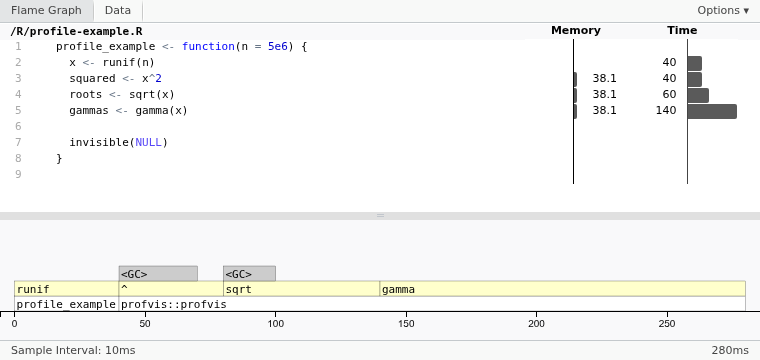
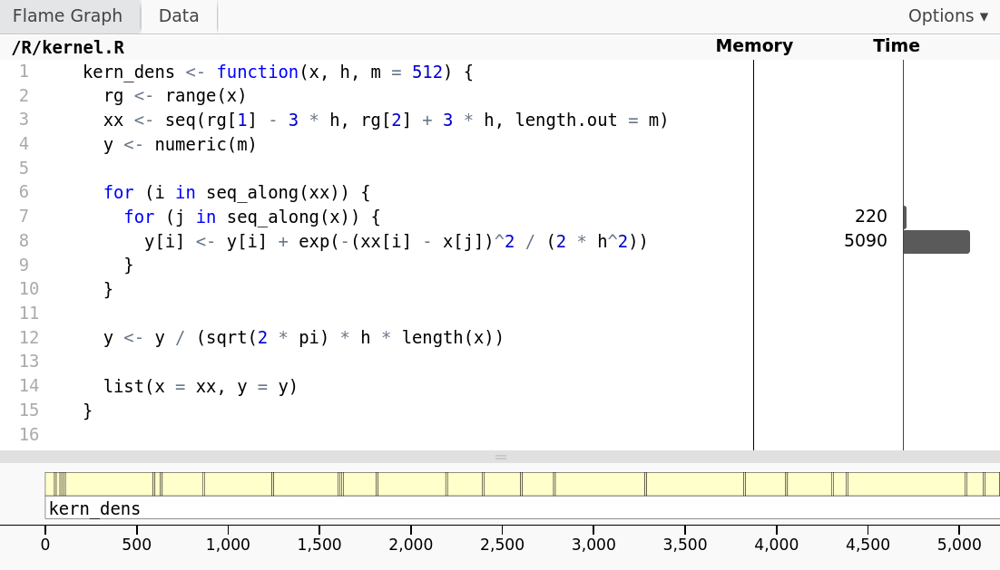
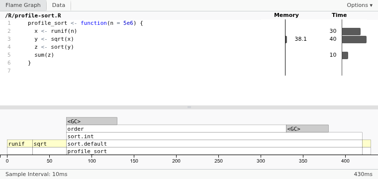
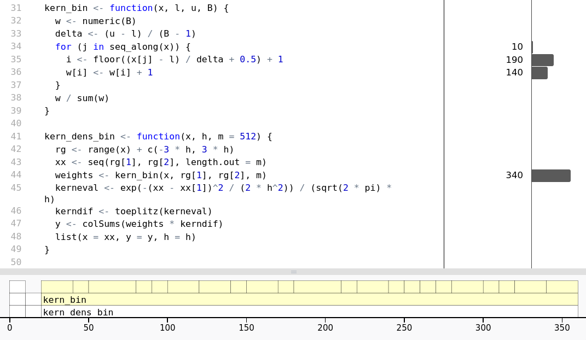



```{r}
#| label: setup
#| include: false

source(here::here("R", "kernel.R"), keep.source = TRUE)

phipsi <- read.table(
  here::here("data", "phipsi.tsv"),
  header = TRUE
)
phipsi[, c("phi", "psi")] <- pi * phipsi[, c("phi", "psi")] / 180
```

## Today's Agenda

### Profiling

Identifying bottlenecks in code

. . .

### Benchmarking

Comparing performance of implementations

. . .

### Improving Performance

Writing efficient code

## Dimensions of Performance

### Speed

How long does it take to run?

. . .

### Memory

How much memory space does it use?

. . .

### Accuracy

How close is an approximation to the target quantity?

## Correctness Is a Constraint

Before optimizing, decide what counts as the same answer:

- exact equality, or\pause
- agreement within a meaningful tolerance.

. . .

### Trade-Offs

Faster methods may require more memory or tolerate more approximation error.

. . .

We will focus on **speed**, but never without checking correctness and accuracy.

## Should You Optimize?

### What is Your Use Case?

Before thinking about improving performance, consider whether you even need to.
Maybe your code is already fast enough?

\medskip\pause

If you're only doing it for yourself, is the **investment** worth it?

. . .

### Premature Optimization: The Root of All Evil?

\medskip

> We *should* forget about small efficiencies, say about 97% of the time:
> premature optimization is the root of all evil. Yet we should not pass up our
> opportunities in that critical 3%.
>
> \medskip
> *---Donald Knuth*

. . .

### Readability

Improving performance often comes at the cost of code readability.

## Profiling

But if your code \alert{is} too slow, then it's time to profile it.

. . .

\medskip

A profiler quantifies how much time each part of your code takes to run.

. . .

R uses a **sampling-based profiler**, which periodically samples the call stack
to see what functions are running.

\pause\medskip

Profilers record both **time** and **memory** usage.

## Sampling-Based Profiling

A profiler periodically records which function is running and tallies the
samples.

```{r}
#| label: sampling-profiler
#| echo: false
#| results: asis

profiler_samples <- c("f", "g", "h", "f")
profiler_colors <- c(
  f = "royalblue",
  g = "darkorange",
  h = "grey35"
)
profiler_code <- c(
  "function(x) {",
  "  f(x)",
  "  g(x)",
  "  h(x)",
  "}"
)
profiler_call_rows <- c(f = 2, g = 3, h = 4)

draw_profiler_sample <- function(step) {
  old_par <- par(mar = rep(0, 4))
  on.exit(par(old_par))

  plot.new()
  plot.window(
    xlim = c(0, 1),
    ylim = c(0, 1),
    xaxs = "i",
    yaxs = "i"
  )

  card_left <- c(0.01, 0.26, 0.51, 0.76)
  card_width <- 0.22
  code_y <- seq(0.78, 0.42, length.out = length(profiler_code))

  for (i in seq_along(profiler_samples)) {
    is_observed <- i <= step
    left <- card_left[i]
    right <- left + card_width

    text(
      (left + right) / 2,
      0.94,
      paste("sample", i),
      col = if (is_observed) "grey20" else "grey75",
      family = "sans",
      cex = 0.75
    )
    rect(
      left,
      0.35,
      right,
      0.87,
      border = if (is_observed) "grey55" else "grey85"
    )

    active_row <- unname(profiler_call_rows[profiler_samples[i]])

    for (line in seq_along(profiler_code)) {
      is_active <- is_observed && line == active_row

      if (is_active) {
        rect(
          left + 0.01,
          code_y[line] - 0.04,
          right - 0.01,
          code_y[line] + 0.04,
          col = profiler_colors[profiler_samples[i]],
          border = NA
        )
      }

      text(
        left + 0.02,
        code_y[line],
        profiler_code[line],
        adj = 0,
        family = "mono",
        font = if (is_active) 2 else 1,
        col = if (is_active) {
          "white"
        } else if (is_observed) {
          "grey20"
        } else {
          "grey80"
        },
        cex = 0.85
      )
    }
  }

  text(
    0.01,
    0.27,
    "sample tally",
    adj = 0,
    family = "sans",
    cex = 0.8
  )

  tally_y <- c(f = 0.19, g = 0.12, h = 0.05)
  observed <- profiler_samples[seq_len(step)]

  for (fun in names(tally_y)) {
    text(
      0.06,
      tally_y[fun],
      paste0(fun, "()"),
      family = "mono",
      cex = 0.85
    )

    count <- sum(observed == fun)
    if (count > 0) {
      for (i in seq_len(count)) {
        left <- 0.12 + (i - 1) * 0.075
        rect(
          left,
          tally_y[fun] - 0.025,
          left + 0.06,
          tally_y[fun] + 0.025,
          col = profiler_colors[fun],
          border = NA
        )
      }
    }
  }
}

profiler_figure_path <- knitr::opts_chunk$get("fig.path")
profiler_figure_base <- file.path(
  profiler_figure_path,
  "sampling-profiler"
)
dir.create(
  profiler_figure_path,
  recursive = TRUE,
  showWarnings = FALSE
)

for (step in seq_along(profiler_samples)) {
  grDevices::pdf(
    paste0(profiler_figure_base, "-", step, ".pdf"),
    width = 5.5,
    height = 2.8,
    pointsize = 9
  )
  draw_profiler_sample(step)
  grDevices::dev.off()
}

cat(
  "\\begin{center}\n",
  sprintf(
    paste0(
      "\\multiinclude[<+>][format=pdf,start=1,end=%d,",
      "graphics={width=0.96\\linewidth}]{%s}"
    ),
    length(profiler_samples),
    profiler_figure_base
  ),
  "\n\\end{center}\n",
  sep = ""
)
```

\pdfpcnote{
  - Each snapshot highlights the function that was running when the profiler
    sampled the call stack.\\
  - The tally approximates the proportion of execution
    time spent in each function.
}

## Profiling in R

The R package [profvis](https://CRAN.R-project.org/package=profvis) provides
tools to visualize profiling output.

```{r}
#| label: load_profvis

library(profvis)
```

. . .

### Simple to Use

1. Source the code you want to profile using `source()`.\pause
2. Either run `profvis()` on the expression you want to profile or, in RStudio,
   select `Profile -> Start Profiling`. Run your code, and then select
   `Profile -> Stop Profiling`.

\pause\medskip

The result is an interactive webpage that opens in a tab in RStudio or Positron.

```{r}
#| label: source_profvis
#| eval: false

source("<your-file>.R")
profvis(your_function())
```

## A Simple Example

Let's begin with a function whose lines perform different amounts of work.

```{r}
#| label: profile-example-code

# In file R/profile-example.R
profile_example <- function(n = 5e6) {
  x <- runif(n)
  squared <- x^2
  roots <- sqrt(x)
  gammas <- gamma(x)

  invisible(NULL)
}
```

. . .

Which line do you expect to take the most time?

## A Simple Example

Now let's run the profiler.

. . .

```{r}
#| label: profile-example-prof
#| eval: false

source(here::here("R", "profile-example.R"), keep.source = TRUE)

profvis(profile_example())
```

##

{fig-align="center" width="95%"}

. . .

`gamma()` receives the most samples.

\pdfpcnote{
  Return to their predictions. Emphasize that the profiler gives an estimate
  based on samples, not an exact decomposition of the running time.
}

## Loop Overhead

Now consider the kernel density estimator from the last lecture.

```{r}
#| label: kern-dens-code

# In file R/kernel.R
kern_dens <- function(x, h, m = 512) {
  rg <- range(x)
  xx <- seq(rg[1] - 3 * h, rg[2] + 3 * h, length.out = m)
  y <- numeric(m)

  for (i in seq_along(xx)) {
    for (j in seq_along(x)) {
      y[i] <- y[i] + exp(-(xx[i] - x[j])^2 / (2 * h^2))
    }
  }

  y <- y / (sqrt(2 * pi) * h * length(x))

  list(x = xx, y = y)
}
```

## Can We See the Overhead?

Now let's run the profiler.

. . .

```{r}
#| label: kern-dens-prof
#| eval: false

source(here::here("R", "kernel.R"), keep.source = TRUE)

x <- rnorm(1e5)

profvis(kern_dens(x, 0.2))
```

. . .

Where will the loop overhead appear in the profile?

##



. . .

Most samples land on the loop body---not the `for` statements. Numerical work
and R's loop overhead are bundled together.

\pdfpcnote{
  The body is evaluated $512N$ times. A line profiler attributes samples to the
  expression being evaluated; it does not measure loop overhead as a separate
  category. We need a benchmark to learn how much vectorization saves.
}

## A First Optimization

One hypothesis is that repeatedly evaluating the inner loop body in R is
expensive.

\pause\medskip

We can test it by \alert{vectorizing} the inner loop.

. . .

```{r}
#| label: kern-dens-vec-code
#| eval: false

# Old (Nested Loop)
kern_dens_vec <- function(x, h, m = 512) {
  # ...
  for (i in seq_along(xx)) {
    for (j in seq_along(x)) {
      y[i] <- y[i] + exp(-(xx[i] - x[j])^2 / (2 * h^2))
    }
  }
  # ...
}
```

## A First Optimization

One hypothesis is that repeatedly evaluating the inner loop body in R is
expensive.

We can test it by \alert{vectorizing} the inner loop.

```{r}
#| label: kern-dens-vec-code-2
#| eval: false

# New (vectorized)
kern_dens_vec <- function(x, h, m = 512) {
  # ...

  for (i in seq_along(xx)) {
    y[i] <- sum(exp(-(xx[i] - x)^2 / (2 * h^2)))
  }

  # ...
}
```

. . .

How much faster is this? We'll \alert{benchmark} this soon.

```{r}
#| label: kern-dens-vec-code-3
#| echo: false

kern_dens_vec <- function(x, h, m = 512) {
  rg <- range(x)
  xx <- seq(rg[1] - 3 * h, rg[2] + 3 * h, length.out = m)
  y <- numeric(m)

  for (i in seq_along(xx)) {
    y[i] <- sum(exp(-(xx[i] - x)^2 / (2 * h^2)))
  }

  y <- y / (sqrt(2 * pi) * h * length(x))

  list(x = xx, y = y)
}
```

## Pitfall: Time in Callees

Now consider a version that calls `sort()`.

```{r}
#| label: profile-sort-code

# In file R/profile-sort.R
profile_sort <- function(n = 5e6) {
  x <- runif(n)
  y <- sqrt(x)
  z <- sort(y)
  sum(z)
}
```

## Pitfall: Time in Callees

{fig-align="center" width="95%"}

. . .

`sort()` dominates the flame graph, but no time is attributed to its source
line.

\pdfpcnote{
  The work is recorded under sort.default(), sort.int(), and order(). This is a
  source-attribution limitation, not lazy evaluation.
}

## Other Common Pitfalls

### Nested Calls

With multiple function calls on the same line, you won't directly see where the
time is spent.

. . .

### Anonymous Functions

Anonymous functions complicate profiling because you will see only `<Anonymous>`
in the output.

. . .

### Resolution

Resolution (sampling frequency) may be too low for small pieces of code---but do
you really need to profile them then?

. . .

### Quarto and R Markdown

Running profvis inside Quarto or R Markdown often does not work well. If you do
so, using `keep.source = TRUE` in `source()` might help.

# Benchmarking

## Benchmarking

The purpose of benchmarking is to compare the performance of different
implementations of the same task.

. . .

### The bench Package

We use the R package [bench](https://cran.r-project.org/package=bench) for
benchmarking.

```{r}
#| label: load_bench

library(bench)
```

. . .

### `bench::mark()`

The package's main function is a high-precision timer that adaptively chooses
the number of iterations needed to obtain accurate results.

. . .

It also checks results for correctness unless `check = FALSE`.

\medskip\pause

Disabling the check only removes a safeguard. It does not make different results
comparable---you must validate them separately against a trusted reference.

## A First, Simple Benchmark

```{r}
#| label: simple-bench

x <- runif(100)

sqrt_bench <- bench::mark(sqrt(x), x^0.5)

sqrt_bench
```

## `plot.bench_mark()`

```{r}
#| label: bee-bench
#| fig-width: 5.3
#| fig-cap: A beeswarm plot of the benchmark results.

plot(sqrt_bench)
```

. . .

The [ggbeeswarm](https://CRAN.R-project.org/package=ggbeeswarm) package is
necessary for the default plot behavior.

## Parameterized Benchmarking

Use `bench::press()` for parameterized benchmarking. It runs expressions across
the Cartesian product of its parameter arguments.

. . .

```{r}
#| label: dens-bench
#| message: false
#| warning: false

dens_bench <- bench::press(N = 2^(6:9), {
  x <- rnorm(N)
  bench::mark(
    base = density(x, 0.2),
    loop = kern_dens(x, 0.2),
    vectorized = kern_dens_vec(x, 0.2),
    check = FALSE # Why? Recall last lecture!
  )
})
```

## Bench Press Results

```{r}
#| label: head-bench

head(dens_bench, 6)
```

##

```{r}
#| label: default-press-plot
#| fig-cap: Default plot method for `bench::press()` results, here showing the
#|   performance of three different implementations of a kernel density
#|   estimator.
#| fig-width: 5.3
#| fig-height: 2.6

plot(dens_bench)
```

##

```{r}
#| label: custom-bench-plot-code
#| ref-label: "custom-bench-plot-code"
#| fig-height: 1.8
#| fig-width: 3.4
#| fig-cap: Custom plot of benchmark results for the three different
#|   implementations.

mutate(dens_bench, method = as.character(expression)) |>
  ggplot(aes(N, median, color = method)) +
  geom_point() +
  geom_line() +
  labs(y = "time (s)")
```

\pdfpcnote{
  Mention the difference in how performance scales with N.
}

## Notes About Benchmarking

### Don't Relativize Too Much

Look at absolute values too: does the difference matter (for your use case)?

. . .

### Background Tasks

Your computer may be doing something else at the same time.

. . .

### Hardware

Hardware matters: different computers may give different results.

\pdfpcnote{
  Mention that some students had benchmarks running before
  they went into sleep mode.
}

# Improving Performance

## Improving Performance

We could divide the strategies for optimizing code into multiple categories.

. . .

::: {.columns}
::::: {.column width="47%"}
### General Strategies

Strategies that apply to **every** programming language, such as

- avoiding copies,\pause
- storing data wisely,\pause and
- parallelizing.

. . .

### R-Specific Tricks

Strategies that apply selectively to the R language, such as calling

- vectorized (compiled) functions, or\pause
- specialized functions.
:::::

. . .

::::: {.column width="47%"}
### Context-Specific Tricks

Strategies that are specific to the problem at hand, such as **binning** (later
this lecture).
:::::
:::

## R Is Slow ...

... when used like a low-level language.

\pause\medskip

R is an **interpreted** (as opposed to *compiled*) language. You have the
convenience of never having to wait around for something to compile, but you pay
the price when you need a piece of code to be fast.

\pause\medskip

It was written mainly for specifying statistical models (not for developing new
numerical methods).

\pause\medskip

It is suitable for high-level programming where most low-level computations are
implemented in a compiled language (e.g., `lm()` and `qr()`).

## R Is Fast ...

... when most computations are carried out by calls to compiled code.

. . .

```{r}
#| label: bench-loop-vector

x <- rnorm(1e4)
bench_res <- bench::mark(
  loop = {
    y <- numeric(length(x))
    for (i in seq_along(x)) {
      y[i] <- 10 * x[i]
    }
    y
  },
  vectorized = 10 * x
)
```

##

```{r}
#| label: bench-plot
#| fig-width: 5
#| fig-cap: Benchmark results for a loop vs. a vectorized computation

plot(bench_res)
```

## Vectorization

Vectorization means rewriting code to operate on entire vectors at once rather
than looping over elements (e.g., `mean()` instead of a `for` loop).

. . .

\medskip

The term is misleading. Most "vectorized" code also involves a loop, but one
that is typically written in C, C++, or Fortran.

## Beware of Loops in Disguise

Using a vectorized function does not necessarily make your code fast.

. . .

```{r}
#| label: bench-loop-bench

loop_bench <- bench::mark(
  sapply = sapply(x, function(x_i) 10 * x_i),
  loop = {
    y <- numeric(length(x))

    for (i in seq_along(x)) {
      y[i] <- 10 * x[i]
    }

    y
  }
)
```

--------------------------------------------------------------------------------

```{r}
#| label: bench-loop-plot
#| fig-width: 5
#| fig-height: 2
#| fig-cap: The loop is slightly faster than the vectorized `sapply()`.
#| echo: false

plot(loop_bench)
```

## Binning in Density Estimation

The line profiler revealed that most time is spent on the kernel evaluation, but
we cannot optimize the kernel further.

\medskip\pause

But we can use \alert{binning}: create $B$ bins, evaluate the kernel at the bin
centers, and replace
$$
  \hat{f}(x) = \frac{1}{N h} \sum_{j=1}^N K\left( \frac{x - x_j}{h} \right)
$$
with
$$
  \hat{f}(x) = \frac{1}{N h} \sum_{j=1}^B N_j K\left( \frac{x - c_j}{h} \right)
$$
where $c_j$ is the center of the $j$th bin and $N_j$ is the number of data
points in the $j$th bin.

\medskip\pause

This reduces the complexity from $O(Nm)$ to $O(N) + O(mB)$.

## Binning Procedure

1. Determine the range of the data and choose equally spaced bin centers.\pause
2. Assign every observation to its nearest center and count the
   assignments.\pause
3. Replace the observations in each bin by its center and count.\pause
4. At every output point, evaluate the weighted kernel sum over the centers.

. . .

\medskip

It's an example of context-specific optimization.

. . .

### Caution

If $N < B$, then binning will not help. (But do you need to optimize for this
scenario?)

## Implementation

A key to the implementation is this function, which loops over the data and, for
each point, checks which bin center is closest.

```{r}
#| label: kern-bin-code

kern_bin <- function(x, l, u, B) {
  w <- numeric(B)
  delta <- (u - l) / (B - 1)

  for (j in seq_along(x)) {
    i <- floor((x[j] - l) / delta + 0.5) + 1
    w[i] <- w[i] + 1
  }

  w / sum(w)
}
```

## Full Binning Implementation

```{r}
#| label: kern-dens-bin-code

kern_dens_bin <- function(x, h, m = 512, B = m) {
  rg <- range(x) + c(-3 * h, 3 * h)
  xx <- seq(rg[1], rg[2], length.out = m)
  centers <- seq(rg[1], rg[2], length.out = B)

  w <- kern_bin(x, rg[1], rg[2], B)

  distances <- outer(xx, centers, "-")
  kernel_values <- exp(-distances^2 / (2 * h^2)) /
    (sqrt(2 * pi) * h)
  y <- drop(kernel_values %*% w)

  list(x = xx, y = y, h = h)
}
```

The argument `B` controls the approximation, while `m` controls the output grid.

##

```{r}
#| label: micro3
#| echo: false
#| fig-width: 5.2
#| fig-cap: The relative benefit of binning increases with the size of the data.
#| fig-height: 3

res2 <- bench::press(N = 2^(5:13), {
  h <- 0.2
  x <- rnorm(N)
  bench::mark(
    base = density(x, h),
    loop = kern_dens(x, h),
    vectorized = kern_dens_vec(x, h),
    binning = kern_dens_bin(x, h),
    check = FALSE
  )
})

mutate(
  res2,
  expr = as.character(expression),
  median = as.numeric(median)
) |>
  ggplot(aes(N, median, color = expr)) +
  geom_point() +
  geom_line() +
  scale_y_log10() +
  labs(y = "time (s)")
```

## Validate the Approximation

We compare every binned estimate with the exact implementation on the same
output grid.

```{r}
#| label: binning-accuracy

set.seed(123)
N <- 2^13
x <- c(rnorm(N / 2), rnorm(N / 2, -3, 0.7))
h <- 0.2
B_values <- 2^(4:9)

reference <- kern_dens_vec(x, h)

accuracy <- tibble(B = B_values) |>
  mutate(
    max_error = map_dbl(B, function(B) {
      estimate <- kern_dens_bin(x, h, B = B)
      max(abs(estimate$y - reference$y))
    })
  )
```

## The Speed--Accuracy Trade-Off

Earlier, `check = FALSE` let us benchmark exact and approximate results
together. The preceding calculation supplies the separate validation that this
requires.

```{r}
#| label: binning-tradeoff
#| echo: false
#| message: false
#| warning: false
#| fig-width: 5.5
#| fig-height: 2.4
#| fig-cap: Increasing the number of bins costs time but reduces the maximum
#|   absolute error.

speed <- bench::press(B = B_values, {
  bench::mark(binned = kern_dens_bin(x, h, B = B))
}) |>
  transmute(B, median_time = as.numeric(median))

time_plot <- ggplot(speed, aes(B, median_time)) +
  geom_line(color = "darkorange") +
  geom_point(color = "darkorange") +
  scale_x_log10(breaks = B_values) +
  scale_y_log10() +
  labs(x = "Number of bins", y = "Median time (s)")

error_plot <- ggplot(accuracy, aes(B, max_error)) +
  geom_line(color = "royalblue") +
  geom_point(color = "royalblue") +
  scale_x_log10(breaks = B_values) +
  scale_y_log10() +
  labs(x = "Number of bins", y = "Maximum absolute error")

time_plot + error_plot
```

## Line Profiling

The `kern_dens_bin()` function is so much faster for long sequences that, to get
good profiling results, we use a data sequence that is 512 times as long.

```{r}
#| label: line-prof-bin
#| eval: false

x <- rnorm(2^22)
profvis(kern_dens_bin(x, 0.2))
```

##



\pdfpcnote{
  - The bottleneck is now the loop in `kern_bin()`.\\
  - We leave solving this to the future.
}

## Avoiding Copies

### Copy-on-Write (Modify)

**Recall:** R passes objects by reference, but when an object is
\alert{modified}, a copy is created.

\pause\medskip

### Examples {.example}

- Accessing a column of a matrix.\pause
- Growing vectors (`c()`) and matrices (`rbind()`, `cbind()`).

. . .

```{r}
#| label: copy-on-write

x <- rnorm(100)
x <- c(x, 4) # 101 values are allocated
```

## Memory

### Memory in R

In R, everything is typically loaded into memory.

### Garbage Collection

R includes a garbage collector, which intermittently releases unused blocks of
memory.

### Trade-Offs

Storing intermediate objects that are used multiple times will boost performance
at the cost of additional memory storage.

## Storage Mode

R stores matrices in \alert{column-major order}.

\pause\medskip

When you access a column of a matrix, you are accessing a \alert{contiguous}
block of memory.

\pause\medskip

Some operations are faster with column-major order, and others are faster with
row-major order.

## Computing Matrix-Vector Products

Let's say we want to compute the product of a matrix `x` and a vector `y`.

### Strategy 1

We access rows, then transpose.

```{r}
#| label: f1-code

f1 <- function(x, y) {
  N <- NROW(x)
  z <- double(N)

  for (i in seq_len(N)) {
    z[i] <- t(x[i, ]) %*% y
  }

  z
}
```

##

::: {.columns}
::::: {.column width="47%"}
### Strategy 2

Transpose first, then access columns.

```{r}
#| label: f2-code

f2 <- function(x, y) {
  N <- NROW(x)
  x_t <- t(x)
  z <- double(N)

  for (i in seq_len(N)) {
    z[i] <- x_t[, i] %*% y
  }

  z
}
```
:::::

. . .

::::: {.column width="47%"}
### Strategy 3

Access columns directly, and update the sums together.

```{r}
#| label: f3-code

f3 <- function(x, y) {
  N <- NROW(x)
  p <- NCOL(x)
  z <- double(N)

  for (i in seq_len(p)) {
    z <- z + x[, i] * y[i]
  }

  z
}
```
:::::
:::

##

```{r}
#| label: bench-matvec
#| echo: false
#| fig-width: 5
#| fig-height: 2.8
#| fig-cap: Benchmark results for three different implementations of
#|   matrix-vector multiplication.

N <- 1e3
p <- 1e1

x <- matrix(rnorm(N * p), N)
y <- matrix(rnorm(p), p, 1)

bench::mark(f1(x, y), f2(x, y), f3(x, y)) |>
  plot()
```

# Exercises

## Exercises

### Exercise 1

Benchmark `gauss()` against `dnorm()`; plot and compare the results. Before
starting: which do you think will be faster?

```{r}
#| label: gauss-code

gauss <- function(x, h = 1) {
  exp(-x^2 / (2 * h^2)) / (h * sqrt(2 * pi))
}
```

. . .

### Exercise 2

Profile `gauss()` by breaking the function apart. Is there a bottleneck? Can you
improve the performance?

\medskip\pause

## Summary

First, find bottlenecks through profiling.

\pause\medskip

Benchmark different implementations and use existing solutions.

\pause\medskip

Vectorize and use domain-specific knowledge to improve performance.

. . .

### Keep in Mind

Beware of the **root of all evil**: profile first, optimize second.

\pause\medskip

Keep readability in mind: performant code can be hard to read.

\pause\medskip

Write tests: performance improvements can introduce bugs.

## Next Time

### Parallelization

Using multiple CPU cores to speed up computations.

. . .

### Scatterplot Smoothing

Using kernel density estimation to smooth scatterplots.
