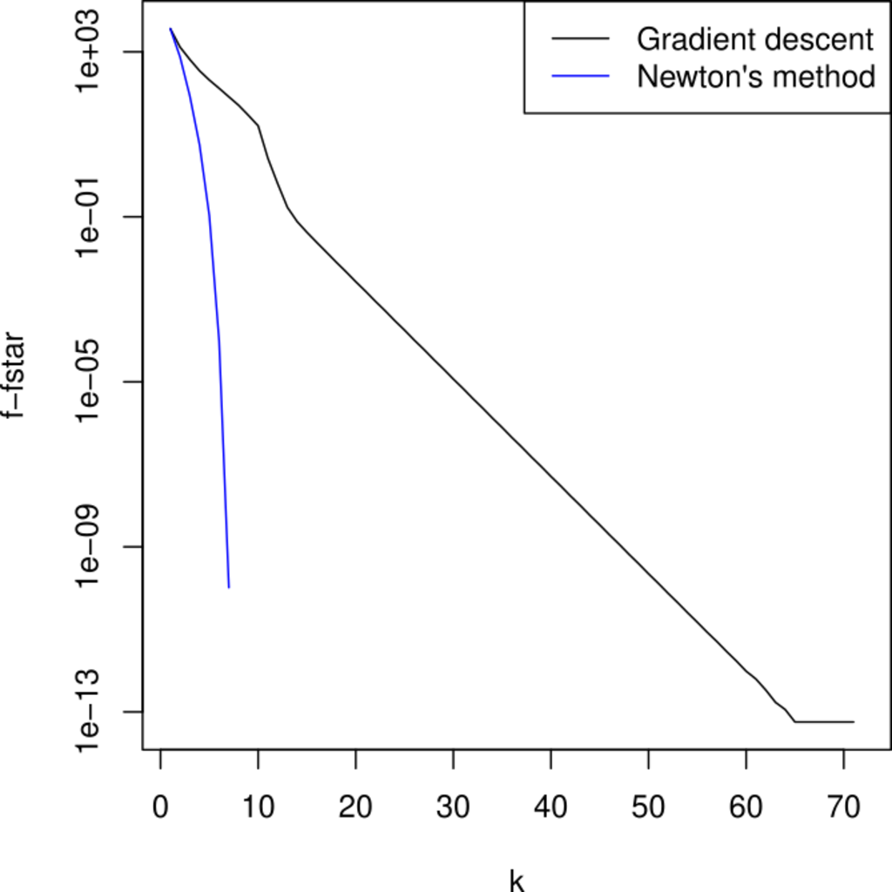
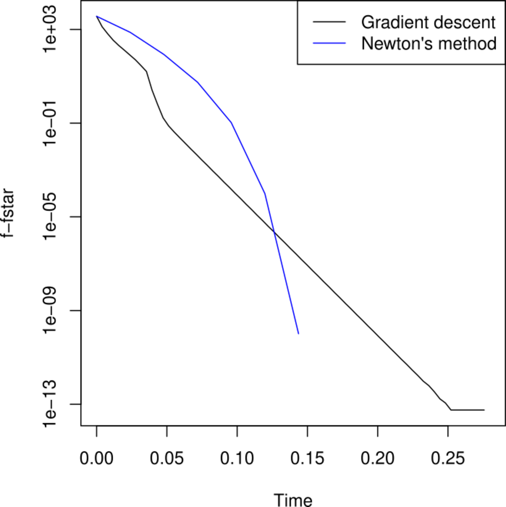



```{r}
#| label: setup
#| include: false

library(patchwork)
library(tidyverse)

old_options <- options(digits = 4)
```

## Recap: Monte Carlo Methods

### Standard Monte Carlo

Estimate $\E h(X)$ with $X \sim f$ by
$$
  \hat{\mu}_{\mathrm{MC}} = \frac{1}{N} \sum_{i=1}^N h(X_i) \quad \text{with } X_i \overset{iid}{\sim} f.
$$

. . .

### Importance Sampling

Use the "trick" that
$$
  \mu = \int h(x) f(x) \ \mathrm{d}x = \int h(x) \frac{f(x)}{g(x)} g(x) \ \mathrm{d}x = \int h(x) w^*(x) g(x) \ \mathrm{d}x
$$
and estimate
$$
  \hat{\mu}^*_{\mathrm{IS}} = \frac{1}{N} \sum_{i=1}^N h(X_i) w^*(X_i) \quad \text{with } X_i \overset{iid}{\sim} g.
$$

## Recap: Importance Sampling

### Normalized Weights

When $f$ is known only up to a normalizing constant, we can still use importance
sampling by estimating normalized weights.

. . .

### Picking a Good Importance Distribution

Pick an importance distribution $g$ that covers the important parts of $f$, with
heavy tails, and from which we can easily sample.

## Today

### Optimization

What is an optimization problem?

\medskip\pause

We learn about different kinds of optimization problems.

. . .

### Convex Optimization

Convex optimization problems are a special class of optimization problems that
are easier to solve.

. . .

### Algorithms

We learn about gradient descent and Newton's method.

# Optimization

## Optimization

The process of trying to optimize an objective function $H$.

\medskip\pause

Typically, we are interested in either **minimizing** or **maximizing** the
function.

\medskip\pause

Since minimizing $H$ is equivalent to maximizing $-H$, we will focus on
minimization.

. . .

### Examples {.example}

- Fitting a generalized linear model by minimizing the negative log-likelihood
  \pause
- Finding the shortest path in a network \pause
- Minimizing variance in a portfolio of financial assets

## Standard Form

In *standard form*, an optimization problem is written as
$$
  \begin{aligned}
    &\operatorname*{minimize}_\theta && H(\theta) \\
    &\textrm{subject to}            && g_i(\theta) \leq 0, \quad i = 1, \ldots, m \\
    &                               && h_j(\theta) = 0, \quad j = 1, \ldots, k.
    \end{aligned}
$$
where

- $H$ is the objective function,
- $g_i$ are inequality constraints, and
- $h_j$ are equality constraints.

. . .

### Solution

We write the solution as
$$
  \theta^* = \argmin_\theta H(\theta)
$$

## Examples of Optimization Problems

### Smoothing Splines

$$
  \operatorname*{minimize}_{\symbf{\beta}} \left(
    (\symbf{y} - \symbf{\Phi}\symbf{\beta})^T (\symbf{y} - \symbf{\Phi}\symbf{\beta}) + \lambda \symbf{\beta}^T \symbf{\Omega} \symbf{\beta}
  \right)
$$

. . .

### Finding the Hyperparameter for Smoothing Splines

$$
  \begin{aligned}
    &\operatorname*{minimize}_\lambda  && \left( (\symbf{y} - \symbf{\Phi}\symbf{\beta})^T (\symbf{y} - \symbf{\Phi}\symbf{\beta}) + \lambda \symbf{\beta}^T \symbf{\Omega} \symbf{\beta} \right) \\
    &\textrm{subject to}               && \lambda \geq 0.
  \end{aligned}
$$

## Examples of Optimization Problems

### Maximum Likelihood

$$
  \operatorname*{minimize}_{\theta} \big(-\ell(\theta)\big),
$$
where $\ell$ is the log-likelihood function.

. . .

### Minimum-Variance Portfolio

$$
  \begin{aligned}
    &\operatorname*{minimize}_w  &&  w^T \Sigma w\\
    &\textrm{subject to}         && \bar{p}^T w \geq r_\mathrm{min},\\
    &                            && \symbf{1}^T w = 1,
  \end{aligned}
$$
where $w$ are the asset weights, $\Sigma$ is the covariance matrix of asset
returns, $\bar{p}$ is the vector of expected returns, and $r_\mathrm{min}$ is
the minimum acceptable return.

## Example: Ordinary Least Squares (OLS) Regression

The problem is to
$$
  \begin{aligned}
    &\operatorname*{minimize}_{\beta \in \mathbb{R}^p} && H(\beta) = \frac{1}{2} \|y - X\beta\|_2^2.
  \end{aligned}
$$

. . .

### Solution

The solution is
$$
  \beta^* = \argmin_{\beta \in \mathbb{R}^p} H(\beta).
$$

## Types of Optimization Problems

### Convexity

- **Convex**
- Quasiconvex
- Nonconvex

. . .

### Smoothness

- **Smooth**
- Nonsmooth

. . .

### Constraints

- **Unconstrained**
- Constrained

## Convex Optimization Problems

Standard form:

$$
  \begin{aligned}
    &\operatorname*{minimize}_\theta && H(\theta) \\
    &\textrm{subject to}            && g_i(\theta) \leq 0, \quad i = 1, \ldots, m, \\
    &                               && a_j^T \theta = b_j, \quad j = 1, \ldots, k,
    \end{aligned}
$$

where $H$ and $g_i$ are convex.

## Convex Functions

A function $H$ is convex iff for all
$\theta_1, \theta_2 \in \operatorname{dom} H$ and $\lambda \in [0, 1]$
$$
  H(\lambda \theta_1 + (1 - \lambda) \theta_2) \leq \lambda H(\theta_1) + (1 - \lambda) H(\theta_2).
$$

This is known as **Jensen's inequality**.

\medskip\pause

```{r}
#| echo: false
#| fig-width: 4
#| fig-height: 2
#| fig-cap: "Jensen's inequality for a convex function."

library(ggplot2)

# Convex function
f <- function(x) x^2

# Points for Jensen's inequality
x1 <- -0.5
x2 <- 1
lambda <- 0.3
x_mid <- lambda * x1 + (1 - lambda) * x2

df <- data.frame(
  x = c(seq(-2, 2, length.out = 100), x1, x2),
  y = c(f(seq(-2, 2, length.out = 100)), f(x1), f(x2)),
  type = c(rep("f", 100), rep("chord", 2))
)

pts <- data.frame(x = c(x1, x2), y = c(f(x1), f(x2)))

labels <- c(
  f = expression(H(theta)),
  chord = expression(lambda * H(theta[1]) + (1 - lambda) * H(theta[2]))
)

ggplot(df, aes(x, y)) +
  geom_line(aes(linetype = type, color = type)) +
  geom_point(data = pts, aes(x, y)) +
  scale_linetype_manual(
    values = c(f = "solid", chord = "dashed"),
    labels = labels
  ) +
  scale_color_manual(
    values = c(f = "black", chord = "steelblue"),
    labels = labels
  ) +
  geom_text(
    aes(x, y),
    data = pts,
    label = c("theta[1]", "theta[2]"),
    parse = TRUE,
    nudge_x = c(-0.3, 0.3)
  ) +
  labs(color = NULL, linetype = NULL) +
  labs(y = expression(H(theta)), x = expression(theta))
```

## First-Order Condition for Convexity

If $H$ is **differentiable**, then the condition is equivalent to
$$
  H(\theta_1) \geq H(\theta_2) + \nabla H(\theta_2)^T(\theta_1 - \theta_2).
$$

. . .

```{r}
#| echo: false
#| fig-width: 4
#| fig-height: 2
#| fig-cap: "First-order condition for convexity."

library(ggplot2)
# Convex function
f <- function(x) x^2
f_prime <- function(x) 2 * x
# Points for tangent line
x0 <- 0.2
x_vals <- seq(-1, 2, length.out = 100)
df <- data.frame(
  x = c(x_vals, x0),
  y = c(f(x_vals), f(x0)),
  type = c(rep("f", 100), "tangent")
)
pts <- data.frame(x = x0, y = f(x0))

labels <- c(
  f = expression(H(theta)),
  tangent = expression(H(theta[2]) + nabla * H(theta[2])^T * (theta[1] - theta[2]))
)

ggplot(df, aes(x, y)) +
  geom_line(aes(linetype = type, color = type)) +
  geom_abline(
    slope = f_prime(x0),
    intercept = f(x0) - f_prime(x0) * x0,
    linetype = "dashed",
    color = "steelblue"
  ) +
  geom_point(data = pts, aes(x, y), label = expression(theta[2]), nudge_y = 0.3) +
  scale_linetype_manual(
    values = c(f = "solid", tangent = "dashed"),
    labels = labels
  ) +
  scale_color_manual(
    values = c(f = "black", tangent = "steelblue"),
    labels = labels
  ) +
  lims(y = c(-1, 4)) +
  labs(color = NULL, linetype = NULL) +
  labs(y = expression(H(theta)), x = expression(theta))
```

## Optimality

Any (local) minimum is **global** (but not necessarily unique).

### First-Order Condition

For differentiable $H$, $\theta^*$ is optimal iff
$$
  \nabla H(\theta^*)^T(\theta - \theta^*) \geq 0\quad\text{for all}\quad \theta \in C,
$$
where $C$ is the feasible set.

. . .

### Second-Order Condition

If $H$ is twice-differentiable, then $\theta^*$ is optimal iff
$$
  \nabla^2 H(\theta^*) \succeq 0.
$$

## Quasiconvex Optimization Problems

### Standard Form

$$
  \begin{aligned}
    &\operatorname*{minimize}_\theta && H(\theta) \\
    &\textrm{subject to}            && g_i(\theta) \leq 0, \quad i = 1, \ldots, m, \\
    &                               && A^T \theta = b,
    \end{aligned}
$$
where $g_i$ are convex but $H$ is **quasiconvex**.

. . .

### Examples

- Utility functions (economics) \pause
- The floor function $H(\theta) = \lfloor \theta \rfloor$

. . .

### Algorithms

Won't cover here, but for instance the **bisection** method.

## Nonconvex Optimization Problems

- Generally hard to solve.
- No standard form (can be anything).
- Local minima are not necessarily global.

. . .

### Examples

- Deep learning
- Hyperparameter tuning (cross-validation)
- Combinatorial problems

. . .

### Algorithms

Won't cover here, but typically **stochastic algorithms** (next week) or
**global optimization methods** (not in this course).

##

```{r}
#| label: convexity-types
#| echo: false
#| warning: false
#| fig-height: 3.4
#| fig-width: 5.4
#| fig-cap: "$\\theta^2$ (convex), $\\sin(\\theta + \\pi)$ (non-convex),
#|   and $\\sqrt{|\\theta|}$ (quasi-convex)."

convex_function <- function(x) x^2
non_convex_function <- function(x) sin(x + pi)
quasi_convex_function <- function(x) sqrt(abs(x))

# Define the gradients
convex_gradient <- function(x) 2 * x
non_convex_gradient <- function(x) cos(x + pi)
quasi_convex_gradient <- function(x) sign(x) * 0.5 * abs(x)^(-0.5)

# Create a sequence of x values
x_vals <- seq(-2, 2, length.out = 100)

# Create data frames for plotting
convex_df <- data.frame(
  x = x_vals,
  y = convex_function(x_vals),
  gradient = convex_gradient(x_vals),
  type = "Convex"
)
non_convex_df <- data.frame(
  x = x_vals,
  y = non_convex_function(x_vals),
  gradient = non_convex_gradient(x_vals),
  type = "Non-Convex"
)
quasi_convex_df <- data.frame(
  x = x_vals,
  y = quasi_convex_function(x_vals),
  gradient = quasi_convex_gradient(x_vals),
  type = "Quasi-Convex"
)

# Combine data frames
df <- bind_rows(convex_df, non_convex_df, quasi_convex_df)

# Function to add Jensen's inequality line segment
add_jensens_line <- function(df, func) {
  x1 <- -1.5
  x2 <- 0.1
  y1 <- func(x1)
  y2 <- func(x2)
  df |>
    mutate(
      jensens_y = ifelse(
        x >= x1 & x <= x2,
        y1 + (y2 - y1) * (x - x1) / (x2 - x1),
        NA
      )
    )
}

# Add Jensen's inequality line segments
convex_df <- add_jensens_line(convex_df, convex_function)
non_convex_df <- add_jensens_line(non_convex_df, non_convex_function)
quasi_convex_df <- add_jensens_line(quasi_convex_df, quasi_convex_function)

# Combine data frames with Jensen's line
df_with_jensens <- bind_rows(convex_df, non_convex_df, quasi_convex_df)

# Plot the objective functions with Jensen's inequality line segments using facets
p1 <- ggplot(df_with_jensens, aes(x = x)) +
  geom_line(aes(y = y)) +
  geom_line(aes(y = jensens_y), linetype = "dashed", color = "steelblue4") +
  labs(y = expression(H(theta)), x = expression(theta)) +
  facet_wrap(~type, scales = "free_y")

# Plot the gradients using facets
p2 <- ggplot(df, aes(x = x, y = gradient)) +
  geom_line() +
  labs(y = expression(nabla * H(theta)), x = expression(theta)) +
  facet_wrap(~type, scales = "free_y")

# Print the plots
p1 / p2 +
  plot_layout(axis_title = "collect", guides = "collect", axes = "collect")
```

# Solving Optimization Problems

## Types of Optimization Methods

### Direct (Exact) Methods

Provides a solution up to machine precision.

\medskip\pause

**Examples:** solving a linear system of equations

. . .

### Iterative Optimization

Incrementally update optimization variable until some convergence criterion is
met.

\medskip\pause

**Examples:** gradient descent, hill-climbing

. . .

## Running Example: OLS

```{r}
#| echo: false

source(here::here("R", "gradient_descent.R"))

library(mvtnorm)
library(plot3D)

set.seed(24)

Sigma <- matrix(c(1, 0.8, 0.8, 1), 2, 2)
x <- rmvnorm(100, sigma = Sigma)

colnames(x) <- c("x1", "x2")

beta <- c(1, 2)

y <- x %*% beta

beta1_grid <- seq(-1, 4, length.out = 51)
beta2_grid <- seq(-1, 4, length.out = 51)

beta1_grid_persp <- seq(-1, 4, length.out = 21)
beta2_grid_persp <- seq(-1, 4, length.out = 21)

f <- function(beta, x, y) norm(y - x %*% beta, "2")^2 / (2 * nrow(x))

f_vals <- outer(
  beta1_grid,
  beta2_grid,
  Vectorize(function(b1, b2) f(c(b1, b2), x, y))
)

f_vals_persp <- outer(
  beta1_grid_persp,
  beta2_grid_persp,
  Vectorize(function(b1, b2) f(c(b1, b2), x, y))
)

colnames(f_vals) <- beta1_grid
rownames(f_vals) <- beta2_grid
colnames(f_vals_persp) <- beta1_grid_persp
rownames(f_vals_persp) <- beta2_grid_persp

optimum_df <- tibble(beta1 = beta[1], beta2 = beta[2])

beta_df <- tibble(
  beta1 = rep(beta1_grid, times = ncol(f_vals)),
  beta2 = rep(beta2_grid, each = nrow(f_vals)),
  f = as.vector(f_vals)
)

beta_df_persp <- tibble(
  beta1 = rep(beta1_grid_persp, times = ncol(f_vals_persp)),
  beta2 = rep(beta2_grid_persp, each = nrow(f_vals_persp)),
  f = as.vector(f_vals_persp)
)
```

We are going to use a simple example of OLS as a running example.

\medskip\pause

We will let $p=2$, and generate some data from a multivariate normal
distribution:
$$
  \symbf{x} \sim \normal(
    \symbf{\mu} = \begin{bmatrix}1 \\ 1\end{bmatrix},
    \symbf{\Sigma} = \begin{bmatrix}1 & 0.8 \\ 0.8 & 1\end{bmatrix}
  )
$$

##

::: {.columns}
::::: {.column width="47%"}
```{r}
#| fig-width: 4
#| fig-height: 4
#| echo: false

persp3D(
  beta1_grid,
  beta2_grid,
  f_vals,
  theta = 30,
  phi = 30,
  expand = 0.5,
  border = "black",
  col = "steelblue1",
  xlab = "beta1",
  ylab = "beta2",
  zlab = "H"
)
```
:::::

::::: {.column width="47%"}
```{r}
#| fig-height: 2.8
#| echo: false

source(here::here("R", "gradient_descent.R"))

contour_scale <- scale_color_gradient(
  low = "grey50",
  high = "grey80",
  guide = NULL
)

step_size_illustration <- function(
  x,
  y,
  t = NULL,
  maxit = 35,
  line_search = FALSE,
  plot_convergence = TRUE,
  plot_approx = FALSE,
  method = c("gd", "newton")
) {
  method <- match.arg(method)

  optimizer <- switch(method, gd = gd, newton = newton)

  res <- optimizer(x, y, t = t, maxit = maxit, line_search = line_search)

  L <- norm(t(x) %*% x, "2") / nrow(x)

  if (is.null(t)) {
    if (method == "newton") {
      t <- 1
    } else {
      t <- 1 / L
    }
  }

  df <- t(res$betas)
  colnames(df) <- c("beta1", "beta2")

  approx_point <- df[2, ]

  beta1_grid <- seq(-1, 4, length.out = 51)
  beta2_grid <- seq(-1, 4, length.out = 51)

  f <- function(beta, x, y) norm(y - x %*% beta, "2")^2 / (2 * nrow(x))

  f_grad <- function(beta, x, y) -t(x) %*% (y - x %*% beta) / nrow(x)

  taylor_approx <- function(beta, beta0, x, y, t) {
    f(beta, x, y) +
      t(f_grad(beta0, x, y)) %*% (beta - beta0) +
      (1 / (2 * t)) * sum((beta - beta0)^2)
  }

  hessian_approx <- function(beta, beta0, x, y, t) {
    H <- t(x) %*% x / (nrow(x))
    f(beta, x, y) +
      (1 / (2 * t)) * t(f_grad(beta0, x, y)) %*% (beta - beta0) +
      t(beta - beta0) %*% H %*% (beta - beta0)
  }

  f_vals <- outer(
    beta1_grid,
    beta2_grid,
    Vectorize(function(b1, b2) f(c(b1, b2), x, y))
  )

  colnames(f_vals) <- beta1_grid
  rownames(f_vals) <- beta2_grid

  optimum_df <- tibble(beta1 = beta[1], beta2 = beta[2])

  beta_df <- tibble(
    beta1 = rep(beta1_grid, times = ncol(f_vals)),
    beta2 = rep(beta2_grid, each = nrow(f_vals)),
    f = as.vector(f_vals)
  )

  res <- ggplot(beta_df, aes(beta1, beta2)) +
    contour_scale +
    geom_point(data = optimum_df, color = "darkorange", size = 3, pch = 4) +
    labs(x = expression(beta[1]), y = expression(beta[2])) +
    coord_fixed(xlim = c(-1, 4), ylim = c(-1, 4), expand = FALSE) +
    geom_contour(aes(z = f, color = after_stat(level)), bins = 25)

  if (plot_approx) {
    approx_fun <- if (method == "gd") {
      taylor_approx
    } else {
      hessian_approx
    }

    approx_vals <- outer(
      beta1_grid,
      beta2_grid,
      Vectorize(function(b1, b2) approx_fun(c(b1, b2), approx_point, x, y, t))
    )

    colnames(approx_vals) <- beta1_grid
    rownames(approx_vals) <- beta2_grid

    approx_df <- tibble(
      beta1 = rep(beta1_grid, times = ncol(approx_vals)),
      beta2 = rep(beta2_grid, each = nrow(approx_vals)),
      f = as.vector(approx_vals)
    )

    res <- res +
      geom_contour(
        data = approx_df,
        aes(beta1, beta2, z = f),
        color = "steelblue",
        linetype = "dashed",
        bins = 15
      ) +
      geom_point(
        aes(x = approx_point[1], y = approx_point[2]),
        color = "steelblue",
        size = 2
      )
  }

  if (plot_convergence) {
    res <- res + geom_point(data = df, size = 0.5) + geom_path(data = df)
  }

  res
}

step_size_illustration(x, y, plot_convergence = FALSE)
```
:::::
:::

## Direct Methods

Analytical solution, up to machine precision.

### Example: OLS

Solve
$$
  X^TX \beta = X^Ty
$$
for $\beta \in \mathbb{R}^p$.

\medskip\pause

How do you solve this in practice? In R you call

```r
solve(crossprod(X), crossprod(X, y))
```

. . .

but what happens \alert{under the hood}?

## Iterative Methods

Update a current best guess iteratively until it is "good enough".

. . .

### Taxonomy by Order

Can be categorized by order, in terms of the information used

- **0-order**: only use function value ($H(\theta)$)
- **first-order**: also use first derivative ($H'(\theta)$)
- **second-order**: also use second derivative ($H''(\theta)$)

## Zero-Order Methods

Use only the function value.

### Examples

- Hill climbing
- Bisection
- Grid search (cross validation)

## First-Order Methods

Use the gradient of the function (**first** derivative).

### Examples

- **Gradient descent**
- Conjugate gradient

## Second-Order Methods

Use the Hessian of the function (**second** derivative).

### Examples

- **Newton's Method**
- Trust-region methods

## Gradient Descent

The quintessential first-order method!

\medskip\pause
::: {.columns}
::::: {.column width="47%"}
\begin{algorithm}[H]
  \caption{Gradient descent}
  \KwData{Step size $\gamma > 0$}
  \Repeat{convergence}{
    $\theta \gets \theta - \gamma \nabla H(\theta)$\;
  }
  \Return{$\theta$}
\end{algorithm}

\medskip

Converges to a local minimum if $H$ is convex and differentiable and $\gamma$
small enough.

### Step Size {.alert}

But how do we choose $\gamma$?
:::::

::::: {.column width="47%"}
```{r}
#| echo: false

# illustration of how gradient descent works,
# with a simple one-dimensional function, showing the
# tangent line at say, two steps
gd_illustration <- function(f, f_prime, x0, t, n_steps) {
  x_vals <- numeric(n_steps + 1)
  x_vals[1] <- x0

  for (i in 1:n_steps) {
    x_vals[i + 1] <- x_vals[i] - t * f_prime(x_vals[i])
  }

  df <- data.frame(
    x = seq(min(x_vals) - 0.5, max(x_vals) + 1, length.out = 100),
    y = f(seq(min(x_vals) - 0.5, max(x_vals) + 1, length.out = 100))
  )

  points_df <- data.frame(step = 0:n_steps, x = x_vals, y = f(x_vals))

  ggplot(df, aes(x, y)) +
    geom_line() +
    geom_point(data = points_df, aes(x, y)) +
    geom_segment(
      data = points_df[-nrow(points_df), ],
      aes(
        x = x + 0.1 * f_prime(x),
        y = y + 0.1 * f_prime(x) * f_prime(x),
        xend = x - t * f_prime(x),
        yend = y - t * f_prime(x) * f_prime(x)
      ),
      arrow = arrow(length = unit(0.2, "cm")),
      color = "steelblue"
    ) +
    geom_point(
      aes(x, y),
      data = tibble(x = 2, y = f(2)),
      color = "darkorange"
    ) +
    labs(y = expression(H(theta)), x = expression(theta))
}

gd_illustration(
  f = function(x) (x - 2)^2 + 1,
  f_prime = function(x) 2 * (x - 2),
  x0 = 0,
  t = 0.2,
  n_steps = 3
)
```
:::::
:::

##

```{r}
#| echo: false
#| fig-width: 5
#| fig-height: 3.25
#| fig-cap: The step size is too small!

step_size_illustration(x, y, 0.0003)
```

##

```{r}
#| echo: false
#| fig-width: 5
#| fig-height: 3.25
#| fig-cap: The step size is too large!

step_size_illustration(x, y, 0.0115, maxit = 35)
```

## Derivation of Update

Take the second-order Taylor expansion of $H$ around $\theta$:
$$
  H(\vartheta) \approx \hat{H}(\vartheta) = H(\theta) + \nabla H(\theta)^T (\vartheta - \theta) + \frac{1}{2}(\vartheta - \theta)^T \nabla^2 H(\theta) (\vartheta - \theta).
$$

. . .

::: {.columns}
::::: {.column width="47%"}
Replace $\nabla^2 H(\theta)$ with $\frac{1}{\gamma} I$ and minimize w.r.t
$\vartheta$ to get
$$
  \theta_{n + 1} = \theta_n - \gamma \nabla H(\theta_n).
$$

### Step Size {.alert}

But we still need to choose $\gamma$!
:::::

::::: {.column width="47%"}
```{r}
#| echo: false

# show a illustration of this taylor expansion, and the fact that the
# gradient descent step is the minimizer of this taylor expansion
gd_taylor_illustration <- function(f, f_prime, x0, t) {
  x_vals <- seq(x0 - 0.5, x0 + 1.5, length.out = 100)
  df <- data.frame(
    x = x_vals,
    y = f(x_vals),
    taylor = f(x0) + f_prime(x0) * (x_vals - x0) + (x_vals - x0)^2 / (2 * t)
  )

  df_long <- df |>
    pivot_longer(
      cols = c("y", "taylor"),
      names_to = "type",
      values_to = "value"
    )

  taylor_min <- tibble(x = df$x[which.min(df$taylor)], y = min(df$taylor))

  next_step <- tibble(
    x = c(x0, x0 - t * f_prime(x0)),
    y = c(f(x0), f(x0 - t * f_prime(x0)))
  )

  ggplot(df_long, aes(x)) +
    geom_line(aes(y = value, color = type, linetype = type)) +
    geom_point(aes(x, y), data = taylor_min, color = "steelblue") +
    geom_point(aes(x, y), data = next_step, color = "black") +
    geom_text(
      aes(x, y),
      data = next_step,
      nudge_x = -0.1,
      nudge_y = -0.35,
      label = c("theta[n]", "theta[n + 1]"),
      parse = TRUE
    ) +
    scale_color_manual(
      values = c(y = "black", taylor = "steelblue"),
      labels = c(y = expression(H(theta)), taylor = expression(hat(H)(theta)))
    ) +
    scale_linetype_manual(
      values = c(y = "solid", taylor = "dashed"),
      labels = c(y = expression(H(theta)), taylor = expression(hat(H)(theta)))
    ) +
    labs(
      y = expression(H(theta)),
      x = expression(theta),
      color = NULL,
      linetype = NULL
    ) +
    theme_void()
}

gd_taylor_illustration(
  f = function(x) (x - 2)^2 + 1,
  f_prime = function(x) 2 * (x - 2),
  x0 = 0,
  t = 0.2
)
```
:::::
:::

## The Descent Lemma (from Taylor's Theorem)

### Taylor's Theorem

For any $\theta, \vartheta$ in the domain of $H$, there exists a $\zeta$ on the
line segment between $\theta$ and $\vartheta$ such that
$$
  H(\vartheta) = H(\theta) + \nabla H(\theta)^T (\vartheta - \theta) + \frac{1}{2}(\vartheta - \theta)^T \nabla^2 H(\zeta) (\vartheta - \theta).
$$

. . .

### Descent Lemma

Suppose we know that the Hessian is bounded above by $L I$, i.e.,
$$
  \nabla^2 H(\theta) \preceq L I \quad \text{for all } \theta.
$$

. . .

Then
$$
  H(\vartheta) \leq H(\theta) + \nabla H(\theta)^T (\vartheta - \theta) + \frac{L}{2} \|\vartheta - \theta\|_2^2.
$$

## Lipschitz Constant

::: {.columns}
::::: {.column width="47%"}
The bound that we used in the descent lemma, $L$, is known as the **Lipschitz
constant** of $\nabla H$.

\medskip\pause

It is defined as follows.
$$
  \|\nabla H(\theta) - \nabla H(\vartheta)\|_2 \leq L \|\theta - \vartheta\|_2.
$$

. . .

It measures how fast the gradient of $H$ can change, relative to the change in
$\theta$.

### Twice-Differentiable Case

If $H$ is twice-differentiable, then the Lipschitz constant is the smallest $L$
such that
$$
  \nabla^2 H(\theta) \preceq L I \quad \text{for all } \theta.
$$
:::::

. . .

::::: {.column width="47%"}
```{r}
#| echo: false
#| fig-height: 3.2

# For a Lipschitz continuous function, there exists a double cone (white) whose
# origin can be moved along the graph so that the whole graph always stays
# outside the double cone
# Let's plot this for a one-dimensional function.

lipschitz_illustration <- function(f, f_prime, L, x0) {
  x_vals <- seq(x0 - 2, x0 + 2, length.out = 200)

  df <- data.frame(x = x_vals, y = f_prime(x_vals))

  ggplot(df, aes(x, y)) +
    geom_ribbon(
      aes(
        ymin = f_prime(x0) - L * abs(x - x0),
        ymax = f_prime(x0) + L * abs(x - x0)
      ),
      fill = "grey40",
      alpha = 0.5
    ) +
    geom_line() +
    geom_point(
      aes(x, y),
      data = tibble(x = x0, y = f_prime(x0)),
      color = "darkorange"
    ) +
    labs(y = expression(nabla * H(theta)), x = expression(theta))
}

f <- function(x) ifelse(x < 0, x^2 - x, -log(1 + x))

f_prime <- function(x) ifelse(x < 0, 2 * x - 1, -1 / (1 + x))

p1 <- lipschitz_illustration(f = f, f_prime = f_prime, L = 2, x0 = 0)

f <- function(x) {
  ifelse(
    x < 1,
    12.5 * x^2,
    ifelse(1 <= x & x < 2, 0.5 * x^2 + 24 * x - 12, 12.5 * x^2 - 24 * x + 36)
  )
}

f_prime <- function(x) {
  ifelse(x < 1, 25 * x, ifelse(1 <= x & x < 2, x + 24, 25 * x - 24))
}

p2 <- lipschitz_illustration(f = f, f_prime = f_prime, L = 25, x0 = 0)

p1 / p2 + plot_layout(axes = "collect")
```
:::::
:::

## The Connection to Gradient Descent

If we apply the descent lemma with $\vartheta = \theta - \gamma \nabla H(\theta)$,
we get
$$
  H(\theta - \gamma \nabla H(\theta)) \leq H(\theta) - \gamma \|\nabla H(\theta)\|_2^2 + \frac{L \gamma^2}{2} \|\nabla H(\theta)\|_2^2.
$$

. . .

This means that if $\gamma \leq 1/L$, then
$$
  H(\theta - \gamma \nabla H(\theta)) \leq H(\theta) - \frac{\gamma}{2} \|\nabla H(\theta)\|_2^2.
$$

. . .

In other words, the function value decreases at each step.

##

```{r}
#| echo: false
#| fig-width: 5
#| fig-height: 3.25
#| fig-cap: The step size is just right ($\gamma = 1/L$)!

step_size_illustration(x, y)
```

## Line Searching

In practice, we may not know $L$ or it may be difficult to compute.

. . .

### Exact Line Search

It may be tempting to try to solve
$$
  \gamma^* = \argmin_\gamma H(\theta - \gamma \nabla H(\theta)).
$$

. . .

But this is typically too expensive. Instead, we typically use an inexact line
search, like **backtracking line search**.

## Backtracking Line Search

::: {.columns}
::::: {.column width="53%"}
\begin{algorithm}[H]
  \caption{Backtracking line search}
  \KwData{Initial step size $\gamma_0 > 0$, parameters $c \in (0, 1/2]$ and $d \in (0, 1)$}
  $\gamma \gets \gamma_0$\;
  \While{$H(\theta - \gamma \nabla H(\theta)) > H(\theta) - c \gamma \|\nabla H(\theta)\|_2^2$}{
    $\gamma \gets d \gamma$\;
  }
  \Return{$\gamma$}
\end{algorithm}

\bigskip\pause

Guarantees that the step size is not too large, and that the function value
decreases sufficiently.

\medskip\pause

Adapts to local curvature of the function.
:::::

::::: {.column width="41%"}
```{r}
#| fig-height: 2.9
#| fig-width: 2.6
#| echo: false
#| fig-cap: An illustration of backtracking line search.

# show a illustration of backtracking line search
# that shows how the check work on a simple one-dimensional function
# with a tangent line and the next step
backtracking_illustration <- function() {
  H <- function(theta) (theta - 2)^2 + 1
  H_prime <- function(theta) 2 * (theta - 2)

  theta <- 0.5
  c_suff <- 0.3
  gamma <- seq(-0.2, 1, length.out = 102)

  df <- data.frame(
    gamma = gamma,
    f1 = H(theta - gamma * H_prime(theta)),
    f2 = H(theta) - gamma * H_prime(theta)^2,
    f3 = H(theta) - c_suff * gamma * H_prime(theta)^2
  )

  labels <- c(
    f1 = expression(H(theta - gamma * nabla * H(theta))),
    f2 = expression(H(theta) - gamma * nabla * H(theta)^2),
    f3 = expression(H(theta) - c * gamma * nabla * H(theta)^2)
  )

  df_long <- df |>
    pivot_longer(
      cols = c("f1", "f2", "f3"),
      names_to = "type",
      values_to = "y"
    ) |>
    filter(!(gamma < 0 & (type == "f2" | type == "f3")))

  ggplot(df_long, aes(gamma, y)) +
    geom_line(aes(color = type, linetype = type)) +
    labs(y = expression(H(gamma)), x = expression(gamma)) +
    scale_y_continuous(limits = c(-2, 5)) +
    scale_color_manual(
      values = c(f1 = "black", f2 = "darkorange", f3 = "steelblue"),
      labels = labels
    ) +
    scale_linetype_manual(
      values = c(f1 = "solid", f2 = "dashed", f3 = "dashed"),
      labels = labels
    ) +
    labs(color = NULL, linetype = NULL) +
    guides(
      color = guide_legend(position = "inside"),
      linetype = guide_legend(position = "inside")
    ) +
    theme(legend.position.inside = c(0.6, 0.85))
}
backtracking_illustration()
```
:::::
:::

##

```{r}
#| echo: false
#| fig-width: 5
#| fig-height: 3.25
#| fig-cap: "Backtracking line search."

step_size_illustration(x, y, line_search = TRUE)
```

## Conditioning

::: {.columns}
::::: {.column width="46%"}
So, $L$ decides how large step size we can take.

\medskip\pause

But $L$ is based on the largest \alert{eigenvalue} of $\nabla^2 H(\theta)$,
which means that it may be pessimistic in some directions.

. . .

### Condition Number

The **condition number** of $H$ is defined as
$$
  \kappa = \frac{\lambda_{\max}}{\lambda_{\min}}.
$$

. . .

If $\kappa$ is large, we say that $H$ is **ill-conditioned**. If $\kappa$ is
small, we say that $H$ is **well-conditioned**.
:::::

::::: {.column width="46%"}
```{r}
#| echo: false
#| fig-height: 3.2

well_conditioned <- function(x) 0.5 * ((x[1] - beta[1])^2 + (x[2] - beta[2])^2)

ill_conditioned <- function(x) {
  0.5 * ((x[1] - beta[1])^2 + 5 * (x[2] - beta[2])^2)
}

conditioned_df <- function(f, beta1_grid, beta2_grid) {
  f_vals <- outer(
    beta1_grid,
    beta2_grid,
    Vectorize(function(b1, b2) f(c(b1, b2)))
  )

  colnames(f_vals) <- beta1_grid
  rownames(f_vals) <- beta2_grid

  tibble(
    beta1 = rep(beta1_grid, times = ncol(f_vals)),
    beta2 = rep(beta2_grid, each = nrow(f_vals)),
    f = as.vector(f_vals)
  )
}

well_df <- conditioned_df(well_conditioned, beta1_grid, beta2_grid) |>
  mutate(type = "Well-conditioned (L = 1)")
ill_df <- conditioned_df(ill_conditioned, beta1_grid, beta2_grid) |>
  mutate(type = "Ill-conditioned (L = 5)")

conditioned_df <- bind_rows(well_df, ill_df)

p1 <- ggplot(conditioned_df, aes(beta1, beta2)) +
  contour_scale +
  geom_point(data = optimum_df, color = "darkorange", size = 3, pch = 4) +
  labs(x = expression(beta[1]), y = expression(beta[2])) +
  coord_fixed(xlim = c(-1, 4), ylim = c(0.5, 3.5), expand = FALSE) +
  geom_contour(aes(z = f, color = after_stat(level)), bins = 35) +
  facet_wrap(~type, ncol = 1)
p1
```
:::::
:::

## Convergence and Conditioning

::: {.columns}
::::: {.column width="47%"}
```{r}
#| fig-height: 2.5
#| echo: false
#| fig-cap: "Gradient descent on a well-conditioned problem."

x_well <- rmvnorm(100, sigma = diag(2))
y_well <- x_well %*% beta

step_size_illustration(x_well, y_well)
```
:::::

. . .

::::: {.column width="47%"}
```{r}
#| fig-height: 2.5
#| echo: false
#| fig-cap: "Gradient descent on an ill-conditioned problem."

x_ill <- rmvnorm(100, sigma = matrix(c(1, 0.8, 0.8, 1), 2, 2))
y_ill <- x_ill %*% beta

step_size_illustration(x_ill, y_ill)
```
:::::
:::

## Gradient Descent and Conditioning

::: {.columns align=center}
::::: {.column width="47%"}
The problem with gradient descent is that it is sensitive to this kind of
conditioning.
:::::

::::: {.column width="47%"}
```{r}
#| echo: false
#| fig-height: 2.8
#| fig-cap: "The gradient descent approximation."

step_size_illustration(x_ill, y_ill, t = 0.001, plot_approx = TRUE)
```
:::::
:::

## Newton's Method

Recall second-order expansion of $H$ around $\theta$:
$$
  H(\vartheta) \approx \hat{H}(\vartheta) = H(\theta) + \nabla H(\theta)^T (\vartheta - \theta) + \frac{1}{2}(\vartheta - \theta)^T \nabla^2 H(\theta) (\vartheta - \theta).
$$

. . .

::: {.columns}
::::: {.column width="47%"}
### Gradient Descent Update

Replace $\nabla^2 H(\theta)$ with $\frac{1}{\gamma} I$ and minimize.

. . .

### Newton Update

Instead, minimize $\hat{H}(\vartheta)$ directly:
$$
  \theta_{n + 1} = \theta_n - \big(\nabla^2 H(\theta_n)\big)^{-1} \nabla H(\theta_n).
$$

\pause\bigskip
:::::

::::: {.column width="47%"}
```{r}
#| echo: false
#| fig-height: 2.4

step_size_illustration(
  x,
  y,
  plot_convergence = TRUE,
  method = "newton",
  plot_approx = TRUE,
  t = 0.8,
)
```
:::::
:::

## Damped Newton

This might actually not converge, so instead we use **damped** Newton:
$$
  \theta_{n + 1} = \theta_n - \gamma \nabla^2 H(\theta_n)^{-1} \nabla H(\theta_n),
$$
with $\gamma > 0$ chosen by backtracking line search.

. . .

### Phases

- As long as $\gamma < 1$, we are in the **damped** phase. \pause
- When $\gamma = 1$, we enter the **pure** phase and $\gamma$ will remain $1$.\pause
- In pure phase, we have quadratic convergence.

##

```{r}
#| echo: false
#| fig-width: 5.4
#| fig-height: 2.8
#| fig-cap: "Gradient descent vs Newton's method on the ill-conditioned problem."

pl_gd <- step_size_illustration(
  x_ill,
  y_ill,
  method = "gd",
  plot_convergence = TRUE
) +
  ggtitle("Gradient Descent")
pl_newton <- step_size_illustration(
  x_ill,
  y_ill,
  method = "newton",
  t = 1,
  line_search = TRUE,
  plot_convergence = TRUE
) +
  ggtitle("Newton's Method")

pl_gd + pl_newton + plot_layout(guides = "collect")
```

## Convergence in Time and Iterations

::: {.columns}
::::: {.column width="47%"}
{width=100%}
:::::

::::: {.column width="47%"}
{width=100%}
:::::
:::

\bigskip

In practice, results depend on the problem.

## Gradient Descent vs Newton's Method

::: {.columns}
::::: {.column width="47%"}
### Gradient Descent

- Cheap iterations: $O(p)$
- Sensitive to conditioning
- Linear convergence ($O(1/n)$)
- Few assumptions on $H$
:::::

. . .

::::: {.column width="47%"}
### Newton's Method

- Expensive iterations: $O(p^3)$
- Insensitive to conditioning
- Quadratic convergence ($O(\log \log(1/n))$)
- Requires $H$ to be twice-differentiable and Hessian to be positive definite
:::::
:::

## Quasi-Newton Methods

Replace $\nabla^2 H(\theta)$ with an approximation $B_n$.

. . .

### BFGS

Complexity: $O(p^2)$, still same memory cost.

. . .

### L-BFGS

Same complexity but lower memory cost.

## Stopping Criteria

::: {.columns}
::::: {.column width="47%"}
### Common (ad-hoc) choices

- Small gradient:
  $$
  \|\nabla H(\theta_n)\|_r \leq \epsilon
  $$
  \pause
- Small relative change in $\theta$:
  $$
  \frac{\|\theta_{n + 1} - \theta_n\|_2}{\|\theta_n + 10^{-q}\|_2}
  \leq \epsilon
  $$
  \pause
- Small relative change in $H$:
  $$
  \frac{H(\theta_{n + 1}) - H(\theta_n)}{H(\theta_n)}
  \leq \epsilon
  $$
:::::

. . .

::::: {.column width="47%"}
### Duality Gap

If $H$ is **strongly** convex and $\theta$ optimal, then the duality gap is zero
at the optimum.

\medskip\pause

Most principled stopping criterion, but not always available.

\medskip\pause

\alert{Out of scope for this course!}
:::::
:::

## Summary

### Today

- Optimization problems
- Algorithms to solve optimization problems
  - Gradient descent
  - The Newton method

. . .

### Things We Did Not Cover

- Accelerated gradient methods
- Conjugate gradient
- Constrained optimization
- Nonsmooth objectives

## Exercise

We will attempt to minimize the following function:
$$
  H(\theta) = \log(1 + e^\theta) + \frac{1}{2}(\theta - 2)^2.
$$

. . .

```{r}
#| echo: false
#| include: false

H <- function(theta) log(1 + exp(theta)) + 0.5 * (theta - 2)^2

curve(H, from = -2, to = 5)

H_prime <- function(theta) exp(theta) / (1 + exp(theta)) + (theta - 2)
```

### Step 1

Implement a gradient descent method for solving this problem. Plot convergence
in terms of iterations and time. Implement a stopping criterion.

. . .

### Step 2

Test and benchmark your implementation against R's built-in `optimize()`.

. . .

### Step 3

Implement Newton's method for solving this problem and repeat the analysis.

## Next Time

### Testing

We will cover how to \alert{systematically} test your code using **testthat**.

. . .

### Debugging

We will cover how fix bugs in your code using debugging tools in R.

\medskip\pause

This part will mostly be a hands-on sessions, so bring your laptop!
